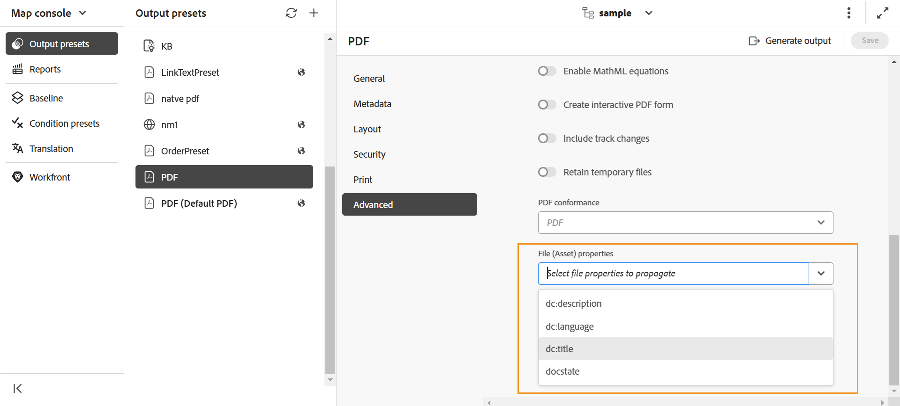
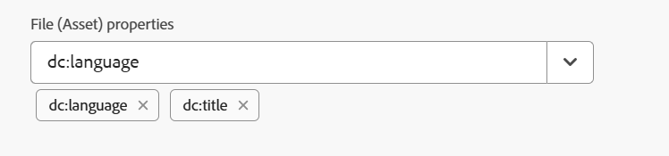

# Pasar los metadatos a la salida utilizando DITA-OT {#id21BJ00QD0XA}

Los metadatos son información adicional sobre el resultado. En Adobe Experience Manager Guides, puede pasar los metadatos existentes o crear etiquetas de metadatos personalizadas. Puede pasar metadatos a salidas de AEM, PDF, HTML5, EPUB y de formato personalizado mediante la publicación DITA-OT.

Existen dos maneras de pasar los metadatos a la salida mediante DITA-OT:

- [Uso de la consola Mapa](#using-map-console)
- [Uso del tablero de mapas](#using-map-dashboard)

## Uso de la consola Mapa

Realice los siguientes pasos para pasar los metadatos a la salida mediante la publicación DITA-OT:

1. [Abra el archivo de mapa DITA en la consola de mapas](./open-files-map-console.md) para el que desea pasar los metadatos a DITA-OT.
1. Seleccione y abra un ajuste preestablecido de salida al que desee pasar los campos de metadatos. Por ejemplo, seleccione el ajuste preestablecido de salida PDF. Asegúrese de que se ha creado con la opción **DITA-OT**.
1. En el menú desplegable **Propiedades del archivo**, seleccione los metadatos que desee pasar a la publicación DITA-OT.

   {align="left"}

   La lista desplegable Propiedades enumera las propiedades personalizadas y las predeterminadas. Por ejemplo, en la captura de pantalla anterior `dc:description`, `dc:language`, `dc:title` y `docstate` son las propiedades predeterminadas.

   >[!NOTE]
   >
   > Estas propiedades se seleccionan del archivo metadataList disponible en la siguiente ubicación:`/libs/fmdita/config/metadataList`. De manera predeterminada, hay cuatro propiedades enumeradas en este archivo: `dc:description`, `dc:language`, `dc:title` y `docstate`.

   Este archivo se puede superponer en: `/apps/fmdita/config/metadataList`.

   Para pasar una propiedad personalizada para la que ya ha definido los valores, vea [Usar metadatos de AEM en la salida DITA-OT de PDF](https://experienceleaguecommunities.adobe.com/t5/xml-documentation-discussions/use-aem-metadata-in-dita-ot-pdf-output/td-p/411880?profile.language=es).

1. Las propiedades seleccionadas se muestran debajo de la lista desplegable.

   {width="300" align="left"}

1. Seleccione **Guardar** en la parte superior derecha para guardar los cambios.
1. Seleccione **Generar salida**.

Las propiedades de metadatos seleccionadas se pasarán a la salida generada mediante DITA-OT.

>[!NOTE]
>
> A partir de la versión 2502 de Experience Manager Guides, la funcionalidad para pasar argumentos de metadatos de mapa raíz a través de la línea de comandos DITA-OT ha quedado obsoleta. Sin embargo, para evitar interrupciones, se ha agregado una nueva propiedad en `Config.Manager` para habilitar o deshabilitar la funcionalidad.  Para obtener más información, vea [Configurar opciones de generación de resultados](../cs-install-guide/conf-output-generation.md#configure-the-dita-ot-command-line-arguement-field-on-the-dita-map-dashboard).

## Uso del tablero de mapas

Si trabaja en la **interfaz de usuario de Assets**, realice los siguientes pasos para pasar los metadatos a la salida mediante la publicación DITA-OT:

1. En la **interfaz de usuario de Assets**, vaya y elija el archivo de asignación DITA para el que desea pasar los metadatos a DITA-OT.
1. Seleccione y edite un ajuste preestablecido de salida al que desee pasar los campos de metadatos. Por ejemplo, seleccione el ajuste preestablecido de salida PDF.
1. Seleccione la opción **DITA-OT** en el ajuste preestablecido de salida seleccionado.

   {align="left"}

1. En la lista desplegable Propiedades, seleccione los metadatos que desee pasar a la publicación DITA-OT.

   La lista desplegable Propiedades enumera las propiedades personalizadas y las predeterminadas. Por ejemplo, en la captura de pantalla anterior, el autor es la propiedad personalizada, mientras que `dc:description`, `dc:language`, `dc:title` y `docstate` son las propiedades predeterminadas.

   >[!NOTE]
   >
   > Estas propiedades se seleccionan del archivo metadataList disponible en la siguiente ubicación:`/libs/fmdita/config/metadataList`. De manera predeterminada, hay cuatro propiedades enumeradas en este archivo: `dc:description`, `dc:language`, `dc:title` y `docstate`.

   Este archivo se puede superponer en: `/apps/fmdita/config/metadataList`.

   Para pasar una propiedad personalizada para la que ya ha definido los valores, vea [Usar metadatos de AEM en la salida DITA-OT de PDF](https://experienceleaguecommunities.adobe.com/t5/xml-documentation-discussions/use-aem-metadata-in-dita-ot-pdf-output/td-p/411880?profile.language=es).

1. En el menú desplegable **Propiedades**, seleccione las propiedades personalizadas y predeterminadas necesarias. Por ejemplo, seleccione `author`, `dc:title` y `dc:description`. Estos son los estándares `metadata/properties` que se crean una vez que creamos un archivo. Las propiedades seleccionadas se muestran debajo de la lista desplegable.

   {width="300" align="left"}

1. Seleccione **Listo** en la parte superior izquierda para guardar los cambios.
1. Genere la salida.

Las propiedades de metadatos seleccionadas se pasarán a la salida generada mediante DITA-OT.

**Tema principal:**&#x200B;[&#x200B; Generación de resultados](generate-output.md)
