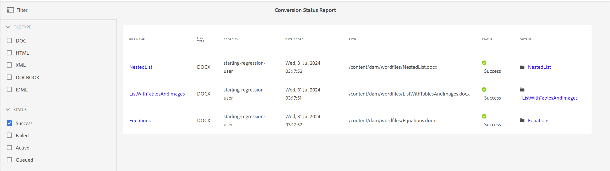

# Informe de estado de conversión {#id205BBA00WZZ}

Adobe Experience Manager Guides proporciona una función de conversión sólida para convertir documentos de diversos formatos a DITA. El informe de estado de conversión proporciona una vista consolidada de todas las tareas de conversión ejecutadas por Experience Manager Guides.

Siga estos pasos para ver el informe de estado de conversión:

1. Seleccione el logotipo de Adobe Experience Manager en la parte superior y elija **Herramientas**.

1. Seleccione **Guías** de la lista de herramientas.

1. Seleccione el mosaico **Informe de estado de conversión**.

   El informe de estado de conversión se muestra para todas las tareas de conversión ejecutadas en el sistema.

   {align="left"}

1. La página del informe se divide en dos partes:

   - **Filtro:**

     Puede filtrar los datos del informe en función del Tipo de archivo y el Estado de conversión. En Tipo de archivo, puede elegir ver los datos del informe para el documento de Word, HTML estructurado, XML, DocBook y tipo IDML de documentos. En Estado, puede elegir ver los datos del informe de las tareas que se han ejecutado correctamente, con error, activas o en cola.

     La siguiente captura de pantalla muestra los datos del informe de las tareas de conversión que tienen el estado Correcto.

     {align="left"}

   - **Datos del informe:**

     Los datos del informe contienen las columnas siguientes:

      - **Nombre de archivo**: Nombre del archivo de origen en el que se ejecutó el proceso de conversión. Al seleccionar el vínculo Nombre de archivo, se le lleva a la ubicación del documento de origen.

      - **Tipo de archivo**: tipo de documento de origen, que puede ser Word, HTML estructurado, XML, IDML y DocBook.

      - **Agregado por**: nombre del usuario que ejecutó la tarea de conversión.

      - **Fecha de incorporación**: Fecha en la que se ejecutó la tarea. Al seleccionar en el vínculo Fecha de incorporación, se descarga el archivo de registro.

      - **Ruta**: Ruta de acceso completa del documento de origen.

      - **Estado**: estado de las tareas de conversión: correcto, fallido, activo o en cola.

      - **Salida**: ruta del documento convertido correctamente. La selección en el vínculo Output le lleva a la ubicación en la que se guarda la salida.

**Tema principal:**&#x200B;[ Introducción a los informes](reports-intro.md)
