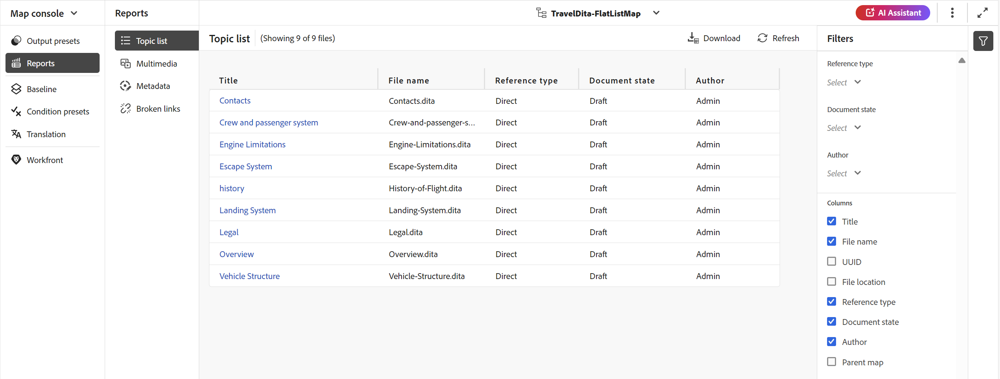
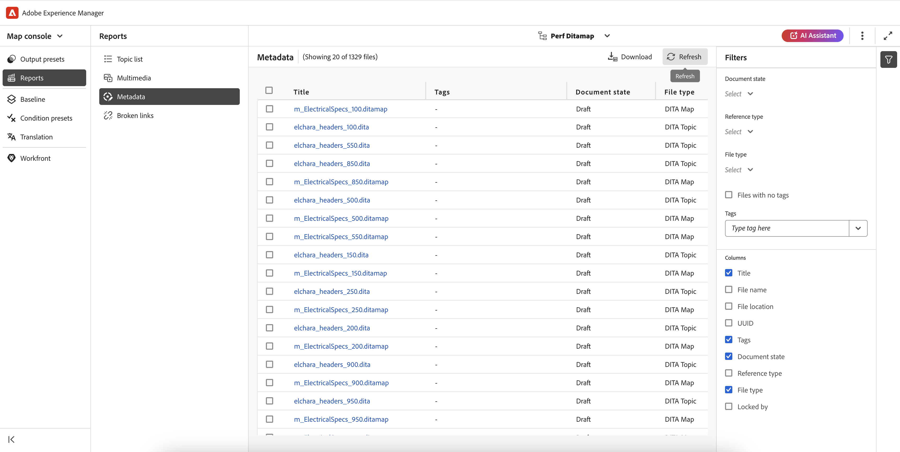

# Informe de asignación DITA desde la consola Mapa {#id231HF0Z0NXA}

Adobe Experience Manager Guides viene con una función en la consola Mapa que le permite comprobar la integridad general del mapa y generar informes para él.

Puede ver la lista de temas, administrar los metadatos de todas las referencias, ver la lista multimedia y corregir todos los vínculos rotos para el mapa actual desde la pestaña **Informes** en la consola de mapas, a la que puede acceder de la siguiente manera:

1. En el panel **Repositorio**, abra el archivo de mapa DITA en la vista Mapa.

   >[!NOTE]
   >
   > También puede abrir un mapa DITA directamente en la ficha **Consola de mapas** de la lista desplegable situada en la parte superior izquierda de la página principal.

1. Seleccione el icono **Abrir en la consola de mapas**.

   {width="600" align="left"}

1. Seleccione **Informes** en el panel izquierdo.

Puede localizar los cuatro informes en el panel **Informes**. En función de sus necesidades, puede seleccionar cualquiera de los informes que se muestran aquí.

{align="left"}

El panel Informes proporciona acceso a cuatro tipos diferentes de informes. Cada informe, junto con su accesibilidad y características, se analiza en detalle a continuación.

## Informe Lista de temas

El informe **Lista de temas** proporciona información detallada sobre los temas, como el tipo de referencia, el estado del documento y el autor.

Se puede ver el informe de lista de temas de un mapa realizando los siguientes pasos:

1. Seleccione **Lista de temas** en el panel Informes. Se mostrará la lista de temas presentes en el mapa DITA.

   {align="left"}

1. Desde el panel **Filtros**, puede filtrar los temas en función del **Tipo de referencia** \(directo o indirecto\), **Estado del documento** \(por ejemplo, si los temas están en estado Editar, En revisión o Revisado, se muestran\) o el **Autor** del tema.

   >[!NOTE]
   >
   > Todos los filtros proporcionan una lista exhaustiva de opciones presentes en el sistema.

1. También puede utilizar las siguientes opciones de filtrado de temas para elegir mostrar las siguientes columnas en la lista:

   - **Título** El título del tema se especifica en el mapa DITA. Puede seleccionar el tema para editarlo.
   - **Nombre de archivo** Nombre del archivo.
   - **UUID**: el identificador único universal \(UUID\) del archivo.
   - **Ubicación de archivo** Ruta de acceso completa del tema.
   - **Tipo de referencia** El tipo de referencia: directa o indirecta.
   - **Estado del documento**: el estado del tema.
   - **Autor**: el usuario que trabajó por última vez en el tema. La lista se pagina y se carga asincrónicamente, mostrando un conjunto limitado de usuarios a la vez y recuperando más a medida que se desplaza o navega. Esto mejora la velocidad de carga y el rendimiento general, especialmente cuando se trabaja con un gran número de usuarios.
   - **Mapa principal** Lista de todas las asignaciones en las que se hace referencia directamente al tema.
   >[!NOTE]
   >
   > Seleccione **Actualizar** para obtener una lista nueva de temas y ver cualquier cambio en el archivo de asignación o si se actualiza alguna referencia en el archivo de tema.

1. Seleccione **Descargar** para descargar la instantánea de todos los temas del mapa DITA. La hoja de Excel contiene las columnas seleccionadas y los temas filtrados en la vista **Lista de temas**.

## Informe de metadatos

El **informe de metadatos** proporciona un informe detallado de las referencias en el mapa DITA actual, como el tipo de referencia, el estado del documento, las etiquetas, la ubicación del archivo, etc.

Puede ver el informe de metadatos de un mapa realizando los siguientes pasos:

1. Seleccione **Metadatos** del panel Informes. La lista de todas las referencias de un mapa se muestra junto con sus metadatos, como etiquetas, estado del documento o metadatos personalizados. Para agregar una nueva columna de metadatos personalizada, consulte [Agregar columnas de metadatos personalizadas](#add-custom-metadata-columns).

   {align="left"}

1. Desde el panel **Filtros**, puede filtrar los temas según el **estado del documento** \(por ejemplo, si los temas están en estado Editar, En revisión o Revisado, se muestran\), **Referencias** \(directas o indirectas\), **Tipo de archivo** \(Mapa, Tema, Documento, Imagen, Vídeo y Otros\) de la referencia.

   >[!NOTE]
   >
   > Todos los filtros proporcionan una lista exhaustiva de opciones presentes en el sistema.

1. También puede elegir ver solamente los **archivos sin etiquetas** o también elegir etiquetas específicas del filtro **Etiquetas** para ver los archivos asociados con ellos.
1. También puede utilizar las siguientes opciones de filtrado de temas para elegir mostrar las siguientes columnas en la lista de metadatos:
   - **Título** \(seleccionado de forma predeterminada\) El título del archivo al que se hace referencia se especifica en el mapa DITA. Puede seleccionar el archivo para editarlo.

     >[!NOTE]
     >
     > También aparece un icono de desprotección cerca del título de un archivo desprotegido. Puede pasar el ratón sobre el icono para ver el nombre del usuario.

   - **Nombre de archivo** El nombre del archivo.
   - **Ubicación del archivo** Ruta de acceso completa del archivo.
   - **UUID**: el identificador único universal \(UUID\) del archivo.
   - **Etiquetas** \(seleccionadas de forma predeterminada\) Etiquetas aplicadas al archivo.

     >[!NOTE]
     >
     > De forma predeterminada, puede ver dos etiquetas para un archivo. Para ver más etiquetas, selecciona **Mostrar más**. Seleccione **Mostrar menos** para contraer de nuevo la lista.

   - **Estado del documento** \(seleccionado de forma predeterminada\) Estado actual del archivo de referencia.
   - **Tipo de referencia** El tipo de referencia: directa o indirecta
   - **Tipo de archivo** \(seleccionado de forma predeterminada\) Tipo de archivo de origen. Las opciones disponibles son Mapa, Tema e Imagen.
   - **Bloqueado por** El usuario que ha bloqueado el archivo.

1. Seleccione **Descargar** para descargar la instantánea de todas las referencias en el mapa DITA. La hoja de Excel contiene las columnas seleccionadas y las referencias filtradas en la vista **Metadatos**.

### Administrar metadatos por lotes desde el informe Metadatos

Puede aplicar etiquetas a un tema individual o utilizar la función de etiquetado masivo para aplicar varias etiquetas a varios temas, a un mapa DITA o a un submapa. También puede cambiar el estado del documento de todos los temas seleccionados al siguiente estado común posible del documento.

### Actualización de los metadatos

Para actualizar los metadatos, realice los siguientes pasos:

1. Para actualizar los metadatos, seleccione los archivos que desee actualizar. Puede seleccionar los archivos que aparecen en el panel Metadatos marcando la casilla que aparece junto a **Título**.

   Si desea seleccionar todos los registros, utilice la ficha **Seleccionar todo** situada encima de la barra de título. Dado que los registros se cargan progresivamente a medida que se desplaza, asegúrese de desplazarse hasta el final de la lista antes de utilizar **Seleccionar todo**. Esto garantiza que los permisos de edición y el estado de bloqueo se evalúen para todos los archivos, no solo para los registros visibles actualmente.

   >[!NOTE]
   >
   > Si un archivo está bloqueado por otro usuario, no se puede seleccionar para actualizar los metadatos. También aparece un icono de candado cerca del título de un archivo bloqueado. Puede pasar el ratón sobre el icono para ver el nombre del usuario.

   {align="left"}

1. Seleccione **Administrar** de la parte superior.

   {width="350" align="left"}

1. Si desea añadir nuevas etiquetas, seleccione nuevas etiquetas en la lista desplegable para aplicarlas a todos los temas seleccionados. También puede eliminar cualquier etiqueta seleccionando el icono en forma de cruz cerca de la etiqueta.

1. Seleccione un nuevo estado de documento si desea cambiar el estado del documento de todas las referencias seleccionadas. La lista desplegable muestra el estado posible común de todos los temas seleccionados. Por ejemplo, si el estado actual de los temas es En revisión, puede ver los estados Borrador, Aprobado o Revisado.
1. Seleccione **Actualizar** para actualizar los metadatos. Se muestra un mensaje de confirmación para los metadatos, tanto si se actualizan correctamente como si tienen actualizaciones fallidas. También seleccionó **Descargar informe** para descargar la instantánea del informe. Esta instantánea contiene los detalles del estado actualizado de las referencias seleccionadas.

### Añadir columnas de metadatos personalizadas

Esta función le permite agregar columnas de metadatos personalizadas según los requisitos, que luego se muestran en los informes de metadatos. También proporciona una mayor flexibilidad en la creación de informes de metadatos. Para agregar una nueva columna de metadatos personalizada, realice los siguientes pasos:

1. Para agregar una columna de metadatos personalizada, selecciona **Configuración de Workspace** (que aparece como **Configuración** para **Local**) en los tres puntos de la esquina superior derecha de la página de metadatos.

   {width="600" align="left"}

1. Seleccione **Metadatos** en el panel izquierdo de la ventana emergente que aparece.
1. Agregue un nuevo campo de metadatos personalizado según los requisitos usando la ficha **Agregar**.

   {width="600" align="left"}

1. Especifique una ruta de metadatos específica y un título apropiado para el mismo que desee agregar en el informe de columnas de metadatos. Por ejemplo, se agregan metadatos personalizados con el idioma del título y una ruta específica.

   >[!NOTE]
   >
   > Si desea eliminar una columna de metadatos determinada, puede eliminarla de la lista mostrada. Además, puede editar **Label** para modificar el título de la columna que se muestra.

   {width="600" align="left"}

1. Seleccione **Guardar** y **Actualizar** la vista de metadatos. Se agrega una nueva columna personalizada **Idioma** a la lista de columnas del panel Filtro.

   >[!NOTE]
   >
   > Añadir una nueva columna de metadatos también se reflejará en el panel **Historial de versiones** del Editor. Para obtener más información, vea **[Metadatos](web-editor-features.md)**.

   {width="600" align="left"}

Del mismo modo, puede seguir los pasos mencionados para agregar cualquier nuevo campo de metadatos personalizado en función de sus necesidades que se necesite en los informes de metadatos.

## Informe multimedia

El informe **Multimedia** proporciona información detallada sobre los archivos multimedia que se usan en el mapa, como el título, el tipo \(audio, vídeo e imágenes\), los archivos en los que se usa multimedia y el tipo de referencia de los archivos en los que se han usado. También puede ver el UUID y la ubicación del contenido multimedia dentro del repositorio. Para ver un informe del contenido multimedia, siga estos pasos:

1. Seleccione **Multimedia** en el panel Informe. Se mostrará la lista de elementos multimedia presentes en el mapa DITA.
1. Desde el panel **Filtros** puede ordenar la lista por contenido multimedia o por los nombres de los elementos utilizados en las referencias.

   - Cuando ordena por **Multimedia**, el nombre del contenido multimedia se muestra en la primera columna y, a continuación, los nombres de todas las referencias en las que se han utilizado se muestran en otra columna de la misma fila. Por ejemplo, la siguiente captura de pantalla muestra el archivo multimedia testSong.mp3 en la primera columna y dos referencias en las que se utiliza se muestran en la tercera columna de la misma fila.

     {width="650" align="left"}

   - Si ordena por **Usado en** columna, verá la vista transpuesta en la que los nombres de las referencias en las que se ha utilizado multimedia se enumeran en la primera columna, mientras que los nombres multimedia se enumeran en otra columna en filas separadas. Por ejemplo, la siguiente captura de pantalla muestra los nombres de dos referencias \(testing_direct y Video content Topic\) en la primera columna y el archivo multimedia testSong.mp3 se muestra en la tercera columna en dos filas independientes.

     {width="650" align="left"}

1. Puede filtrar su contenido multimedia según el **tipo multimedia** y el **tipo de referencia**. La lista de archivos multimedia se muestra en función de su selección en la lista desplegable. Por ejemplo, se puede elegir mostrar sólo las referencias de audio en el mapa DITA y un fichero sólo muestra las referencias de audio utilizadas en él.

1. También puede utilizar las siguientes opciones de filtrado para elegir mostrar las siguientes columnas en la lista:

   - **Multimedia** \(seleccionado de forma predeterminada\) El título del multimedia se especifica en el mapa DITA. Puede seleccionar el contenido multimedia para editarlo.
   - **Ubicación multimedia** Ruta de acceso completa de la multimedia.
   - **UUID multimedia**: El identificador único universal \(UUID\) del archivo.
   - **Tipo multimedia** \(seleccionado de forma predeterminada\) Tipo de multimedia. Las opciones disponibles son Audio, Vídeo o Imagen.
   - **Utilizado en** \(seleccionado de forma predeterminada\) Las referencias en las que se ha utilizado el contenido multimedia. Se puede seleccionar la referencia para editarla.
   - **Tipo de referencia** \(seleccionado de forma predeterminada\) El tipo de referencia: directa o indirecta.
   >[!NOTE]
   >
   > Seleccione **Actualizar** para obtener una lista nueva de contenido multimedia y ver cualquier cambio en el archivo de mapa o si se ha actualizado algún contenido multimedia del mapa DITA.

1. Seleccione **Descargar** para descargar la instantánea de todos los elementos multimedia del mapa DITA. La hoja de Excel contiene las columnas seleccionadas y los elementos multimedia filtrados en la vista **Multimedia**.

## Informe de vínculos rotos

Los **vínculos rotos** son un informe útil que proporciona los detalles de los vínculos rotos presentes en el mapa actual. Puede ver los vínculos rotos, que pueden ser para temas DITA, referencias de archivos multimedia, referencias de claves de contenido, etc. También tiene la capacidad de corregirlos aquí mismo.
El informe proporciona información detallada, como el vínculo roto, el tipo de vínculo, los archivos en los que se utiliza la referencia y el tipo de archivos en los que se ha utilizado.
Para ver el informe de los vínculos rotos, siga estos pasos:

1. Seleccione **Vínculos rotos** en el panel Informes. Se mostrará la lista de vínculos rotos o referencias presentes en el mapa DITA.
1. Desde el panel **Filtros** puede ordenar la lista por vínculos o por los nombres de los elementos utilizados en las referencias.

   - Cuando ordena por **vínculo roto**, las rutas de los vínculos rotos se muestran en la primera columna y, a continuación, los nombres de todas las referencias en las que se han utilizado se muestran en otra columna en filas independientes. Si se utiliza el mismo vínculo roto en varios archivos, estos se muestran en una fila y se muestran como filas agrupadas o secundarias. Por ejemplo, la siguiente captura de pantalla muestra dos vínculos rotos en la primera columna y la referencia en la que se utilizan; `m_ElectricalSpecs_900.ditamap` se muestra en la tercera columna en dos filas independientes.

   {align="left"}

   - Si ordena por **Utilizado en la columna**, verá la vista transpuesta en la que los nombres de las referencias en las que se han utilizado los vínculos rotos se enumeran en la primera columna, mientras que los vínculos rotos se enumeran en otra columna de la misma fila. Por ejemplo, la siguiente captura de pantalla muestra la referencia (en la que se utiliza el vínculo roto) `m_ElectricalSpecs_900.ditamap` en la primera columna y los vínculos rotos se muestran en la tercera columna de la misma fila.

   {align="left"}

1. Puede filtrar los vínculos rotos en función de **Tipo de archivo** y **Tipo de vínculo**. La lista de vínculos rotos se muestra según lo que haya seleccionado en la lista desplegable. Por ejemplo, se puede elegir mostrar únicamente las referencias de contenido en el mapa DITA y un fichero sólo muestra las referencias de contenido rotas utilizadas en él.

   El tema DITA, el mapa DITA, la referencia de archivo, la referencia de clave, la referencia de contenido, la referencia de clave de contenido, la referencia de imagen, la referencia de archivo multimedia y la referencia de clave multimedia son valores disponibles para la lista desplegable **Tipo de vínculo**, y Tema, mapa, documento, imagen, vídeo, audio y otros son valores disponibles para la lista desplegable **Tipo de archivo**.
1. También puede utilizar las siguientes opciones de filtrado para elegir mostrar las siguientes columnas en la lista:

   - **Vínculo roto** (seleccionado de forma predeterminada) La ruta del vínculo roto se especifica en el mapa DITA.

   - **Tipo de vínculo** (seleccionado de forma predeterminada) El tipo de vínculos. Las opciones disponibles son Tema, Mapa, Referencia de archivo, Referencia de clave, Referencia de contenido, Referencia de clave de contenido, Referencia de imagen, Referencia de archivo multimedia y Referencia de clave multimedia.

   - **Utilizado en** (seleccionado de forma predeterminada) Las referencias en las que se ha utilizado el vínculo roto. Puede seleccionar la referencia para verla en el modo Autor.

   - **Tipo de archivo** (seleccionado de forma predeterminada) El tipo de referencia: Tema, Mapa, Documento, Imagen, Vídeo, Audio y Otros.

   Seleccione **Actualizar** para obtener una lista nueva de vínculos rotos y ver cualquier cambio en el archivo de asignación o si se actualiza algún vínculo roto en el mapa DITA.
1. Puede seleccionar en el icono **Corregir vínculo** () para corregir el vínculo roto.

   >[!NOTE]
   >
   > Pase el ratón sobre la ruta del vínculo roto en la columna Vínculo interrumpido para ver el icono Corregir vínculo ().

   Puede corregir un vínculo en ambas vistas, cuando lo haya pedido **Vínculos rotos** o **Utilizado en**.

   >[!NOTE]
   >
   > Cuando arregla un enlace roto mientras ha ordenado por Enlaces rotos, el enlace será corregido en todos los archivos donde se utiliza (que se agrupan en una sola fila).

1. Debe actualizar los detalles de referencia necesarios en el cuadro de diálogo **Actualizar vínculo**. Los detalles requeridos en el cuadro de diálogo **Actualizar vínculo** dependerían del tipo de referencia.\
   Una vez corregido un vínculo, no se muestra en la lista de vínculos rotos. En su lugar, puede verlo en la Lista de temas o en Metadatos.

1. Seleccione **Descargar** para descargar la instantánea de todos los vínculos rotos del mapa DITA. El archivo de Excel contiene las columnas seleccionadas y los vínculos rotos filtrados en la vista Vínculos rotos.

**Tema principal:**[ Introducción a los informes](reports-intro.md)
