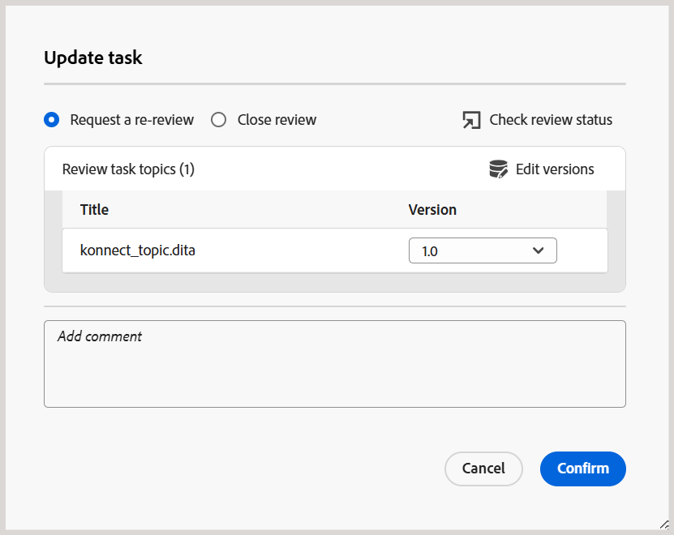

# Solicitar una revisión o cerrar una tarea de revisión como autor

>[!IMPORTANT]
>
> Las nuevas funciones descritas en este artículo se habilitan de forma predeterminada con la versión 2508 de Experience Manager Guides as a Cloud Services. Las revisiones creadas antes de la migración no se ven afectadas y seguirán utilizando el flujo de trabajo anterior. Si prefiere seguir utilizando las funciones existentes sin estas actualizaciones, póngase en contacto con el equipo de éxito del cliente para que se deshabiliten las nuevas funciones.

Cuando un revisor marca una tarea de revisión como completada, se activa una notificación para el iniciador de la tarea, lo que les permite acceder y revisar la tarea y los comentarios de nivel de tarea relacionados.

Como iniciador de la tarea de revisión, puede decidir cómo proceder en función de los comentarios. Las opciones disponibles son:

- Solicitar una nueva revisión
- Cerrar la tarea de revisión

## Solicitar una nueva revisión o cerrar una tarea de revisión

Realice los siguientes pasos para solicitar una nueva revisión o cerrar una tarea de revisión:

1. Abra la tarea Revisar en el editor.
2. En el panel Revisar, seleccione la tarea de revisión de la lista **Tareas activas**.

   >[!NOTE]
   >
   > También puede abrir la tarea en el panel de tareas para obtener una vista más completa. Para ello, seleccione **Abrir en el panel de tareas** del menú Opciones de cualquier tarea de revisión activa. Se abrirán los detalles de la tarea en la consola Proyectos.

   
3. Seleccione el cuadro de diálogo **Comentarios de la tarea** para acceder y revisar los comentarios de nivel de tarea agregados por el revisor.

   .

   El cuadro de diálogo **Comentarios de la tarea** se muestra a la derecha.

   {width="350" align="left"}.
4. Seleccione **Actualizar tarea** para realizar más acciones en la tarea de revisión seleccionada.
5. En el cuadro de diálogo **Actualizar tarea**, elija una de las siguientes acciones:

   - **Solicitar nueva revisión**: inicia otra ronda de revisión. Puede seleccionar una versión diferente del tema para revisarlo. De forma predeterminada, está seleccionada la última versión (o la última versión editada) del tema o archivo de asignación enviado para su revisión. Los revisores que hayan completado la revisión anterior recibirán una notificación para proporcionar comentarios sobre la versión actualizada. A otros revisores que no hayan marcado la tarea de revisión como completada se les notifica la actualización del tema.

   - **Cerrar revisión**: Cierra la tarea de revisión. El botón **Actualizar tarea** presente en la parte inferior del panel Revisar cambia a **Cerrada** y se envía una notificación a todos los usuarios involucrados en la tarea de revisión indicando su cierre.

   Para obtener más información sobre el déclencheur de las notificaciones de revisión, consulte [Explicación de las notificaciones de revisión](./review-understanding-review-notifications.md).

   .

6. Seleccione **Confirmar**.

Como autor o iniciador de una tarea de revisión, al cerrar la tarea, el botón **Actualizar tarea** presente en la parte inferior del panel Revisar se cambia a **Cerrada**, lo que indica que la tarea ya no está activa.

{width="350" align="left"}

Además, el botón **Actualizar tarea** presente en el panel Revisar permanece deshabilitado para los demás usuarios de la tarea de revisión. Por ejemplo, como uno de los revisores de una tarea de revisión, si abre la tarea en el Editor, el botón Actualizar tarea se deshabilitará con un mensaje **No tiene permiso para realizar esta tarea**. Solo el iniciador de una tarea de revisión tiene permiso para actualizar la tarea desde el Editor.

{width="350" align="left"}