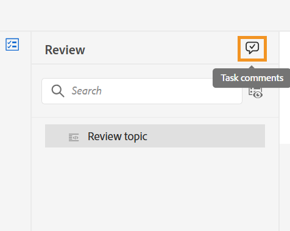

# Completar la tarea de revisión como revisor

>[!IMPORTANT]
>
> Las nuevas funciones descritas en este artículo se habilitan de forma predeterminada con la versión 2508 de Experience Manager Guides as a Cloud Service. Las revisiones creadas antes de la migración no se ven afectadas y seguirán utilizando el flujo de trabajo anterior. Si prefiere seguir utilizando las funciones existentes sin estas actualizaciones, póngase en contacto con el equipo de éxito del cliente para que se deshabiliten las nuevas funciones.

Como revisor, puede marcar una tarea de revisión como completada una vez que haya revisado todo el contenido y desee notificarlo al autor. También puede dejar cualquier comentario final en este momento.

Siga estos pasos para completar una tarea de revisión:

1. Abra la tarea de revisión asignada.
2. Seleccione **Marcar como listo** en la parte superior como se muestra a continuación:

   {width="350" align="left"}

   Se muestra el cuadro de diálogo **Completar tarea**.
3. En el cuadro de diálogo **Completar tarea**, agregue los comentarios finales para el autor y seleccione **Completar**.

   >[!NOTE]
   >
   > Los comentarios de nivel de tarea sirven como resumen o comentarios finales y son distintos de los comentarios de nivel de texto agregados durante la revisión del tema. En este cuadro de diálogo, puede esbozar acciones de seguimiento como solicitar al autor que dirija comentarios específicos y reenvíe la tarea para su revisión o indicar que la revisión ha finalizado.

   Por ejemplo, como revisor, puede agregar un comentario como acción de seguimiento para el autor:

   {width="350" align="left"}

   O bien, agregue un comentario para indicar la finalización de la tarea, como se muestra a continuación:

   {width="350" align="left"}

Ha marcado correctamente la tarea como completada y su estado ahora se establece en **Completada**. No se permiten más acciones una vez que la tarea se marca como completada. Se envía una notificación al autor o al iniciador de la tarea de revisión para llamar su atención inmediatamente. Para obtener más información sobre el déclencheur de las notificaciones de revisión, consulte [Explicación de las notificaciones de revisión](./review-understanding-review-notifications.md).

{width="350" align="left"}

En función de los comentarios, si el autor o el iniciador de la tarea decide [cerrar la tarea de revisión](./review-close-review-task.md), el estado de la tarea en la interfaz de usuario de revisión cambia a **Cerrada**.

{width="350" align="left"}

## Ver comentarios de nivel de tarea

Todos los comentarios de nivel de tarea se muestran en el cuadro de diálogo **Comentarios sobre tareas**, que está disponible en el modo de solo lectura. Cuando complete una tarea de revisión con un comentario final, la entrada se registra en este cuadro de diálogo para referencia futura.

Para acceder a los comentarios de nivel de tarea desde la interfaz de usuario de revisión, vaya al panel izquierdo y seleccione el icono **Comentarios de tarea**.

{width="350" align="left"}

El cuadro de diálogo **Comentarios de la tarea** se muestra a la derecha.

{width="350" align="left"}

Los comentarios del cuadro de diálogo se muestran en orden cronológico, con los comentarios recientes apareciendo primero y los más antiguos apareciendo últimos. Este orden le ayuda a seguir la conversación a medida que progresa con el tiempo.

El cuadro de diálogo **Comentarios de la tarea** es accesible para todos los usuarios involucrados en la tarea de revisión, incluidos el autor o iniciador de la tarea de revisión y otros revisores. Por lo tanto, los comentarios de otros revisores (si están implicados) también pueden aparecer en el cuadro de diálogo Comentarios sobre la tarea. Esto ayuda a garantizar una comunicación clara y rastreable a lo largo del proceso de revisión.

Después de revisar los comentarios de nivel de tarea, el autor puede solicitar una nueva revisión o cerrar la tarea de revisión. En ambos casos, todos los comentarios capturados durante el proceso de revisión permanecen disponibles en el cuadro de diálogo **Comentarios de la tarea** como referencia.
