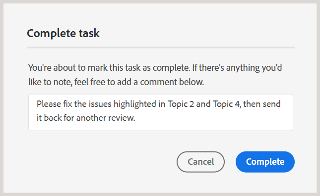

# Completar la tarea de revisión como revisor

Como revisor, puede marcar una tarea de revisión como completada una vez que haya revisado todo el contenido y desee notificarlo al autor. También puede dejar cualquier comentario final en este momento.

Siga estos pasos para completar una tarea de revisión:

1. Abra la tarea de revisión asignada.
2. Seleccione **Marcar como listo** en la parte superior como se muestra a continuación:

   {width="350"}

   Se muestra el cuadro de diálogo **Completar tarea**.
3. En el cuadro de diálogo **Completar tarea**, agregue los comentarios finales para el autor y seleccione **Completar**.

   >[!NOTE]
   >
   > Los comentarios de nivel de tarea sirven como resumen o comentarios finales y son distintos de los comentarios de nivel de texto agregados durante la revisión del tema. En este cuadro de diálogo, puede esbozar acciones de seguimiento como solicitar al autor que dirija comentarios específicos y reenvíe la tarea para su revisión o indicar que la revisión ha finalizado.

   Por ejemplo, como revisor, puede agregar un comentario como acción de seguimiento para el autor:

   {width="350"}

   O bien, agregue un comentario para indicar la finalización de la tarea, como se muestra a continuación:

   {width="350"}

Ha marcado correctamente la tarea como completada y su estado ahora se establece en **Completada**. No se permiten más acciones una vez que la tarea se marca como completada. Se envía una notificación al autor o al iniciador de la tarea de revisión para llamar su atención inmediatamente. Para obtener más información sobre el déclencheur de las notificaciones de revisión, consulte [Explicación de las notificaciones de revisión](./review-understanding-review-notifications.md).

{width="350"}

En función de los comentarios, si el autor o el iniciador de la tarea decide [cerrar la tarea de revisión](./review-close-review-task.md), el estado de la tarea en la interfaz de usuario de revisión cambia a **Cerrada**.

{width="350"}

>[!NOTE]
>
> La sincronización de tareas entre la IU de revisión y la bandeja de entrada de AEM está disponible y habilitada de forma predeterminada. Cuando un revisor marca una tarea de revisión como **Completada** en la interfaz de usuario de revisión, la tarea correspondiente se completa automáticamente y se quita de la bandeja de entrada de AEM del revisor. Del mismo modo, al completar una tarea desde la bandeja de entrada AEM, se marca automáticamente como completada en la interfaz de usuario de revisión.
>
> El autor o el iniciador de la tarea pueden seguir revisando los comentarios y reasignando la tarea si se requiere una revisión adicional. Cuando se reasigna una tarea, se genera una nueva notificación en la bandeja de entrada AEM para el revisor, que permite volver a revisar la tarea.
>
> Si desea utilizar el comportamiento anterior, en el que las tareas de revisión completadas permanecen en la Bandeja de entrada de AEM del revisor hasta que el autor o el iniciador de la tarea revisa los comentarios y cierra la tarea de revisión, póngase en contacto con el equipo de éxito del cliente para deshabilitar la sincronización de tareas.

## Ver comentarios de nivel de tarea

Todos los comentarios de nivel de tarea se muestran en el cuadro de diálogo **Comentarios sobre tareas**, que está disponible en el modo de solo lectura. Cuando complete una tarea de revisión con un comentario final, la entrada se registra en este cuadro de diálogo para referencia futura.

Para acceder a los comentarios de nivel de tarea desde la interfaz de usuario de revisión, vaya al panel izquierdo y seleccione el icono **Comentarios de tarea**.

{width="350"}

El cuadro de diálogo **Comentarios de la tarea** se muestra a la derecha.

{width="350"}

Los comentarios del cuadro de diálogo se muestran en orden cronológico, con los comentarios recientes apareciendo primero y los más antiguos apareciendo últimos. Este orden le ayuda a seguir la conversación a medida que progresa con el tiempo.

El cuadro de diálogo **Comentarios de la tarea** es accesible para todos los usuarios involucrados en la tarea de revisión, incluidos el autor o iniciador de la tarea de revisión y otros revisores. Por lo tanto, los comentarios de otros revisores (si están implicados) también pueden aparecer en el cuadro de diálogo Comentarios sobre la tarea. Esto ayuda a garantizar una comunicación clara y rastreable a lo largo del proceso de revisión.

Después de revisar los comentarios de nivel de tarea, el autor puede solicitar una nueva revisión o cerrar la tarea de revisión. En ambos casos, todos los comentarios capturados durante el proceso de revisión permanecen disponibles en el cuadro de diálogo **Comentarios de la tarea** como referencia.

## Delegar una tarea de revisión a otro revisor

>[!IMPORTANT]
>
> Esta función está habilitada de forma predeterminada. Si prefiere no utilizar esta función en su entorno, póngase en contacto con el equipo de éxito del cliente.

Como Revisor, es posible que a veces desee que otro usuario evalúe una revisión antes de que vuelva al Autor. Por ejemplo, si parte del contenido queda fuera de su experiencia, o si desea obtener una segunda opinión antes de marcar la tarea como **Completada**. En lugar de enrutar esto a través de un administrador de proyecto, puede recomendar un revisor directamente desde la tarea de revisión mediante la opción **Delegar**.

Seleccionar **Delegar** no completa la tarea de revisión en su nombre. Envía la recomendación al autor (iniciador de la tarea), que decide si se agrega el revisor recomendado a la tarea.

Realice los siguientes pasos para delegar una tarea de revisión:

1. Abra la tarea de revisión asignada.
2. Una vez que hayas revisado el contenido, selecciona **Delegar** junto a **Marcar como listo**.

   {width="350"}

3. Se muestra el cuadro de diálogo **Recomendar revisor**. Seleccione un usuario de la lista desplegable para recomendarlo como revisor para esta tarea.

   {width="350"}

4. *(Opcional)* Agregue un comentario para el autor, para el contexto.
5. Seleccione **Delegar**.

Se envía una notificación al autor para indicar que ha solicitado agregar un revisor a la tarea. Para obtener detalles sobre cómo responde el autor a esta solicitud, vea [Solicitar una revisión o cerrar una tarea de revisión como autor](./review-close-review-task.md).

