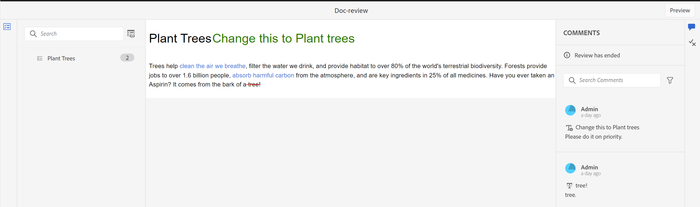

# Ver una tarea de revisión finalizada

Puede completar las tareas de revisión de los proyectos de los que sea autor (o iniciador). Una vez finalizada una tarea de revisión, usted y todos los revisores pueden acceder a ella en modo de solo lectura.

## Como revisor

Como revisor, puede ver un indicador en el panel de comentarios que indica que la revisión ha finalizado. La barra de herramientas de comentarios no se muestra, por lo que no puede resaltar, tachar, insertar texto ni agregar comentarios. Puede leer un comentario, pero no puede editar ni eliminar ningún comentario. Tampoco puede agregar una respuesta a los comentarios. No puede ver la barra de herramientas contextual (utilizada para resaltar o tachar texto). El icono de comentarios obsoletos tampoco se muestra en una tarea de revisión finalizada.

Sin embargo, puede buscar o filtrar cualquier comentario. También puede elegir mostrar u ocultar condiciones y mostrar contenido condicionado en consecuencia. Puede descargar los archivos adjuntos, pero no puede cargarlos ni eliminarlos para los comentarios.

## Como autor

Puede ver las tareas de revisión completadas en el panel **Revisar** a nivel de proyecto desde la sección **Tareas cerradas**, como se muestra en la captura de pantalla. Puede buscar o filtrar tareas de revisión en función de los proyectos. Por ejemplo, puede seleccionar proyectos específicos en el cuadro de diálogo **Filtro** y mostrarlos en el Panel de revisión activo. Puede filtrar aún más los resultados usando las **Tareas iniciadas por mí** y las opciones **Mostrar solo las tareas activas**.

En el caso de las tareas de revisión cerradas, puede leer un comentario, pero no puede aceptarlo ni rechazarlo. No puede editar ni eliminar ningún comentario. Tampoco puede añadir ninguna respuesta para el comentario. El icono Comentarios obsoletos y el icono Importar comentarios en la vista de autor no se muestran para una tarea de revisión completada. El icono Revertir tema y el icono Importar se desactivan después de que se complete la tarea de revisión como se muestra en la captura de pantalla.

También puede buscar o filtrar cualquier comentario presente en el panel Revisar. Puede descargar los archivos adjuntos, pero no puede cargarlos ni eliminarlos para los comentarios.

Por lo tanto, tanto como revisor como autor, puede ver el contenido revisado junto con los comentarios, pero no puede realizar ningún cambio en una tarea de revisión completada.
