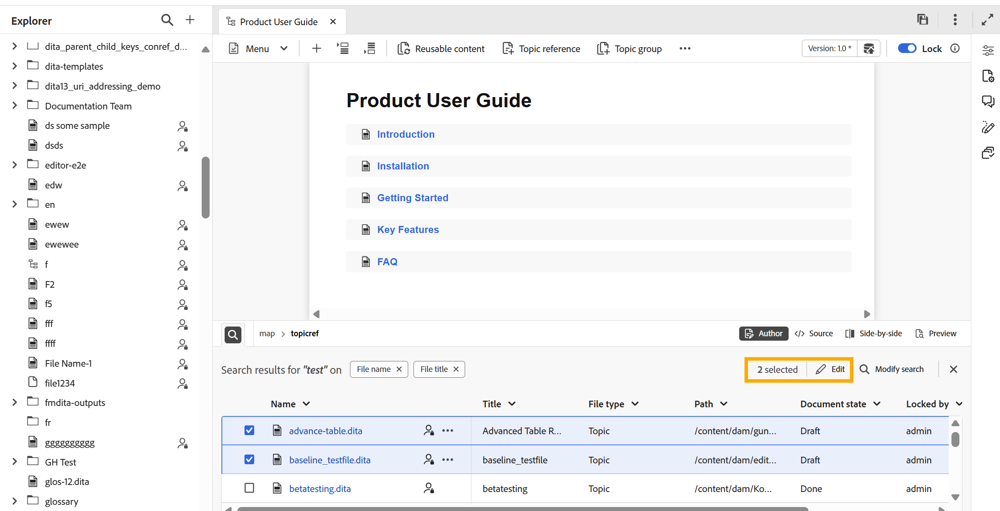
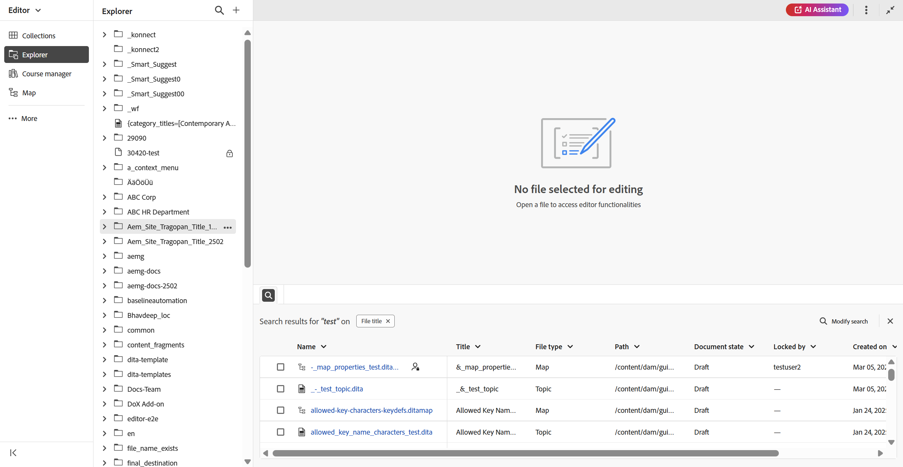

# Panel Buscar

>[!INFO]
>
>Este tema se aplica tanto al Editor nuevo como al Editor antiguo. Aunque la funcionalidad principal sigue siendo coherente, las diferencias en la interfaz de usuario, la terminología y las interacciones se indican dentro del contenido mediante pestañas y llamadas, según corresponda.

El panel Buscar del Editor mejora la productividad al proporcionar un acceso rápido a un subconjunto de archivos, que se muestran según los términos de búsqueda o los filtros aplicados al editar contenido. Le ayuda a abrir fácilmente uno o varios archivos buscados o a utilizarlos dentro de un archivo existente simplemente arrastrando y soltando en un tema o mapa. Puede encontrar el **panel Buscar** en la parte inferior del Editor.

Se puede acceder al panel Buscar desde los siguientes puntos:

- **Interfaz del editor**: seleccionando el **icono de búsqueda** del **panel Explorador** o utilizando el **icono de búsqueda** de la esquina inferior izquierda del **área de edición de contenido**. Para obtener más información, vea [Buscar en el panel Explorador](#search-from-the-explorer-panel).

  

- **Página de inicio**: se usa la opción **Mostrar en el panel de búsqueda** al navegar desde la interfaz del repositorio en la página de inicio. Para ver los detalles, [busque en el repositorio](#search-from-the-repository-interface-on-the-home-page).

  

## Ventajas principales

- Vista centralizada de todos los resultados de búsqueda para facilitar la referencia.
- Funcionalidad de arrastrar y soltar para insertar referencias directamente en el tema o mapa actual.
- Opciones flexibles para modificar o perfeccionar las búsquedas sin salir del Editor.

## Buscar en el panel Explorador

Al trabajar en la interfaz del editor, puede filtrar el conjunto de archivos para ver un subconjunto de los archivos relevantes que necesite. Siga estos pasos para buscar archivos desde el Explorador:

1. Seleccione el icono **Buscar** de la esquina superior derecha del **panel Explorador** o el icono **Buscar** presente en la parte inferior izquierda del **área de edición de contenido**. Esto abre el cuadro de diálogo **Buscar repositorio**, que ofrece la misma experiencia de búsqueda y filtrado que la interfaz del Repositorio en la página de inicio.

   >[!NOTE]
   >
   >Si hay algunos resultados de búsqueda presentes en la sesión actual, al seleccionar el **icono Buscar** en el Explorador o el que se encuentra en la parte inferior izquierda del área de edición de contenido, simplemente se abrirá el panel que muestra esos resultados anteriores. Para actualizar o restringir las búsquedas, seleccione **Modificar búsqueda**.

   

2. Realice la búsqueda y aplique los filtros según sea necesario. Para obtener instrucciones detalladas sobre las opciones de búsqueda y filtrado, consulta [Buscar y filtrar la experiencia](./home-page-repository-view.md#search-and-filter-experience).

3. Una vez completada la búsqueda, selecciona **Mostrar en el panel Buscar**. Las búsquedas recientes aparecerán en el panel Buscar de la parte inferior del Editor.

   

4. Para actualizar los resultados de búsqueda, selecciona la opción **Modificar búsqueda** en el panel Buscar y actualiza los criterios para obtener nuevos resultados.

   

Una vez que los resultados de la búsqueda se muestran en el panel Buscar, puede trabajar con ellos, ya sea abriendo y editando uno o varios archivos directamente desde el panel o arrastrando y soltando los archivos seleccionados en un tema o mapa existente para agregar referencias.

>[!BEGINTABS]

>[!TAB Nuevo editor]

>[!TAB Editor antiguo]

>[!ENDTABS]

## Buscar desde la interfaz de Repositorio en la página Inicio

Cuando realiza una búsqueda y aplica filtros en la interfaz del repositorio en la página principal, al seleccionar **Mostrar en el panel de búsqueda**, se le redirigirá a la interfaz del editor. Todos los resultados de búsqueda se reflejarán en el panel Buscar en la parte inferior de la interfaz del editor.

Desde el panel Buscar, puede **arrastrar y soltar** archivos en el tema actual para adjuntar referencias sin problemas o editar varios archivos al mismo tiempo. Además, puede restringir los resultados de búsqueda mediante la opción **Modificar búsqueda** disponible en el panel Buscar.

