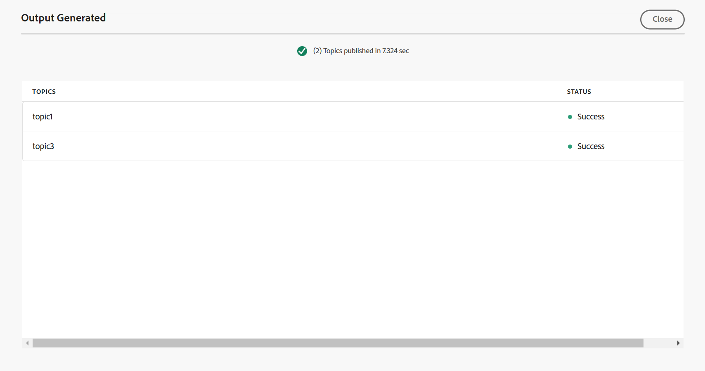

# Cree ajustes preestablecidos de salida para la base de conocimiento desde el editor {#id218CL400JW3}

Realice los siguientes pasos para crear ajustes preestablecidos de salida para el mapa DITA:

1. En la interfaz de usuario de Assets, vaya al archivo de asignación que desee editar.

1. Para obtener un bloqueo exclusivo en el archivo de asignación, selecciónelo y seleccione **Retirar**.

1. Seleccione la opción **Editar temas** en el menú de acción del archivo de asignación.

   El archivo de mapa se abre para editarlo en el Editor.

   >[!NOTE]
   >
   > Puede añadir o eliminar cualquier tema del mapa mediante el Editor de mapas avanzado. Para obtener más información, vea [Trabajar con el editor de mapas avanzado](map-editor-advanced-map-editor.md#).

1. Seleccione el icono **Abrir en la consola de mapas**. El mapa se abre en la consola de mapas.

1. Vaya a la pestaña **Ajustes preestablecidos de salida** y seleccione el icono + para crear un ajuste preestablecido de salida para el mapa DITA.

1. Seleccione **Base de conocimiento** de la lista desplegable **Tipo**, escriba el nombre y seleccione **Adobe Experience Manager** en el cuadro de diálogo **Nuevo ajuste preestablecido de salida**.
1. Seleccione la opción **Agregar al perfil de carpeta actual** para crear un ajuste preestablecido de salida para el perfil de carpeta actual. El icono  indica un ajuste preestablecido de nivel de perfil de carpeta.

   Obtenga más información acerca de [Administrar ajustes preestablecidos de salida de perfil global y de carpeta](./web-editor-manage-output-presets.md).

1. Seleccione **Añadir**.

   Se crea el ajuste preestablecido de la Base de conocimiento.

   {align="left"}

Una vez creado el ajuste preestablecido, puede generar la salida para artículos específicos de la base de conocimiento. Para ello, vaya a la pestaña **Articles** y seleccione los temas para los que desea generar la salida.
1. Seleccione **Generar salida** en la parte superior para generar la salida.

   {align="left"}

1. En el mensaje **Confirmar archivos para publicar**, seleccione los archivos que desee publicar y confirme seleccionando **Publicar**.

   {align="left"}

Verá el estado del proceso de generación de resultados. La columna **Temas** enumera los temas para los que se genera la salida, mientras que la columna **Estado** muestra el estado de publicación de cada tema.

{align="left"}

Para ver el resultado, cierre el cuadro de diálogo Resultado generado y seleccione **Ver resultado** en la página preestablecida.

>[!NOTE]
>
> También puede Cambiar nombre, Duplicar o Eliminar un ajuste preestablecido de salida existente desde el menú Opciones.

**Tema principal:**[ Publicación basada en artículos desde el editor](web-editor-article-publishing.md)
