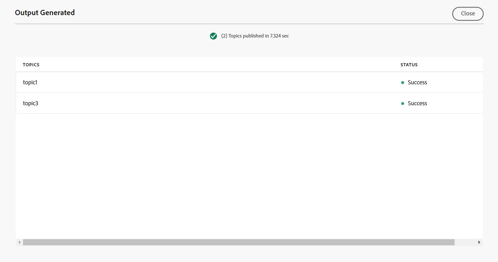

# Generar salida de la base de conocimiento {#id218CL05J0M1}

Adobe Experience Manager Guides incluye una función de publicación basada en artículos que permite a los usuarios publicar uno o más artículos de la Base de conocimiento simultáneamente.

Este motor también incluye una plantilla de contenido OOTB, basada en los componentes principales de Adobe Experience Manager, que permite a los usuarios crear un repositorio basado en el conocimiento del contenido técnico. Esta plantilla se puede personalizar para adaptarla a las necesidades de los clientes. Este motor permite a los usuarios crear el mapa DITA de forma aditiva y publicar temas cuando estén listos.

Si ha actualizado el contenido sólo para algunos temas del mapa DITA, no siempre tiene que publicar todo el mapa. Puede seleccionar y publicar solo los temas actualizados.

Para la publicación basada en artículos, debe crear el ajuste preestablecido de salida para el mapa DITA de la base de conocimiento. El mapa debe incluir los temas que desea publicar. También puede aplicar condiciones y especificar los detalles de AEM Sites para el ajuste preestablecido de salida. A continuación, puede generar resultados mediante la característica **Generar resultados**.

Siga estos pasos para generar resultados basados en artículos:

1. [Crear el ajuste preestablecido de Knowledge Base](./generate-output-knowledge-base.md) para la salida basada en artículos.
1. Vaya a la pestaña **Artículos** y seleccione los temas para los que desea generar la salida.
1. Seleccione **Generar salida** en la parte superior para generar la salida.

   {align="left"}

1. En el mensaje **Confirmar archivos para publicar**, seleccione los archivos que desee publicar y confirme seleccionando **Publicar**.

   {align="left"}

   Verá el estado del proceso de generación de resultados. La columna **Temas** enumera los temas para los que se genera la salida, mientras que la columna **Estado** muestra el estado de publicación de cada tema.

   {align="left"}

   Para ver la salida, cierre el cuadro de diálogo **Salida generada** y seleccione **Ver salida** en la página preestablecida.

   >[!NOTE]
   >
   > También puede Cambiar nombre, Duplicar o Eliminar un ajuste preestablecido de salida existente desde el menú Opciones.

**Tema principal:**[ Trabajar con el editor](web-editor.md)
