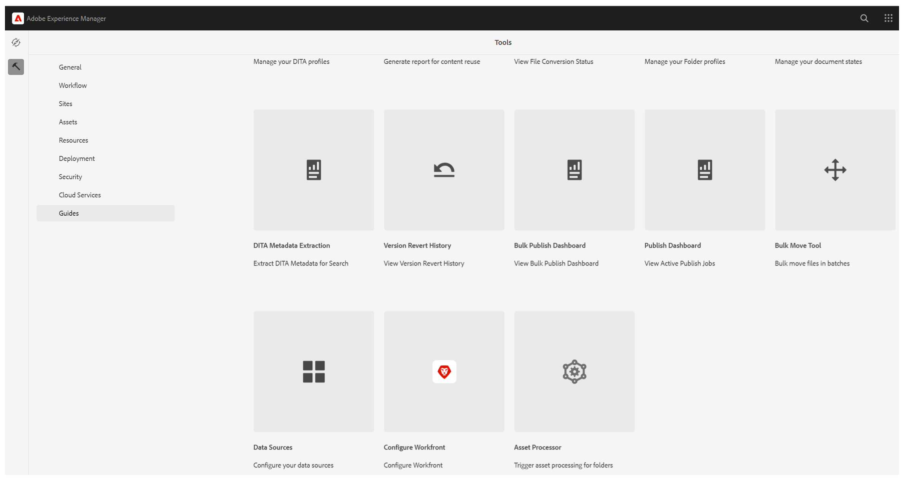

# Nueva línea de base (Beta) en Experience Manager Guides

>[!NOTE]
>
> Este artículo se aplica a la nueva línea de base , actualmente disponible como característica de *Beta*, que ofrece un rendimiento y una estabilidad mejorados con la versión de Experience Manager Guides 2026.03.0. Para habilitar la nueva función de línea de base en la configuración, póngase en contacto con el equipo de éxito del cliente.

La nueva función de línea de base aborda los problemas críticos de fiabilidad y rendimiento asociados con mapas grandes y complejos. Viene con una arquitectura de línea de base rediseñada que ofrece una experiencia de línea de base más rápida, estable y coherente.

El nuevo modelo de línea de base fortalece el manejo de la línea de base al abordar los puntos de dolor comunes:

- Carga lenta y respuesta deficiente al trabajar con líneas de base grandes
- Estados de línea base incoherentes causados por actualizaciones parciales o validaciones fallidas
- Visibilidad y control limitados al administrar contenido de línea de base extenso
- Cuellos de botella de rendimiento durante la creación, las actualizaciones o las regeneraciones de la línea de base

En las secciones siguientes se describe el nuevo modelo de línea de base, incluidas las mejoras que introduce, los cambios de comportamiento clave que se deben tener en cuenta antes de la migración y las instrucciones para migrar a y utilizar la nueva línea de base:

- [Mejoras clave introducidas en la nueva línea de base](#key-enhancements-introduced-in-the-new-baseline)
- [Cambios de comportamiento que se deben conocer antes de migrar a la nueva línea de base](#behavior-changes-to-know-before-migrating-to-the-new-baseline)
- [Migrar a la nueva línea base](#migrate-to-new-baseline)
- [Usar la nueva línea base](#use-the-new-baseline)

## Mejoras clave introducidas en la nueva línea de base

La nueva línea de base introduce mejoras significativas que hacen que la administración de la línea de base sea más rápida y fácil de escalar sin cambiar la forma en que trabaja. Considere la posibilidad de pasar a la nueva línea de base para:

- **Rendimiento y escalabilidad mejorados:** El modelo de datos de línea de base y el comportamiento de procesamiento se han optimizado para escalar eficazmente con líneas de base grandes, utilizando carga incremental y una estructura de datos optimizada para mejorar la capacidad de respuesta.
- **Consistencia más sólida en la interfaz de usuario y el servidor:** Cualquier cambio realizado en una línea de base (como actualizaciones de versión o dependencia) ahora se reflejará en la interfaz de usuario solo después de una validación correcta del servidor, lo que impide la creación de líneas de base no válidas.
- **Filtrado, ordenación y navegación:** Las líneas de base admiten un filtrado completo en varios atributos, incluidos el estado del documento, las etiquetas, el tipo de archivo, el tipo de referencia y la búsqueda basada en GUID en toda la línea de base. La paginación es compatible con líneas de base grandes, con la opción de incluir archivos sin etiquetas.
- **Borrar visibilidad sobre el impacto de la dependencia:** El impacto de la dependencia (para dependencias agregadas o eliminadas) se muestra como una vista previa antes de que se apliquen los cambios de versión, lo que le permite revisar los cambios antes de aplicarlos.
- **Administración de etiquetas más flexible:** Las etiquetas se pueden mover de una versión a otra dentro de una línea de base, lo que proporciona mayor flexibilidad al administrar etiquetas en distintas versiones de temas.
- **Comportamiento determinístico de edición y guardado:** las ediciones de línea de base admiten actualizaciones a nivel de fila, cargan datos de uso intensivo de recursos (como árboles de versiones y diferencias de dependencia) solo durante las actualizaciones de versión y completan operaciones de guardado de forma determinista en un solo paso, lo que reduce los errores de guardado inesperados y las actualizaciones parciales.
- **Creación de línea de base más confiable:** las líneas de base se crean usando datos de referencia almacenados en lugar del análisis en tiempo de ejecución, con la información de versión necesaria validada por adelantado para evitar líneas de base incompletas o no válidas.
- **Compatibilidad con API y automatización:** El nuevo modelo de línea de base es totalmente compatible mediante las API de REST y Java SDK, lo que permite la automatización y la integración con flujos de trabajo externos.

## Cambios de comportamiento que se deben conocer antes de migrar a la nueva línea de base

Antes de migrar al nuevo modelo de línea de base, revise los siguientes cambios de comportamiento. Estos cambios afectan a cómo se crean, actualizan y administran las líneas de base, y pueden influir en los flujos de trabajo existentes.

| Área | Cambio (descripción) |
|------|-------------|
| **Resolución de referencia** | Las referencias de mapa directo se clasifican como **DIRECT**. Se omiten las referencias no válidas y se siguen excluyendo las referencias de `reltable`. |
| **Seleccionar automáticamente** | La selección de versiones se evalúa inmediatamente antes de resolver referencias directas, lo que garantiza una resolución de versiones precisa. |
| **Reglas de creación de línea base** | La versión **1.0** es obligatoria. Las líneas bases con versiones ambiguas o que faltan pueden resolverse de forma diferente después de la migración. |
| **Gestión de la migración** | Se omiten las referencias no válidas. Las referencias **DIRECT** tienen prioridad, las referencias desancladas se mueven a la versión más reciente y se agregan metadatos adicionales a partir de la versión **5.0**. |
| **Modelo de datos de línea base** | El nuevo modelo de línea base basado en gráficos elimina los campos mutables y no es compatible con el modelo de línea base anterior. |
| **Uso de API** | Las operaciones de línea de base son compatibles mediante las API de REST y Java SDK. Los objetos de línea de base sin procesar ya no se exponen. |
| **Depuración de versiones** | Después de la migración, la depuración de versiones considera solamente las líneas base almacenadas en el nuevo repositorio de línea base. |

## Migrar a nueva línea base

Una vez habilitada la función desde el Equipo de éxito del cliente, debe migrar las líneas de base existentes a la nueva línea de base.

Realice los siguientes pasos para migrar la línea base existente a la nueva línea base.

1. Seleccione el logotipo de Adobe Experience Manager en la parte superior y elija **Herramientas**.
1. En el panel **Herramientas**, seleccione **Guías**.
1. Seleccione el mosaico **Procesador en lotes**.

   {align="left"}

   Se muestra la página **Procesador masivo de guías**.

1. Seleccione **Nuevo proceso** en la esquina superior derecha de la página para iniciar una nueva tarea de procesamiento.

   Se muestra el cuadro de diálogo **Nuevo proceso**.

1. Proporcione los siguientes detalles en el cuadro de diálogo:

   1. **Tipo de característica**: seleccione **Línea de base** en la lista desplegable.
   1. **Seleccionar carpeta(s) y archivo(s)**: Desplácese y elija una o varias carpetas y archivos para procesar.
   1. **Seleccionar carpeta(s) para omitir**: opcionalmente, seleccione subcarpetas dentro de la carpeta principal elegida para excluirlas de la migración.

   {align="left"}

1. Seleccione **Crear**.

Aparece una ventana emergente que muestra **Procesamiento de recursos activado correctamente**. Puede ver el estado de la tarea de procesamiento en la página.

También puede seleccionar **Ver registros** para comprobar y descargar los registros de la tarea de migración.

{align="left"}

El informe de registro proporciona detalles sobre la migración, incluido el número de mapas migrados, las líneas de base migradas correctamente y los detalles relacionados.

{align="left"}

>[!NOTE]
>
> No se deben realizar ediciones de línea de base durante la migración, especialmente en las copias de trabajo, para evitar errores. Después de la migración, algunas líneas de base pueden requerir una reconstrucción si faltan versiones.

## Usar la nueva línea base

El nuevo modelo de línea base utiliza los mismos flujos de trabajo e interfaz de usuario que la función de línea base existente en Experience Manager Guides. Puede continuar con [Crear y administrar línea de base desde la consola de mapas](./web-editor-baseline.md) con las opciones disponibles.

>[!NOTE]
>
> El nuevo modelo de línea base no admite la creación y administración de líneas base desde el tablero Mapa.

En esta sección se describen únicamente los cambios y mejoras introducidos con el nuevo modelo de línea base. Los flujos de trabajo de línea de base comunes permanecen inalterados a menos que se mencione explícitamente.

**Opciones nuevas o mejoradas disponibles en la nueva interfaz de usuario de línea de base**

Las siguientes actualizaciones se aplican cuando se trabaja con líneas de base creadas con el **nuevo modelo de línea de base**:

- Se cambió el nombre de la opción **Exportar línea de base** del menú Opciones a **Descargar** para las líneas de base creadas con actualizaciones tanto manuales como automáticas.

  

- Las líneas de base dinámicas se pueden abrir directamente desde el panel **Línea de base** y administrar mediante las acciones disponibles en el menú Opciones.

  

  También se pueden utilizar las nuevas opciones introducidas para las líneas base dinámicas creadas con el nuevo modelo de línea base:
   - **Editar propiedades**: permite editar las propiedades de una línea de base existente.
   - **Reconstruir**: permite reconstruir una línea base dinámica cada vez que se producen cambios.

     {align="left"}

- La acción **Descargar** admite descargas paginadas. En la descarga se incluye todo el contenido de línea de base que coincida con los filtros aplicados, no solo el contenido visible en la página actual.
- Filtre los archivos por GUID, además de los nombres o la ubicación de los archivos. También hay disponible una opción adicional para **filtrar archivos sin etiquetas**.

  
- El nuevo modelo de línea base admite la edición determinística, lo que permite actualizar una referencia a la vez con resolución de dependencia validada.

  +++Pasos para editar las referencias de una nueva línea base

  Realice los siguientes pasos para realizar ediciones en una línea de base:

   - Abra la línea de base desde el panel **Línea de base**.

     Se muestra la vista tabular de las referencias de las líneas base.

   - Desplácese hasta el archivo que desee editar y coloque el puntero sobre él.
   - Seleccione el icono **Editar**.

     {align="left"}

     Se muestra el cuadro de diálogo **Editar versión**.
   - Seleccione la versión requerida en el menú desplegable **Versión** (por ejemplo, cambie de la versión 1.0 a la 1.1).

     {align="left"}

     Las dependencias añadidas y eliminadas se evalúan y se muestran como una vista previa. Revise los cambios antes de aplicarlos.

     

     Si no se detectan cambios de dependencia, se muestra un mensaje de estado vacío.

   - Seleccione **Actualizar** para aplicar los cambios.

  La línea base se actualiza con la versión seleccionada.
  +++
