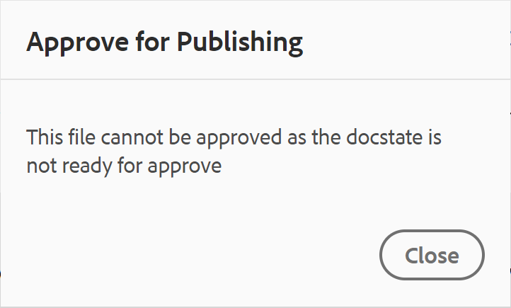

# Estado del documento {#id1821HC00URO}

Para administrar la preparación de los documentos, Adobe Experience Manager Guides proporciona la propiedad de estado del documento para indicar el estado actual del documento. Los estados de documento le ayudan a averiguar rápidamente si un documento es nuevo, está en revisión o revisa el estado completado.

## Tipos de estados de documento

Un documento puede tener cualquiera de los estados de documento definidos en el perfil **Estado del documento**. Por ejemplo, un documento puede tener cualquiera de los siguientes estados de documento:

- Borrador: indica que el documento se crea y se guarda con los nuevos cambios.
- En revisión: indica que se ha iniciado un flujo de trabajo de revisión para el documento.
- Revisado: indica que el documento ha sido revisado por los usuarios previstos.

Estos estados se establecen manual o automáticamente según la configuración del perfil Estados del documento. Por ejemplo, si el perfil de estado del documento está configurado con el estado de inicio como Borrador y el estado En revisión está definido para los documentos que se están revisando. A continuación, al crear un documento, el estado del documento se establece en *Borrador*. Si inicia una tarea de revisión, el estado del documento cambia a En revisión.

También puede cambiar manualmente el estado del documento para uno o varios documentos. Sin embargo, si decide cambiar el estado del documento para varios documentos, el estado permitido se determina según los estados comunes permitidos para los documentos seleccionados. Por ejemplo, supongamos que ha definido los estados del documento como Borrador, En revisión, Revisado y Listo para publicar, en el mismo orden. En el documento uno.dita, el estado se establece en *Borrador* y en el documento dos.dita, se establece en Revisado. Cuando selecciona one.dita y two.dita, el estado del documento permitido será *Listo para publicar*. Dado que two.dita se encuentra en el estado *Revisado*, el siguiente estado posible para two.dita es solamente *Listo para publicar*, que se muestra cuando se seleccionan ambos documentos.

>[!NOTE]
>
> Un documento sólo puede existir en un estado a la vez.

## Cambiar el estado del documento desde el editor

Para cambiar el estado de un documento, realice los siguientes pasos:

1. Abra el documento en el Editor y, a continuación, seleccione Propiedades del archivo en el panel Derecho.
1. En el panel Propiedades del archivo, seleccione el nuevo estado en la lista desplegable **Estado del documento**. Puede seleccionar solo los estados de documento permitidos en la sección Transición de estado del perfil Estado del documento.

   >[!NOTE]
   >
   >Los administradores pueden ver todos los estados de los documentos y cambiar el documento a cualquier estado posible.

1. Seleccione **Guardar** en el mensaje de confirmación.

## Cambiar el estado del documento desde la IU de Assets

1. En la interfaz de usuario de Assets, seleccione uno o varios documentos cuyo estado de documento desee cambiar.
1. En la barra de herramientas principal, seleccione **Propiedades**.
1. Seleccione el nuevo estado en la lista desplegable **Estado del documento**. Puede seleccionar solo los estados de documento permitidos en la sección Transición de estado del perfil Estado del documento.

   >[!NOTE]
   >
   >Los administradores pueden ver todos los estados de los documentos y cambiar el documento a cualquier estado posible.

1. Seleccione **Guardar y cerrar**.

### Ver estado del documento

La vista de tarjeta de la interfaz de usuario de Assets muestra el estado actual junto con la fecha de creación y el tamaño del tema o mapa DITA correspondiente.

{align="left"}

## Usar estados de documento en DLC

Los estados de documento desempeñan un papel importante en la administración del ciclo de vida de los documentos en DLC. Si su organización sigue estrictamente el DLC, tener un mecanismo para controlar la edición de documentos en función de su estado se convierte en una función esencial. Por ejemplo, puede permitir la edición de documentos cuando tengan los estados *Borrador* o *En revisión*. Sin embargo, una vez que un documento se revise y esté listo para publicarse, debe haber una forma de evitar nuevas modificaciones de los documentos.

Experience Manager Guides proporciona un flujo de trabajo de aprobación de documentos, que le ayuda a controlar el ciclo de vida del proceso de desarrollo de documentos. Una vez que un documento está listo para publicarse o ha alcanzado el penúltimo estado, puede marcarlo como aprobado. Una vez aprobado un documento, Experience Manager Guides crea una nueva versión del mismo y lo convierte en de solo lectura. A continuación, puede mover el documento para publicarlo o crear una línea base para un procesamiento posterior.

Para iniciar una nueva versión a partir de los documentos marcados como aprobados, un autor debe iniciar una nueva versión. Al iniciar una nueva versión, se cambia de nuevo el estado del documento a *Borrador*. Si cambia el estado del documento a *Borrador*, el documento volverá a ser editable y podrá seguir trabajando en la próxima versión.

Para utilizar la función de aprobación de documentos, realice los siguientes pasos:

>[!NOTE]
>
> El administrador debe habilitar la función de flujo de trabajo de aprobación. Para obtener más información, consulte la sección *Habilitar el flujo de trabajo de aprobación* en Instalar y configurar Adobe Experience Manager Guides as a Cloud Service.

1. En el Editor, abra el documento que desea marcar para su aprobación.

1. Seleccione el icono **Marcar como aprobado**.

1. Si el documento se encuentra en el estado para marcarse como aprobado, aparecerá el siguiente cuadro de diálogo:

   {width="300" align="left"}

   Si el documento no se puede marcar como aprobado, aparecerá el siguiente mensaje:

   {width="300" align="left"}

1. Si el documento está listo para marcarse como aprobado, seleccione una etiqueta de la lista desplegable y seleccione **Aprobar**.

   >[!NOTE]
   >
   > Si el administrador no ha configurado una lista predefinida de etiquetas, se muestra un campo de texto de forma libre para introducir una etiqueta.

1. Una vez que el documento se haya marcado correctamente como aprobado, se mostrará una **vista previa** del documento en modo de solo lectura. Todas las opciones de edición se eliminan de los tres modos: Autor, Source y Vista previa. Sin embargo, aún tienes acceso al menú desplegable **Menú** que incluye las opciones **Historial de versiones** y **Etiquetas**.

   {width="650" align="left"}

   >[!NOTE]
   >
   > En el modo Vista previa, la lista desplegable Menú con las opciones Historial de versiones y Etiquetas se elimina de la barra de herramientas.

Una vez marcado un documento como aprobado, ya no está disponible para su edición. Si desea usar el documento para la próxima versión, debe devolverlo al estado *Borrador*. Para volver a cambiar el estado de un documento aprobado al modo *Borrador*, realice los siguientes pasos:

1. En un documento aprobado, seleccione el icono **Iniciar una nueva versión** .

   Aparecerá el mensaje Iniciar nueva versión.

1. Seleccione **Confirmar**.

   El estado del documento cambia a Borrador y el documento se abre en el Editor en modo de edición.

**Tema principal:**[ Introducción al editor](web-editor.md)
