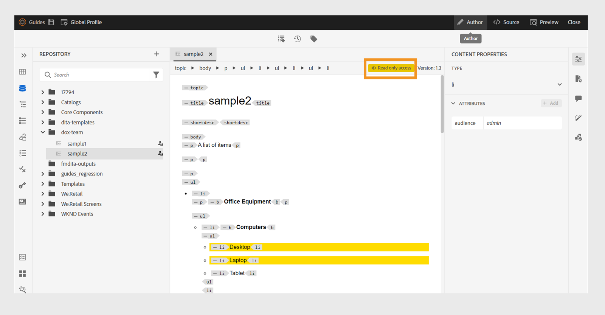

# Editar temas en el editor {#id2056B040VUI}

>[!INFO]
>
>Este tema se aplica tanto al Editor nuevo como al Editor antiguo. Aunque la funcionalidad principal sigue siendo coherente, las diferencias en la interfaz de usuario, la terminología y las interacciones se indican dentro del contenido mediante pestañas y llamadas, según corresponda.

El Editor incluye una serie de características de edición que permiten crear o modificar fácilmente los archivos de temas. En general, debe realizar los siguientes pasos para editar un tema en el Editor.

>[!IMPORTANT]
>
> Si aparece un error de aplicación mientras trabaja en el Editor, actualice la página para seguir trabajando.

>[!BEGINTABS]

>[!TAB Nuevo editor]

1. Para editar o insertar un elemento en un tema, haga clic dentro del límite de texto del elemento requerido para realizar cambios o coloque el cursor al final del elemento después del cual desea agregar un nuevo elemento y seleccione el elemento requerido en la barra de herramientas (o presione Alt+1 para abrir la ventana emergente Insertar elemento), que muestra e inserta de forma inteligente solo elementos válidos para esa ubicación en el tema.

1. Además, puede utilizar el menú Inserción rápida para insertar fácilmente los elementos permitidos en la posición del cursor. Seleccione **Control + /** para Windows o **Comando + /** para Mac para acceder a los elementos.

   {width="650"}

   Busque un nuevo elemento o elija uno de sus favoritos mediante el menú Inserción rápida y, a continuación, insértelo en la posición actual del cursor. Los favoritos incluyen los elementos utilizados con más frecuencia y solo se muestran los válidos para la ubicación actual del cursor. Puede habilitar o deshabilitar esta característica y configurar los elementos favoritos para su inserción mediante el menú Inserción rápida disponible en [Configuración del editor](./config-editor-settings.md).

>[!TAB Editor antiguo]

1. Para realizar cambios en el tema, haga clic dentro del límite de texto del elemento requerido y comience a realizar ediciones.

1. Para insertar un elemento específico, mueva el cursor al final del elemento después del cual desea insertar el nuevo elemento y seleccione el icono de elemento requerido en la barra de herramientas. También puede usar el método abreviado de teclado `Alt+1` para invocar la ventana emergente **Insertar elemento**.

   Aparecerá una lista de elementos que se pueden utilizar en el tema. Experience Manager Guides realiza una colocación inteligente de los elementos según su ubicación válida en el tema.

   >[!NOTE]
   >
   > También puede elegir qué icono se mostrará en la barra de herramientas configurando el archivo `ui_config.json` ubicado en - `/etc/designs/fmdita/clientlibs/xmleditor/`. Para obtener más información acerca de cómo personalizar características, póngase en contacto con el administrador del sistema.

1. Una vez que haya terminado de editar el documento, seleccione **Guardar todo**.

   >[!NOTE]
   >
   > Si no desea confirmar los cambios en el repositorio de Adobe Experience Manager, seleccione **Cerrar** y, a continuación, seleccione **Cerrar sin guardar** en el cuadro de diálogo Cambios no guardados.

>[!ENDTABS]

## Selección parcial del contenido entre elementos

Experience Manager Guides también le permite seleccionar contenido entre elementos. Después de seleccionar el contenido, puede realizar las siguientes operaciones:

- Formato: el formato del contenido seleccionado es considerablemente más sencillo en el editor nuevo en comparación con el editor 1.0, como se muestra a continuación.

>[!BEGINTABS]

>[!TAB Nuevo editor]

Puede dar formato al contenido seleccionado como negrita, cursiva o subrayado mediante la barra de herramientas contextual. Seleccione el contenido y, a continuación, haga clic en el icono de formato adecuado en el menú que aparece. Poner en negrita, cursiva o subrayado el contenido seleccionado. El contenido de las etiquetas abiertas válidas se combina y aparece en un solo elemento.

{width="650"}

>[!TAB Editor antiguo]

Poner en negrita y en cursiva el contenido seleccionado y subrayarlo. El contenido de las etiquetas abiertas válidas se combina y aparece en un solo elemento. Por ejemplo, puede seleccionar el contenido de un párrafo y ampliar la selección a otro párrafo. A continuación, si aplica negrita al contenido seleccionado, todo el contenido en negrita de las etiquetas abiertas se combina y aparece en un solo elemento de párrafo.

>[!ENDTABS]

- Eliminación: Si elimina el contenido seleccionado, se combina el contenido restante después de la eliminación en las etiquetas abiertas.

- Rodee el contenido con un elemento válido: realice los siguientes pasos para envolver el contenido con un elemento válido:

   - Seleccione el contenido de un elemento.
   - Seleccione el icono  de la barra de herramientas de la parte superior para ver el cuadro de diálogo **Insertar elemento**. El cuadro de diálogo muestra los elementos válidos para el contenido seleccionado.

     >[!NOTE]
     >
     > También puede ver el cuadro de diálogo Insertar elemento seleccionando el menú contextual del contenido seleccionado.

   - Seleccione un elemento del cuadro de diálogo. El contenido seleccionado se encuentra dentro de ese elemento. Por ejemplo, si selecciona el contenido en un párrafo y, a continuación, elige el elemento `<note>` del cuadro de diálogo **Insertar elemento**, el contenido seleccionado aparece debajo de una nota.

      {width="300"}

## Actualizar el explorador mientras edita los archivos

Experience Manager Guides proporciona la compatibilidad para actualizar el explorador mientras edita el contenido en el Editor. Esta función le ayuda a seguir editando contenido en caso de que encuentre un error de aplicación mientras trabaja. Si pulsa el botón de actualización del explorador mientras se abren uno o más archivos con cambios no guardados para su edición, se le advertirá de que se pueden perder los cambios no guardados. Tiene la opción de cancelar la operación de actualización y guardar los archivos para conservar los cambios.

Incluso al actualizar el explorador, las vistas de los paneles izquierdo y derecho se conservan en el Editor. Experience Manager Guides restaura el último estado guardado de los archivos abiertos en el Editor al actualizar el explorador. Por ejemplo, los archivos abiertos en el panel Repositorio se vuelven a abrir. El panel Mapa se conserva junto con el mapa abierto anteriormente.

El tema activo o el mapa DITA se vuelve a abrir en el área de edición de contenido.

El panel derecho también se vuelve a abrir y muestra la misma vista que antes de la actualización.

## Indicador de copia de trabajo

Experience Manager Guides proporciona el indicador de copia de trabajo que muestra si la \(copia de trabajo\) actual del archivo está sincronizada con la versión guardada o no. Si ha realizado cambios en la copia actual y no ha guardado el archivo, aparecerá una marca \* junto con el título en la ficha de archivo del tema. Este indicador actúa como un recordatorio para guardar los cambios y desaparece al guardar el archivo.

>[!BEGINTABS]

>[!TAB Nuevo editor]

Esta vista muestra cómo se representa el contenido en el nuevo editor.

{width="550"}

>[!TAB Editor antiguo]

Esta vista muestra cómo se representa el contenido en el editor antiguo.

{width="550"}

>[!ENDTABS]

Experience Manager Guides también indica si la última copia \(de trabajo\) guardada del archivo está sincronizada con la versión guardada o no. Si hay cambios sin guardar entre la copia de trabajo y la última versión guardada, aparecerá una marca \* junto con la información de la versión que se muestra en la esquina superior derecha de la ficha del archivo del tema. Este indicador sirve como recordatorio para guardar y crear una versión a partir de la copia \(de trabajo\) actual del archivo.

>[!NOTE]
>
> Cualquier cambio en los campos de metadatos disponibles en [File properties](./web-editor-right-panel.md#file-properties) o aplicado en el backend también almacenará en déclencheur el asterisco `(*)` en la versión del documento.  Para evitar que las actualizaciones de metadatos generadas por el sistema afecten a este indicador, los administradores pueden configurar una lista de omisión para las propiedades de los metadatos. Para obtener detalles sobre cómo configurar las propiedades de metadatos, vea [Configurar la lista de omisión de propiedades de metadatos](../install-conf-guide/conf-metadata-prop.md).

>[!BEGINTABS]

>[!TAB Nuevo editor]

{width="650"}

>[!TAB Editor antiguo]

{width="650"}

>[!ENDTABS]

## Acceso a archivos bloqueados en los modos Autor y Source

Cuando un fichero DITA o Markdown está bloqueado o extraído por otro usuario, no es posible editar o modificar el contenido. Sin embargo, aún puede ver el archivo en formato de solo lectura en los modos **Autor** y **Source**, además del modo **Vista previa**.

En el modo de solo lectura, puede ver el contenido, las etiquetas y los atributos en los modos **Autor** o **Source**. También puede modificar las propiedades del archivo.

>[!NOTE]
>
> Como administrador, obtienes acceso a la función **Forzar desbloqueo** que te permite desbloquear un archivo bloqueado por otra persona.

<!-- This is no more available -->
<!--
The toolbar displays the following icons for read-only access:

- Toggle Tags view
- Version History
- Version Label

Experience Manager Guides also displays a **Read only access** indicator near the version number.
 

You can access the **Layout** view for read-only DITA maps. This view lets you see the DITA map and its properties but prevents edits.

>[!NOTE]
>
> Your folder-level administrative users must update *ui_config.json* so that you can harmoniously access the read-only files in the  Author, Source, and Layout modes.

 -->

## Busque un archivo abierto en el Explorador

Mientras se abre un archivo en el Editor, Experience Manager Guides proporciona la función para buscar el archivo en el Explorador. Por ejemplo, localiza el tema actual mientras lo está editando.

Puede desactivar la característica para localizar el archivo con la opción **Buscar siempre los archivos en el Explorador** desde la ficha **Apariencia** de **Preferencias de usuario**.

>[!NOTE]
>
>A partir de la versión 2025.11.0, el nombre de la opción **Buscar siempre los archivos en el repositorio** cambiará a **Buscar siempre los archivos en el explorador**. Para la configuración On-Premise, sigue estando disponible como Localizar siempre archivos en el repositorio hasta la versión 5.1 de Experience Manager Guides.

**Tema principal:**&#x200B;[&#x200B; Trabajar con el editor](web-editor.md)
