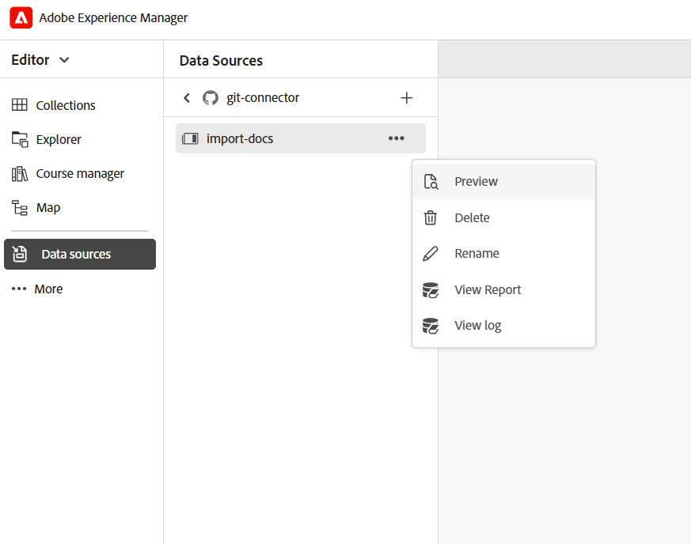

# Importación de contenido mediante el conector Git (Beta)

>[!IMPORTANT]
>
> El conector Git está disponible actualmente como función de Beta y está desactivado de forma predeterminada. Para habilitar esta función, póngase en contacto con el equipo de éxito del cliente.

El conector Git permite importar contenido de repositorios Git conectados a Experience Manager Guides. Una vez importado el contenido, puede utilizar las funciones de creación, revisión, traducción y publicación de Experience Manager Guides para desarrollar y entregar documentación.

Cuando el contenido cambia en el repositorio de origen, puede recuperar las actualizaciones, revisar los conflictos y sincronizar los cambios más recientes con Experience Manager Guides.

## Requisitos previos

Antes de empezar a utilizar esta función, asegúrese de lo siguiente:

- La función del conector Git debe estar habilitada para su entorno.
- (*Si está habilitado*) El administrador ha configurado el conector Git en su entorno. Para obtener más información, vea [Crear y configurar el conector Git desde la interfaz de usuario](../install-conf-guide/conf-git-connector.md).
- Tiene acceso de *lectura* al repositorio de Git que contiene el contenido que desea importar.
- Sabe qué rama del repositorio y carpeta de origen desea importar.
- Conozca la carpeta de destino en Experience Manager Guides donde se almacenará el contenido importado.

## Importar contenido desde el repositorio Git conectado

Una vez que el administrador haya configurado el conector Git, puede utilizarlo desde el editor para iniciar la importación de contenido desde un repositorio Git.  Siga estos pasos para importar contenido de un repositorio Git:

1. En el Editor, abra el panel izquierdo.
1. Seleccionar **orígenes de datos**.

   Se muestran las fuentes de datos conectadas.

1. Seleccione el mosaico **Conector Git**.

1. Seleccione el icono + y, a continuación, **importador en lotes**.

   Se muestra el cuadro de diálogo **Importador en lotes**.

   

1. En el cuadro de diálogo **Importador en lotes**, proporcione un nombre para la importación, seleccione una subcarpeta de su repositorio Git configurado y seleccione **Guardar y recuperar**.  La lista de archivos disponibles para importar se muestra en el cuadro de diálogo. Revise la lista y valide el contenido antes de continuar.

   

1. Después de revisar los archivos, seleccione **Importar todo** para importar el contenido en Experience Manager Guides.

   >[!NOTE]
   >
   > Puede habilitar la sincronización automática **Auto Sync** para sincronizar e importar automáticamente contenido de su repositorio Git a Experience Manager Guides. Si se detectan errores, la sincronización automática no se activa y el autor debe importar manualmente el contenido seleccionando **Importar todo**. Una vez habilitada, la sincronización automática no se puede deshabilitar para el importador.

Una vez importado el contenido, se almacena en la **ruta raíz de AEM de Target** configurada al configurar el conector Git.

## Administración de contenido importado de Git

Una vez importado el contenido en Experience Manager Guides, puede utilizar las acciones disponibles para administrar el contenido y mantenerlo sincronizado con los cambios en el repositorio de origen.

{width="600"}

- **Vista previa**: Previsualizar contenido importado. Si el repositorio de origen contiene actualizaciones, revise las diferencias y use la opción **Recuperar** para importar los cambios más recientes.
- **Eliminar**: elimina el contenido importado que ya no es necesario.
- **Cambiar nombre**: cambie el nombre del contenido importado para facilitar su identificación.
- **Ver registro**: vea el registro de importación para revisar los detalles de la operación de importación.
- **Ver informe**: vea y descargue el **informe de importación en lotes**, que incluye detalles como:

   - número total de archivos importados
   - número de importaciones correctas
   - número de importaciones fallidas

  {width="600"}

  También puede descargar el informe detallado. Si algunos archivos no se importan, use **Reintentar las importaciones con errores** para intentar importarlos de nuevo.

## Revisión y resolución de conflictos de contenido

Cuando se recupera contenido de un repositorio Git, las diferencias en el contenido entre la versión del repositorio y el contenido correspondiente disponible en Experience Manager Guides se muestran como conflictos. Debe resolver y combinar estos conflictos antes de importar los datos en Experience Manager Guides.

Realice los siguientes pasos para resolver y combinar conflictos:

1. Abra el cuadro de diálogo Importador masivo y seleccione **Recuperar**.
1. Si se detectan conflictos, aparecerá la ficha **Combinar necesario** y se enumerarán los archivos que contienen conflictos. Seleccione la ficha **Combinar necesario** y, a continuación, seleccione un archivo de la lista para revisar y resolver los conflictos.
1. Revise el contenido en las secciones siguientes:

   {width="600"}

   - En la sección **AEM**, se muestra la versión actual del contenido presente en Experience Manager Guides.
   - En la sección **Git** se muestra la última versión del contenido del repositorio.
   - En la sección **Merge**, se muestra el contenido combinado.

1. Revise las diferencias resaltadas en el editor y resuelva los conflictos mediante los controles de combinación:

   - Si desea utilizar los cambios más recientes del repositorio Git, asegúrese de que la casilla de verificación para el conflicto en la sección **Git** esté seleccionada y, a continuación, seleccione el control `<<<` correspondiente. El contenido Git seleccionado reemplaza el contenido en conflicto en la sección **Merge**.

     {width="600"}

   - Si desea conservar contenido de ambas versiones, desactive la casilla de verificación del conflicto y, a continuación, utilice el control `<<<` para agregar el contenido necesario a la sección **Combinar** sin reemplazar el contenido existente.

     {width="600"}

   - Del mismo modo, puede utilizar el control `>>>` en la sección AEM para mantener la versión disponible actualmente en Experience Manager Guides.

     {width="600"}

1. Después de revisar el contenido combinado, realice una de las siguientes acciones:

   - Use **Aceptar cambios de Git** cuando la versión del repositorio deba reemplazar el contenido en conflicto.
   - Use **Marcar como combinado** después de revisar y actualizar la versión combinada para asegurarse de que contiene el contenido que desea conservar.
   - Use **Restablecer** para descartar todas las actualizaciones combinadas y restaurar el contenido a su estado original.

Una vez que todos los archivos que contienen los conflictos se hayan marcado como combinados, se habilitará el botón **Importar todo**. Seleccione **Importar todo** para completar el proceso de resolución de conflictos.

Si el repositorio contiene contenido completamente nuevo, como un nuevo tema, párrafo o línea que no entra en conflicto con el contenido existente, se muestra en **Limpiar actualizaciones**. Estas actualizaciones no requieren la resolución de conflictos y se pueden importar directamente.

{width="600"}

