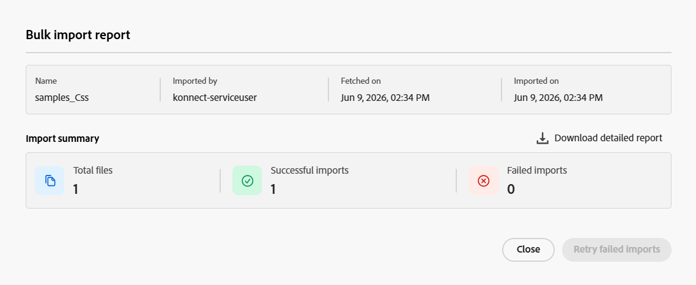
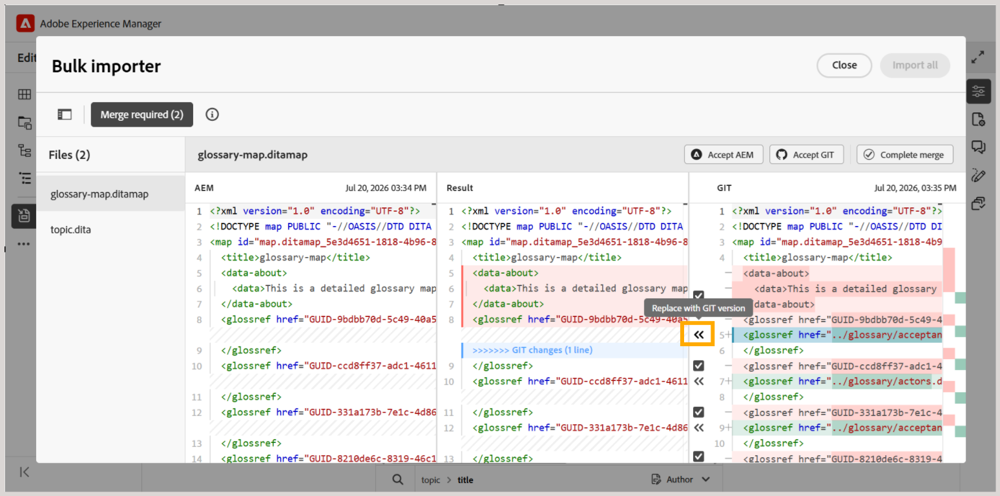

# Importación de contenido mediante el conector Git

>[!NOTE]
>
> Esta función está desactivada de forma predeterminada. Para habilitarlo en su entorno, póngase en contacto con el equipo de éxito del cliente.

El conector Git le permite [importar contenido de repositorios Git conectados a Experience Manager Guides](#import-content-from-the-connected-git-repository). Una vez importado el contenido, puede utilizar las funciones de creación, revisión, traducción y publicación de Experience Manager Guides para desarrollar y entregar documentación.

Cuando el contenido cambia en el repositorio de origen, puede recuperar las actualizaciones, revisar los conflictos y sincronizar los cambios más recientes con Experience Manager Guides.

## Características principales

El conector Git permite a los autores extraer contenido directamente de un repositorio Git a Experience Manager Guides, sin transferencias manuales de archivos. Una vez configuradas, los autores tienen acceso a las siguientes capacidades.

**Ingesta de contenido**

- Sincroniza archivos de cualquier repositorio de Git (público o privado) en Experience Manager Guides.
- Filtra por ruta de carpeta de origen para introducir un solo subdirectorio en lugar de un repositorio completo.
- Utiliza un motor de reglas `gitignore-aware` para omitir automáticamente los archivos excluidos por `.gitignore` patrones o reglas personalizadas.
- Conserva los GUID al volver a sincronizar para mantener intactas las referencias cruzadas de DITA existentes después de una actualización.

**Sincronización incremental (delta)**

- Registra la última confirmación sincronizada y recupera solo los archivos que se añadieron, modificaron o eliminaron en sincronizaciones posteriores, en lugar de volver a importar todo el repositorio.
- Genera un informe delta que enumera todos los archivos modificados y su tipo de cambio antes de la importación.
- Mantiene tiempos de recuperación coherentes independientemente del tamaño del repositorio. Para datos de referencia, vea [pruebas de rendimiento](#performance-benchmarks).

## Cómo funciona el conector Git

El diagrama siguiente muestra cómo el conector Git mueve el contenido de un repositorio de origen a Experience Manager Guides.

El conector Git mueve el contenido de un repositorio Git a Experience Manager Guides en cuatro etapas:

1. **Rastrear y sincronizar**: un rastreador se conecta al repositorio y al perfil de Git configurados y sincroniza el contenido en el conector bajo demanda.
1. **Ingesta y detección de conflictos**: los archivos entrantes se analizan y se colocan en hash con lo que ya está en Experience Manager Guides. Los archivos sin cambios conflictivos se desplazan automáticamente; los archivos con cambios conflictivos se marcan para resolución manual.
1. **Persistir**: el contenido resuelto se procesa y se guarda en AEM, junto con el resto del contenido de Experience Manager Guides.
1. **Flujo de trabajo de Experience Manager Guides**: una vez que persiste, el contenido está disponible como cualquier otro contenido de Experience Manager Guides para la creación, revisión, traducción y publicación.

## Análisis de rendimiento

Los siguientes puntos de referencia muestran tiempos de sincronización completos (no incrementales) de **Importador en lotes** en Experience Manager as a Cloud Service, a una escala de repositorio creciente.

| Escala | Tiempo de recuperación | Tiempo de importación | Tiempo total | Lotes | Rendimiento |
|---|---|---|---|---|---|
| 1.000 archivos | 1 m 53 s | 3m 30s | 5m 29s | 10 × 100 | ~286 archivos/min |
| 5.000 archivos | 1 m 55 s | 18m 21s | 20m 27s | 20 × 250 | ~273 archivos/min |
| 10.000 archivos | 1 m 39 s | 36 m 22 s | 37 m 24 s | 40 × 250 | ~267 archivos/min |
| 50.000 archivos | 1 m 25 s | 2 h 43 m | 2 h 58 m | 200 × 250 | ~270 archivos/min |

## Importación de contenido mediante el conector Git

Una vez que el administrador haya configurado el conector Git en Experience Manager Guides, puede utilizarlo desde el editor para importar contenido desde un repositorio Git.

## Requisitos previos

Antes de empezar a utilizar esta función, asegúrese de lo siguiente:

- La función del conector Git debe estar habilitada para su entorno.
- (*Si está habilitado*) El administrador ha configurado el conector Git en su entorno. Para obtener más información, vea [Crear y configurar el conector Git desde la interfaz de usuario](../install-conf-guide/conf-git-connector.md).
- Tiene acceso de *lectura* al repositorio de Git que contiene el contenido que desea importar.
- Sabe qué rama del repositorio y carpeta de origen desea importar.
- Conozca la carpeta de destino en Experience Manager Guides donde se almacenará el contenido importado.

## Importar contenido desde el repositorio Git conectado

Siga estos pasos para importar contenido de un repositorio Git:

1. En el Editor, abra el panel izquierdo.
1. Seleccionar **orígenes de datos**.

   Se muestran las fuentes de datos conectadas.

1. Seleccione el mosaico **Conector Git**.

1. Seleccione el icono + y, a continuación, **importador en lotes**.

   Se muestra el cuadro de diálogo **Importador en lotes**.

   

1. En el cuadro de diálogo **Importador en lotes**, proporcione un nombre para la importación, seleccione una subcarpeta de su repositorio Git configurado y seleccione **Guardar y recuperar**.  La lista de archivos disponibles para importar se muestra en el cuadro de diálogo. Revise la lista y valide el contenido antes de continuar.

   

1. Después de revisar los archivos, seleccione **Importar todo** para importar el contenido en Experience Manager Guides.

   >[!NOTE]
   >
   > Puede habilitar la sincronización automática **Auto Sync** para sincronizar e importar automáticamente contenido de su repositorio Git a Experience Manager Guides. Si se detectan errores, la sincronización automática no se activa y el autor debe importar manualmente el contenido seleccionando **Importar todo**. Una vez habilitada, la sincronización automática no se puede deshabilitar para el importador.

Una vez importado el contenido, se almacena en la **ruta raíz de AEM de Target** configurada al configurar el conector Git.

## Administración de contenido importado de Git

Una vez importado el contenido en Experience Manager Guides, puede utilizar las acciones disponibles para administrar el contenido y mantenerlo sincronizado con los cambios en el repositorio de origen.

{width="600"}

- **Vista previa**: Previsualizar contenido importado. Si el repositorio de origen contiene actualizaciones, revise las diferencias y use la opción **Recuperar** para importar los cambios más recientes. Si las diferencias requieren combinación, vea [Resolver conflictos del conector Git](#review-and-resolve-content-conflicts).
- **Eliminar**: elimine el importador que ya no es necesario.
- **Cambiar nombre**: cambie el nombre del importador para facilitar su identificación.
- **Ver registro**: vea el registro de importación para revisar los detalles de la operación de importación.
- **Ver informe**: vea y descargue el **informe de importación en lotes**, que incluye detalles como:

  - número total de archivos importados
  - número de importaciones correctas
  - número de importaciones fallidas

  {width="600"}

  También puede descargar el informe detallado. Si algunos archivos no se importan, use **Reintentar las importaciones con errores** para intentar importarlos de nuevo.

## Revisión y resolución de conflictos de contenido

Cuando se recupera contenido de un repositorio Git, las diferencias en el contenido entre la versión del repositorio y el contenido correspondiente disponible en Experience Manager Guides se muestran como conflictos. Debe resolver y combinar estos conflictos antes de importar los datos en Experience Manager Guides.

Realice los siguientes pasos para resolver y combinar conflictos:

1. Abra el cuadro de diálogo Importador masivo y seleccione **Recuperar**.
1. Si se detectan conflictos, aparecerá la ficha **Combinar necesario** y se enumerarán los archivos que contienen conflictos. Seleccione la ficha **Combinar necesario** y, a continuación, seleccione un archivo de la lista para revisar y resolver los conflictos.
1. Para los archivos con conflictos, se muestra una vista de combinación tridireccional.

   

   El panel izquierdo (**AEM**) muestra el contenido actual del repositorio de AEM, mientras que el panel derecho (**GIT**) muestra el contenido entrante del repositorio Git remoto. El panel central (**Result**) se rellena inicialmente con el contenido del repositorio de AEM y sirve como editor de combinación, donde se resuelven los conflictos. El resultado final combinado se produce y se muestra en este panel central.

1. Revise las diferencias resaltadas en el editor y resuelva los conflictos mediante los controles de combinación:

   - Si desea utilizar los cambios más recientes del repositorio Git, asegúrese de que la casilla de verificación para el conflicto en la sección **GIT** esté seleccionada y, a continuación, seleccione el control `<<<` correspondiente. El contenido Git seleccionado reemplaza el contenido en conflicto en la sección **Result**.

     

   - Si desea mantener el contenido de ambas versiones, desactive la casilla de verificación del conflicto y, a continuación, utilice el control `<<<` para agregar el contenido necesario a la sección **Result** sin reemplazar el contenido existente.

     

   - Del mismo modo, puede utilizar el control `>>>` en la sección AEM para mantener la versión disponible actualmente en Experience Manager Guides.

1. Después de revisar el contenido combinado, realice una de las siguientes acciones:

   - Use **Aceptar AEM** para reemplazar el contenido de la sección **Resultado** por completo con la versión de la sección **AEM**, conservando los cambios locales.
   - Use **Aceptar GIT** para reemplazar el contenido de la sección **Resultado** por completo con la versión de la sección **GIT**, conservando los cambios del repositorio.

**Se requiere combinar por completo** independientemente de la opción que use arriba. Al seleccionarlo, se bloquea el contenido actual de **Result** como la versión resuelta de ese archivo y se marca el archivo como combinado.

Una vez que todos los archivos que contienen los conflictos se hayan marcado como combinados, se habilitará el botón **Importar todo**. Seleccione **Importar todo** para completar el proceso de resolución de conflictos.

Si un archivo ha cambiado en el repositorio de Git pero no se ha modificado en Experience Manager Guides, no se requiere ninguna combinación. Estos archivos se incluyen automáticamente en **Actualizaciones limpias** y se pueden importar directamente.

{width="600"}