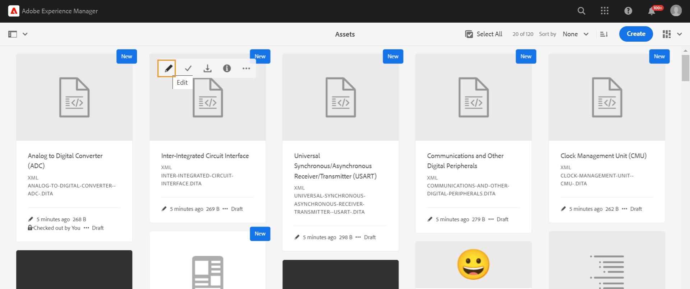
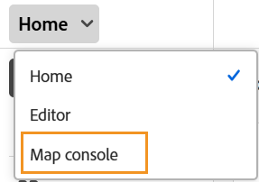

# Iniciar el editor {#id2056B0140HS}

Puede iniciar el Editor desde las siguientes ubicaciones:

- [Página de navegación de Adobe Experience Manager](#adobe-experience-manager-navigation-page)
- [IU de Adobe Experience Manager Assets](#adobe-experience-manager-assets-ui)
- [Consola de mapas](#map-console)

En las secciones siguientes se describen los detalles de cómo puede acceder al Editor e iniciarlo desde varias ubicaciones.

## Página de navegación de Adobe Experience Manager

Al iniciar sesión en Experience Manager, se le muestra la página Navegación:

{align="left"}

Si selecciona el vínculo **Guías**, accederá a la [página de inicio de Adobe Experience Manager Guides](./intro-home-page.md).

{align="left"}

Para iniciar el Editor, ve a la barra de navegación y, a continuación, selecciona **Editor** en la lista desplegable. La Página de inicio está seleccionada de forma predeterminada.

{width="350" align="left"}

Cuando haya iniciado el Editor sin seleccionar ningún archivo, aparecerá una pantalla en blanco en el Editor. Puede abrir un archivo para editarlo desde Experience Manager **Repositorio** o sus **colecciones**.

{align="left"}

También puede iniciar el Editor abriendo los archivos existentes presentes en el widget **Archivos recientes** y el widget **Colecciones** de la [experiencia de la página principal de Adobe Experience Manager Guides](./intro-home-page.md).

Para volver a la página Navegación de Experience Manager, seleccione el logotipo de Adobe Experience Manager en la esquina superior izquierda del encabezado superior.

## IU de Adobe Experience Manager Assets

Otra ubicación desde la que puede iniciar el Editor es desde la interfaz de usuario de Experience Manager Assets. Puede seleccionar uno o varios temas y abrirlos directamente en el Editor.

Para abrir un tema en el Editor, siga estos pasos:

1. En la interfaz de usuario de Assets, vaya al tema que desee editar.

   >[!NOTE]
   >
   > También puede ver el UUID del tema.

   {align="left"}

   >[!IMPORTANT]
   >
   > Asegúrese de tener los permisos de lectura y escritura en la carpeta que contiene el tema que desea editar.

1. Para obtener un bloqueo exclusivo sobre el tema, selecciona el tema y selecciona **Finalizar compra**.

   >[!IMPORTANT]
   >
   > Si el administrador ha configurado la opción **Deshabilitar edición sin bloquear el archivo**, debe desproteger el archivo antes de editarlo. Si no desprotege el archivo, no podrá ver la opción de edición.

1. Cierre el modo de selección de recursos y seleccione el tema que desea editar.

   Se muestra la vista previa del tema.

   Puede abrir el editor desde la vista de lista, la vista de tarjeta y el modo de vista previa.

   >[!IMPORTANT]
   >
   > Si desea abrir varios temas para editarlos, selecciónelos en la interfaz de usuario de recursos y seleccione **Editar**. Asegúrese de que el explorador no tenga un bloqueador de ventanas emergentes habilitado; de lo contrario, solo se abrirá el primer tema de la lista seleccionada para editarlo.

   {align="left"}

   Si no desea obtener una vista previa de un tema y desea abrirlo directamente en el editor, seleccione el icono **Editar** en el menú de acción rápida de la vista de tarjeta:

   {align="left"}

   El tema se abre en el Editor.

   {align="left"}

También puede abrir un archivo de asignación en la interfaz de usuario de Assets e iniciar el Editor para editar los temas del archivo de asignación.

Para abrir un mapa en el Editor, siga estos pasos:

1. En la interfaz de usuario de Assets, vaya y seleccione el archivo de asignación que contiene el tema que desea editar.
1. En la consola de mapas DITA, vaya a la ficha **Temas**. Se muestra una lista de temas en el fichero de asignación.
1. Seleccione el archivo de tema que desee editar.
1. Seleccione **Editar tema**.

   {align="left"}

1. El tema se abre en el Editor.

   >[!IMPORTANT]
   >
   > Si el administrador ha configurado la opción **Deshabilitar edición sin bloquear el archivo**, debe desproteger el archivo antes de editarlo. Si no desprotege el archivo, el documento se abrirá en el editor en modo de solo lectura.

## Consola de mapas

Para abrir el editor desde la consola Mapa, siga estos pasos:

1. Abra la página principal e inicie la consola Mapa.

   {width="350" align="left"}

   Al iniciar la consola Mapa sin seleccionar ningún archivo de mapa, se muestra una pantalla de consola Mapa en blanco. También puede abrir un archivo de asignación desde Experience Manager **Repositorio** o sus **colecciones**.

   {width="500" align="left"}

1. Elija **Seleccionar asignación** para abrir un archivo de asignación que contenga los temas que desea editar en el Editor.
1. Seleccione la ruta en la que se encuentra el archivo de mapa. El archivo de asignación seleccionado se añade a la consola Mapa.
1. Vaya al archivo de asignación y seleccione **Abrir en editor** en la lista desplegable.

   {align="left"}

   El archivo de mapa que contiene los temas está abierto para su edición en el Editor.

   {align="left"}

**Tema principal**: [Introducción al editor](web-editor.md)
