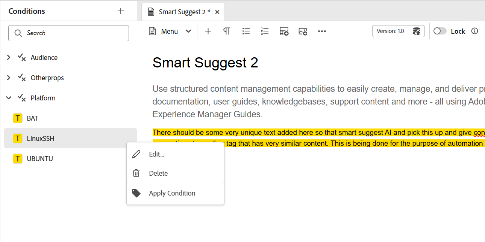

# Panel izquierdo del editor

El panel izquierdo le permite acceder rápidamente a las colecciones, la vista de repositorio, la vista de mapa y otras funciones. Puede expandir el panel seleccionando el icono **Expandir** ubicado en la esquina inferior izquierda de la interfaz. Una vez expandido, usa el icono **Contraer** para contraer el panel. En la vista expandida, muestra los nombres de los iconos que aparecen como información sobre herramientas en la vista contraída.

>[!NOTE]
>
>Se puede cambiar el tamaño del panel izquierdo. Para cambiar el tamaño del panel, coloque el cursor sobre el límite del panel, el cursor cambiará a una flecha de dos puntas, seleccione y arrastre para cambiar el tamaño del ancho del panel.

El panel izquierdo le permite acceder a las siguientes funciones:

- [Colecciones](#collections)
- [Repositorio](#repository)
- [Explorer](#explorer)
- [Mapa](#map)
- [Contenido reutilizable](#reusable-content)
- [Descripción](#outline)

Algunas de las características del panel izquierdo están disponibles en la sección **Más**. Seleccione el icono Más  para acceder a las siguientes funciones:

- [Glosario](#glossary)
- [Condiciones](#conditions)
- [Régimen del sujeto](#subject-scheme)
- [Fragmentos](#snippets)
- [Plantillas](#templates)
- [Citas](#citations)
- [Variables de idioma](#language-variables)
- [Variables](#variables)
- [Buscar y reemplazar](#find-and-replace)
- [PDF templates](#pdf-templates)
- [Revisión](#review)


También se mostrará una opción adicional denominada **Workfront** en el panel izquierdo si Adobe Workfront está configurado.

Para obtener más información, vea [Integración de Workfront](./workfront-integration.md).

>[!NOTE]
>
> El administrador gestiona las funciones disponibles en el panel izquierdo, lo que les permite activar o desactivar las funciones individuales presentes en el panel izquierdo. En el panel izquierdo solo se muestran las funciones activadas. Para obtener más información, vea la sección **Paneles** de [Barra de fichas](./web-editor-tab-bar.md).

La explicación detallada de las funciones del panel izquierdo es la siguiente:

## Colecciones

Si trabaja en un conjunto de archivos o carpetas, puede agregarlos a su lista de favoritos para acceder a ellos rápidamente. **Colecciones** muestran la lista de documentos que ha agregado y otra lista de documentos de acceso público de los otros usuarios.

De forma predeterminada, puede ver los archivos por títulos. Al pasar el ratón por encima de un archivo, puede ver el título y la ruta del archivo como información sobre herramientas.

>[!NOTE]
>
> Como administrador, también puede elegir ver la lista de archivos por nombres de archivo en el Editor. Seleccione la opción **Nombre de archivo** de la sección **Archivos del editor muestran la configuración** en **Preferencias de usuario**.

<details>
    <summary> Crear una nueva colección </summary>


Para crear una nueva colección, seleccione el icono + situado junto al panel Colecciones para que aparezca el cuadro de diálogo **Nueva colección**:

{width="300" align="left"}

Escriba un título y una descripción para la colección que desea crear. Si selecciona **Público**, este favorito también se mostrará a otros usuarios.

>[!NOTE]
>
> También puede crear una colección desde la página principal de Experience Manager Guides. Abra la página principal, vaya al widget **Colecciones** en la [sección Información general](./intro-home-page.md#overview) y seleccione **Nueva colección**.

</details>

<details>
    <summary> Añadir un archivo a las colecciones </summary>


Para añadir un archivo a las colecciones, utilice cualquiera de los siguientes métodos:

- Vaya al archivo o carpeta necesarios en la vista Repositorio, seleccione el icono *Opciones* para abrir el menú contextual y elija **Agregar a** > **Colecciones**. En el cuadro de diálogo **Agregar a colecciones**, puede elegir agregar el archivo o la carpeta a un favorito existente o crear uno nuevo.

  {width="300" align="left"}

- Haga clic con el botón derecho en la pestaña de un archivo en el editor para abrir el menú contextual. Elija **Agregar a** > **Colecciones** para agregar el archivo a su lista de favoritos.

  {align="left"}


>[!NOTE]
>
> - Para quitar un elemento de la lista de favoritos, seleccione el icono Opciones situado junto al elemento en una colección Favoritos y elija **Quitar de las colecciones**.
> - Para obtener una vista previa del archivo sin abrirlo, seleccione un archivo y, a continuación, seleccione **Vista previa** en el menú Opciones.

</details>

**Menú de opciones para una colección**

También puede realizar muchas acciones utilizando el menú Opciones disponible para una colección:

{width="650" align="left"}

- **Cambiar nombre**: cambie el nombre de la colección seleccionada.
- **Eliminar**: elimine la colección seleccionada.
- **Actualizar**: obtenga una lista nueva de archivos y carpetas del repositorio.
- **Ver en la interfaz de usuario de Assets**: muestra el contenido del archivo o carpeta en la interfaz de usuario de Assets.

>[!NOTE]
>
> Puede actualizar la lista con el icono **Actualizar** de la parte superior. Al actualizar la lista, también se cargan de nuevo las colecciones y, como resultado, todas las colecciones expandidas del panel se contraen.


## Repositorio

>[!NOTE]
>
> A partir de la versión 2025.11.0, **el repositorio** del editor quedará obsoleto y será reemplazado por **el explorador** para la configuración de **Cloud Service**. Para la configuración de **On-Premise**, seguirá viendo y utilizando el repositorio a través de la interfaz del editor hasta la versión 5.1 de Experience Manager Guides.

Al seleccionar el icono Repositorio, se obtiene una lista de archivos y carpetas disponibles en DAM. De forma predeterminada, puede ver los archivos por títulos. Al pasar el ratón por encima de un archivo, puede ver el título y el nombre del archivo como información sobre herramientas.

>[!NOTE]
>
> Como administrador, también puede elegir ver la lista de archivos por nombres de archivo en el Editor. Seleccione la opción **Nombre de archivo** de la sección **Archivos del editor muestran la configuración** en **Preferencias de usuario**.

Se cargan 75 archivos a la vez. Cada vez que selecciona **Cargar más**... se cargan 75 archivos y el botón deja de mostrarse cuando se han enumerado todos los archivos. Esta carga por lotes es eficiente y puede acceder a los archivos más rápido en comparación con cargar todos los archivos existentes en una carpeta.

Puede navegar fácilmente al archivo requerido dentro de DAM y abrirlo en el Editor. Si tiene el acceso necesario para editar el archivo, puede hacerlo.

También puede seleccionar y reproducir un archivo de audio o vídeo en el Editor. Puede cambiar el volumen o
la vista del vídeo. En el menú contextual también tiene las opciones para descargar, cambiar la reproducción
velocidad o vea la imagen en la imagen.

Seleccione un mapa y pulse Intro o haga doble clic para abrirlo en la **vista Mapa**. Para obtener más información, vea la descripción de la característica **Vista de mapa** en el panel izquierdo. Seleccione un tema y presione Intro o haga doble clic para abrirlo en el [área de edición de contenido](./web-editor-content-editing-area.md). La posibilidad de desplazarse por un archivo y abrirlo directamente desde el Editor ahorra tiempo y aumenta la productividad.

## Filtrar la búsqueda en el repositorio

El Editor proporciona filtros mejorados para buscar texto. Puede buscar y filtrar un texto en los archivos presentes en la ruta seleccionada del repositorio de Adobe Experience Manager. Busca en el título, el nombre de archivo y el contenido de los archivos.


{width="300" align="left"}

*Aplicar filtros para buscar los archivos que contienen el texto`personal spaceship.`*

Seleccione el icono **Filtro de búsqueda** \(\) para abrir la ventana emergente Filtro.

>[!NOTE]
>
> Cuando busca texto o filtra archivos, aparece un punto azul en el icono **Filtrar búsqueda** \(\) para indicar que estamos en el panel de búsqueda y que se han aplicado algunos filtros.


Tiene las siguientes opciones para filtrar los archivos y limitar la búsqueda en el repositorio de Adobe Experience Manager:

- **Archivos DITA**: Puede buscar todos los **temas DITA** y **mapas DITA** presentes en la ruta seleccionada. Están seleccionadas de forma predeterminada.
- **Archivos que no son DITA**: puede buscar **archivos Ditaval**, **archivos de imagen**, **multimedia**, **documentos** y **JSON** en la ruta seleccionada.

   {width="300" align="left"}

  *Utilice los filtros rápidos para buscar archivos DITA y no DITA.*

>[!NOTE]
>
> También puede usar el filtro **Tema DITA** para buscar contenido específico de los archivos Markdown en el repositorio, incluidos títulos, contenido de temas y propiedades. Actualmente, esta función solo se aplica a los archivos Markdown recién creados.

**Filtro avanzado**

Seleccione el icono **Filtro avanzado** para ver el cuadro de diálogo **Filtro avanzado**.

Puede ver las siguientes opciones en las fichas **General** y **Avanzado**.

 {width="650" align="left"}


**General**

- **Resultados de búsqueda con**: busca texto en los archivos presentes en la ruta seleccionada del repositorio de Adobe Experience Manager. El texto se busca en el título, el nombre de archivo y el contenido de los archivos.

Esto está sincronizado con el cuadro de búsqueda de la ventana del repositorio. Por ejemplo, si escribe `general purpose` en el cuadro de búsqueda del panel del repositorio, también aparecerá en el cuadro de diálogo **Filtro avanzado** y viceversa.

- **Buscar en**: seleccione la ruta en la que desea buscar los archivos presentes en el repositorio de Adobe Experience Manager.
- **Archivos DITA**: Puede buscar todos los **temas DITA** y **mapas DITA** presentes en la ruta seleccionada. Están seleccionadas de forma predeterminada.
- **Archivos que no son DITA**: puede buscar **archivos Ditaval**, **archivos de imagen**, **multimedia**, **documentos** y **JSON** en la ruta seleccionada.
- **Bloqueado por**: muestra una lista de usuarios. La lista se pagina y se carga asincrónicamente, mostrando un conjunto limitado de usuarios a la vez y recuperando más a medida que se desplaza o navega. Esto mejora la velocidad de carga y el rendimiento general, especialmente cuando se trabaja con un gran número de usuarios.
- **Modificado después de** / **Modificado antes de**: filtra el contenido según la fecha de modificación. Seleccione un intervalo de fechas del calendario o elija una de las siguientes opciones de lapso de tiempo:
   - En las últimas dos horas
   - En la última semana
   - En el último mes
   - En el último año
- **Etiquetas**: filtre el contenido según las etiquetas.

**Avanzado**

- **Elementos DITA**: también puede buscar valores específicos en los atributos de los elementos DITA especificados.
   - Seleccione **Agregar elemento** para agregar los elementos, atributos y valores.
   - Aplique los filtros seleccionados.

- Seleccione **Borrar todo** para borrar todos los filtros aplicados.


- Seleccione el icono **Cerrar filtro**  para cerrar el filtro y volver a la vista de árbol del repositorio.

  >[!NOTE]
  >
  >El administrador del sistema también puede configurar los filtros de texto y mostrar u ocultar otros filtros. Para obtener más información, vea la sección *Configuración de filtros de texto* en Instalar y configurar Adobe Experience Manager Guides as a Cloud Service.
  >
  >Se muestra la lista de archivos filtrados que contienen el texto buscado. Por ejemplo, los archivos que contienen el texto `personal spaceship` se muestran en la captura de pantalla anterior. Puede seleccionar varios archivos de la lista filtrada para arrastrarlos y soltarlos en un mapa abierto para editarlos.

### Menú Opciones

Además de abrir archivos desde el panel izquierdo, también puede realizar muchas acciones mediante el menú Opciones disponible en la vista Repositorio. Verá diferentes opciones, dependiendo de si elige una carpeta, un archivo de tema o un archivo multimedia.

**Opciones para una carpeta**

Puede realizar las siguientes acciones mediante el menú Opciones disponible para una *carpeta* en la vista Repositorio:

{width="550" align="left"}


- **Nuevo**: crea un nuevo tema, mapa o carpeta DITA.

<details>
    <summary> Pasos para crear un nuevo tema </summary>

Pasos para crear un nuevo tema:

1. Seleccione **Nuevo** > **Tema**.
1. Se muestra el cuadro de diálogo **Nuevo tema**.

   {width="300" align="left"}

1. En el cuadro de diálogo **Nuevo tema**, proporcione los siguientes detalles:
   - Título del tema.
   - \(Opcional\)* El nombre de archivo del tema. El nombre del archivo se sugiere automáticamente en función del tema Título. Si el administrador ha habilitado nombres de archivo automáticos basados en la configuración de UUID, no verá el campo Nombre.
   - Una plantilla en la que se basará el tema. Por ejemplo, para una configuración predeterminada, puede elegir entre las plantillas en blanco, Concepto, DITAVAL, Referencia, Tarea, Tema, Markdown, Glosario y Solución de problemas. Si la carpeta tiene un perfil de carpeta configurado, solo verá las plantillas de temas que estén configuradas en el perfil de carpeta.

   - Ruta de acceso donde desea guardar el archivo de tema. De forma predeterminada, la ruta de la carpeta seleccionada actualmente en el repositorio se muestra en el campo Ruta.
1. Seleccione **Crear**. El tema se crea en la ruta de acceso especificada. Además, el tema se abre en el Editor para editarlo.

</details>

<details>
<summary> Pasos para crear un nuevo mapa DITA </summary>


Pasos para crear un nuevo mapa DITA:

1. Seleccione **Nuevo** > **mapa DITA**.
2. Se muestra el cuadro de diálogo **Nuevo mapa**.

   {width="300" align="left"}

3. En el cuadro de diálogo **Nuevo mapa**, proporcione los siguientes detalles:
   - Título del mapa.
   - *\(Opcional\)* El nombre de archivo para el mapa. El nombre del archivo se sugiere automáticamente en función del título del mapa. Si el administrador ha habilitado nombres de archivo automáticos basados en la configuración de UUID, no verá el campo Nombre.
   - Una plantilla en la que se basará el mapa. Por ejemplo, para una configuración predeterminada, puede elegir entre las plantillas de mapa de libro o de mapa DITA.
   - Ruta de acceso donde desea guardar el archivo de asignación. De forma predeterminada, la ruta de la carpeta seleccionada actualmente en el repositorio se muestra en el campo Ruta.
4. Seleccione **Crear**. El mapa se crea y se añade dentro de la carpeta especificada en el campo Ruta. Además, el mapa se abre en la vista Mapa. Puede abrir el archivo de asignación en el Editor de mapas y agregarle un tema. Para obtener más información sobre cómo agregar temas a un archivo de asignación, vea [Crear un mapa](map-editor-create-map.md#). También puede seleccionar **Abrir en la consola de mapas** para abrir el mapa en la consola de mapas.
</details>

<details>
<summary> Pasos para crear una carpeta nueva </summary>

Pasos para crear una carpeta nueva:

1. Seleccione **Nueva** > **Carpeta**.
2. Se muestra el cuadro de diálogo **Nueva carpeta**.

   {width="300" align="left"}

3. En el cuadro de diálogo **Nueva carpeta**, proporcione los siguientes detalles:
   - Un Título para la carpeta, que se convierte automáticamente en el nombre de la carpeta.
   - Ruta de acceso donde desea guardar la carpeta. De forma predeterminada, la ruta de la carpeta seleccionada actualmente en el repositorio se muestra en el campo Ruta.
4. Seleccione **Crear**. La carpeta se crea y se añade dentro de la carpeta desde la que se ejecutó la opción create folder.

</details>

- **Cargar recursos**: cargue un archivo de su sistema local a la carpeta seleccionada en el repositorio de Adobe Experience Manager. También puede arrastrar y soltar archivos del sistema local en el tema de trabajo actual. Esto resulta muy útil si desea insertar imágenes del sistema local en el tema.

  {width="300" align="left"}

  Puede seleccionar una carpeta en la que desee cargar el archivo y también se mostrará una vista previa de la imagen. Si desea cambiar el nombre del archivo, puede hacerlo en el cuadro de texto del nombre del archivo. Seleccione **Cargar** para completar el proceso de carga del archivo. Si ha arrastrado y soltado un archivo de imagen sobre un tema, el archivo de imagen se agrega en el artículo y también se carga.

  Si el administrador ha habilitado la opción UUID en *XMLEditorConfig*, verá el UUID de la imagen cargada en la propiedad **Source**.

  {align="left"}

  Después de una carga correcta, se muestra el siguiente cuadro de diálogo de confirmación:

  

  <details>

  <summary>Gestión de caracteres no válidos en los nombres de archivo</summary>

  Si el nombre de archivo del recurso que se carga contiene caracteres no válidos (como * / : [\] | # % { } ?), pueden producirse los siguientes escenarios:

   - **Carga parcial**: indica que uno o más recursos que se están cargando contienen caracteres no válidos en sus nombres de archivo.

     

   - **Error al cargar** : indica que todos los recursos que se están cargando contienen caracteres no válidos en sus nombres de archivo.

     

  Para resolver estos conflictos, elimine los caracteres no válidos de los nombres de archivo de los recursos y, a continuación, vuelva a cargarlos en el repositorio.

  </details>

- **Actualizar**: obtenga una lista nueva de archivos y carpetas del repositorio.
- **Contraer**: contraiga la carpeta seleccionada en el repositorio.

  >[!NOTE]
  >
  > Utilice el icono **\>** junto a una carpeta para expandirla.

- **Buscar archivos en la carpeta**: cambia el enfoque a la búsqueda del repositorio, en la que puede introducir el término de búsqueda. La búsqueda se realiza en la carpeta seleccionada del repositorio. También se puede aplicar un filtro para devolver ficheros DITA, ficheros de imagen o ambos.

  {width="300" align="left"}

  También puede buscar utilizando el UUID de un archivo. En ese caso, los resultados de la búsqueda muestran el título del archivo DITA/XML y, si el archivo es un archivo de imagen, se muestra el UUID del archivo. En el siguiente ejemplo de búsqueda, se busca el UUID de un archivo de imagen y los resultados de la búsqueda muestran el UUID del archivo de imagen original y el título del tema del archivo donde se hace referencia a esa imagen.

  {width="300" align="left"}

- **Agregar a colecciones**: Agrega la carpeta seleccionada a favoritos. Puede elegir agregarlo a una colección existente o nueva.

- **Volver a procesar recursos**: Déclencheur el procesamiento de todos los recursos de la carpeta.
- **Ver en la interfaz de usuario de Assets**: muestra el contenido de la carpeta en la interfaz de usuario de Assets.

**Opciones para un archivo**

Obtenga acceso a distintas opciones en el menú Opciones, dependiendo de si selecciona un archivo multimedia o un archivo DITA. Algunas opciones comunes disponibles para los archivos multimedia y DITA son las siguientes:

- Editar
- Abrir en FrameMaker
- Duplicado
- Bloquear/desbloquear
- Vista previa
- Mover a
- Cambiar nombre
- Eliminar
- Generar
- Descargar como PDF
- Agregar a
- Copiar
- Volver a procesar recurso
- Ver en la IU de Assets
- Propiedades


{width="550" align="left"}

Las distintas opciones del menú Opciones se explican a continuación:

- **Editar**: abra el archivo para editarlo. Si se trata de un archivo .ditamap/.bookmap, se abrirá en el [Editor de mapas](map-editor-advanced-map-editor.md#) para su edición.

- **Editar en oxígeno**: seleccione esta opción para editar el archivo seleccionado en el complemento Conector de oxígeno. El archivo se abrirá para editarlo.

  >[!NOTE]
  >
  >Póngase en contacto con el equipo de éxito del cliente para habilitar esta función en el entorno. Esta opción no está habilitada como parte de la compatibilidad predeterminada. Para obtener más información, consulte la sección [Configurar la opción para editar en Oxígeno](../cs-install-guide/conf-edit-in-oxygen.md) en la Guía de instalación y configuración.

- **Abrir en el tablero de mapas**: Si el archivo seleccionado es un mapa DITA, esta opción abre el tablero de mapas.

- **Abrir en la consola de mapas**: Si el archivo seleccionado es un mapa DITA, esta opción abre la consola de mapas.

- **Bloquear**: bloquea el archivo seleccionado para editarlo. Si el archivo está bloqueado, al pasar el puntero del mouse (ratón) sobre el icono de bloqueo, se muestra **Bloqueado por usted** si lo ha bloqueado, o **Bloqueado por [nombre de usuario]** si otro usuario lo ha bloqueado.

- **Vista previa**: obtenga una vista previa rápida del archivo (.dita, .xml, audio, vídeo o imagen) sin abrirlo. Puede cambiar el tamaño del panel de vista previa. Si el contenido contiene `<xref>` o `<conref>`, puede seleccionarlo para abrirlo en una nueva pestaña. El título del archivo aparece en la ventana. Si no hay ningún título, aparece el nombre de archivo. Para cerrar el panel **Vista previa**, puede seleccionar el icono de cerrar o seleccionar cualquier lugar fuera del panel.

  {align="left"}


- **Duplicate**: utilice esta opción para crear un duplicado o una copia del archivo seleccionado. También tiene la opción de cambiar el nombre del archivo duplicado en la solicitud de recursos duplicados. De forma predeterminada, el archivo se crea con un sufijo \(como nombre de archivo\_1.extensión\). El título del archivo sigue siendo el mismo que el del archivo de origen y el nuevo archivo comienza con la versión 1.0. Todas las referencias, etiquetas y metadatos se copian, mientras que las líneas de base no se copian en el archivo duplicado.

- **Mover a**: utilice esta opción para mover el archivo seleccionado a otra carpeta.
   - Puede escribir el nombre de la carpeta de destino o elegir **Seleccionar ruta** para seleccionar la carpeta de destino.
   - Puede mover un archivo de cualquier tipo a cualquier destino dentro de la carpeta Contenido.
   - Dos archivos no pueden tener el mismo nombre. Por lo tanto, no puede mover un archivo a una carpeta en la que ya existe un archivo con el mismo nombre.

  Si intenta mover un archivo a una carpeta en la que existe un archivo con el mismo nombre pero con un título diferente, se muestra el cuadro de diálogo Cambiar nombre y mover archivo y debe cambiar el nombre del archivo antes de moverlo. El archivo movido en la carpeta de destino tiene el nuevo nombre de archivo.

  {width="550" align="left"}

  >[!NOTE]
  >
  > También puede arrastrar y soltar un archivo en otra carpeta de destino.

  **Escenarios de exclusión**

  Experience Manager Guides no permite cambiar el nombre de un archivo ni moverlo en los siguientes casos:

   - No puede mover ni cambiar el nombre de un archivo si forma parte de un flujo de trabajo de revisión o traducción.

   - Si cualquier otro usuario bloquea el archivo, no puede cambiarle el nombre ni moverlo, no verá la opción Cambiar nombre o Mover a del archivo.

  >[!NOTE]
  >
  > Si el administrador le ha concedido los permisos sobre una carpeta, solo entonces se mostrarán las opciones **Rename** o **Move to**.

  <details>
    <summary> Cloud Services </summary>

  Al cambiar el nombre o mover cualquier archivo, no se rompen las referencias existentes desde o hacia el archivo, ya que cada archivo tiene un UUID único.
  </details>

- **Cambiar nombre**: utilice esta opción para cambiar el nombre del archivo seleccionado. Escriba el nombre del nuevo archivo en el cuadro de diálogo **Cambiar nombre del recurso**.
   - Puede cambiar el nombre de un archivo de cualquier tipo.
   - No se puede cambiar la extensión de un archivo.
   - Dos archivos no pueden tener el mismo nombre. Por lo tanto, no puede cambiar el nombre de un archivo por uno que ya exista. Se muestra un error.

- **Eliminar**: utilice esta opción para eliminar el archivo seleccionado. Se muestra un mensaje de confirmación antes de eliminar el archivo.

   - Se muestra un mensaje de confirmación antes de eliminar el archivo.
   - Si no se hace referencia al archivo desde ningún otro archivo, se elimina y se muestra un mensaje de éxito.
   - Si el archivo está bloqueado, no podrá eliminarlo y aparecerá un mensaje de error.

     >[!NOTE]
     >
     > Si el administrador ha impedido la eliminación de archivos bloqueados, solo entonces se muestra el mensaje de error. Para obtener más información, vea la sección *Impedir la eliminación de archivos desprotegidos* en Instalar y configurar Adobe Experience Manager Guides as a Cloud Service.

   - Si el archivo se agrega a una colección, se muestra el cuadro de diálogo **Forzar eliminación** y puede eliminarlo a la fuerza.
   - Si se hace referencia al archivo desde cualquier otro archivo, se mostrará el cuadro de diálogo **Forzar eliminación** con el mensaje de confirmación y podrá eliminar el archivo a la fuerza:

     {width="300" align="left"}

     >[!NOTE]
     >
     > Si el administrador ha concedido permiso para eliminar archivos, se habilitará **Forzar eliminación**. De lo contrario, **Forzar eliminación** se deshabilitará y aparecerá un mensaje que indica que no tiene permiso para eliminar los archivos a los que se hace referencia. Para obtener más información, vea la sección *Impedir la eliminación de archivos a los que se hace referencia* en Instalar y configurar Adobe Experience Manager Guides as a Cloud Service.

   - Si elimina un tema al que se hace referencia y ha abierto el archivo que contiene referencias para su edición, se mostrará el vínculo roto para el archivo al que se hace referencia.

  >[!NOTE]
  >
  > También puede eliminar el archivo seleccionado de forma similar utilizando la tecla Supr del teclado.

- **Generar**: Utilice la opción para publicar un mapa o temas dentro de un mapa en una página de Sites, un fragmento de contenido o un fragmento de experiencia.

- **Agregar a**: puede elegir entre las siguientes opciones:
   - **Colecciones**: agrega el archivo seleccionado a Colecciones. Puede elegir agregarlo a una colección existente o nueva.

   - **Contenido reutilizable**: agrega el archivo seleccionado a la lista Contenido reutilizable del panel izquierdo.

- **Copiar**: puede elegir entre las siguientes opciones:

   - **Copiar UUID**: copie el UUID del archivo seleccionado en el portapapeles.

   - **Copiar ruta**: copie la ruta completa del archivo seleccionado al Portapapeles.

- **Volver a procesar el recurso**: Déclencheur el procesamiento del recurso seleccionado.

- **Vista en la interfaz de usuario de Assets**: utilícela para mostrar una vista previa de un archivo .dita/.xml en la interfaz de usuario de Assets. En el caso de un archivo .ditamap/.bookmap, todos los archivos de tema dentro del mapa se muestran en una sola vista página a página unificada.

- **Propiedades**: utilice esta opción para abrir la página de propiedades del archivo seleccionado.

  Cualquier adición, eliminación o modificación de las propiedades de metadatos en esta página (ya sea predeterminada o personalizada) almacenará en déclencheur el [indicador de copia de trabajo](./web-editor-edit-topics.md#working-copy-indicator) en la versión del documento.

  También puede acceder a la página Propiedades desde la interfaz de usuario de Assets seleccionando un archivo y, a continuación, el icono Propiedades en la barra de herramientas.

- **Descargar como PDF**: Use la opción para generar la salida de PDF y descargarla.

## Explorer

>[!NOTE]
>
> A partir de la versión 2025.11.0, el término Repositorio en el Editor será reemplazado por **Explorer** para la configuración de Cloud Service. La configuración On-Premise seguirá viendo y accediendo al repositorio en el editor.

El Explorador proporciona la mayoría de las funciones disponibles anteriormente en el Repositorio, entre las que se incluyen:

- Navegación por archivos y carpetas
- Menú Opciones para archivos y carpetas

Sin embargo, introduce una experiencia de búsqueda y filtrado mejorada, diseñada para mejorar la facilidad de uso y la eficiencia.

Para obtener información detallada sobre el menú contextual de archivos y carpetas, vea [Menú de opciones](#options-menu).

Para obtener información detallada sobre la experiencia de búsqueda, vea [Panel de búsqueda](./search-panel-explorer.md).

## Mapa

Cuando se selecciona el icono de vista Mapa, se muestra la vista Mapa donde se muestra una lista de temas dentro del fichero de mapa. Si no ha abierto ningún fichero de mapa, la vista Mapa aparecerá en blanco. Al hacer doble clic en cualquier fichero de mapa, se abre el fichero de mapa en esta vista. Puede hacer doble clic en cualquier archivo del mapa para abrirlo en el Editor.

De forma predeterminada, puede ver los archivos por títulos. Al pasar el ratón por encima de un archivo, puede ver el título y la ruta del archivo como información sobre herramientas.

>[!NOTE]
>
>Como administrador, también puede elegir ver el nombre de archivo del mapa principal que está abierto actualmente en la vista de mapa. Seleccione la opción **Nombre de archivo** de la sección **Archivos del editor muestran la configuración** en **Preferencias de usuario**.


Cuando se abre un mapa en la vista de mapa, el título del mapa actual se muestra en el centro de la barra de pestañas. Si el título es demasiado largo, se muestran puntos suspensivos y también puede pasar el ratón por encima del título para ver el título completo en la información del objeto.

Al definir atributos clave para el tema o las referencias de mapa, puede ver el título, el icono correspondiente y la clave en el panel izquierdo. La clave se muestra como `keys=<key-name>`.

{width="300" align="left"}

Si tiene derechos de edición sobre los archivos de mapa, también podrá editar los archivos. Para obtener más información acerca de cómo abrir y editar un tema a través del mapa DITA, vea [Editar temas a través del mapa DITA](map-editor-advanced-map-editor.md#id17ACJ0F0FHS).

Las siguientes opciones están disponibles para un archivo de asignación en la vista Mapa:

- **Abrir en la consola de mapas**: Abre el archivo de asignación en la consola de mapas.
- **Editar**: abre el archivo de asignación para su edición.
- **Opciones**: abre el menú contextual del archivo de asignación seleccionado.

Puede realizar las siguientes acciones mediante el menú Opciones del archivo de asignación:

{align="left"}

- **Editar**: abre el archivo de asignación para editarlo en el Editor de mapas.

- **Seleccionar todo**: seleccione todos los archivos del mapa.

- **Borrar selección**: Anule la selección de los archivos seleccionados en el mapa.

- **Bloquear**: bloquea los archivos seleccionados en el mapa.

- **Desbloquear**: Desbloquea el archivo de asignación y lo pone a disposición para su edición. No revierte los cambios a la versión anterior.

- **Guardar como nueva versión y desbloquear**: crea una versión más reciente y libera el bloqueo de los archivos seleccionados en el mapa.

- **Vista previa**: abre una vista previa del archivo de mapa. En esta vista, todos los archivos de tema del mapa se muestran en una sola vista página a página unificada.

- **Copiar**: puede elegir entre las siguientes opciones:
   - **Copiar UUID**: copie el UUID del archivo de asignación al portapapeles.
   - **Copiar ruta**: copie la ruta completa del archivo de asignación al Portapapeles.

- **Localizar en el explorador**: Muestra la ubicación del archivo de asignación en el explorador\(o DAM\).

- **Agregar a**: puede elegir entre las siguientes opciones:
   - **Colecciones**: agrega el archivo de asignación a las colecciones. Puede elegir agregarlo a una colección existente o nueva.

   - **Contenido reutilizable**: agrega el archivo de asignación a la lista Contenido reutilizable en el panel izquierdo.

- **Propiedades**: utilice esta opción para abrir la página de propiedades del archivo de asignación. También se puede acceder a esta página de propiedades desde la interfaz de usuario de Assets seleccionando un archivo y el icono Propiedades en la barra de herramientas.

- **Abrir tablero de mapas**: abre el tablero de mapas.

- **Ver en la interfaz de usuario de Assets**: úselo para mostrar una vista previa del archivo de mapa en la interfaz de usuario de Assets. En esta vista, todos los archivos de tema del mapa se muestran en una sola vista página a página unificada.
- **Descargar mapa**: Seleccione esta opción para abrir el cuadro de diálogo **Descargar mapa**.

  En el cuadro de diálogo **Descargar mapa**, puede elegir las siguientes opciones:

  **Usar Línea Base**: Seleccione esta opción para obtener una lista de Líneas Base creadas para el mapa DITA. Si desea descargar el archivo de asignación y su contenido en función de una Línea base específica, seleccione la Línea base en la lista desplegable. Para obtener más información acerca de cómo trabajar con líneas de base, vea [Trabajar con línea de base](./generate-output-use-baseline-for-publishing.md).

  **Acoplar jerarquía de archivos**: seleccione esta opción para guardar todos los temas a los que se hace referencia y los archivos multimedia en una sola carpeta.

  También puede descargar el archivo de asignación sin seleccionar ninguna opción. En ese caso, se descargan las últimas versiones persistentes de los temas a los que se hace referencia y los archivos multimedia.

  Después de seleccionar el botón **Descargar**, la solicitud del paquete de exportación de asignación se pone en cola. El cuadro de diálogo **Éxito** se muestra si el paquete se ha creado correctamente.  Puede seleccionar el botón **Descargar** del cuadro de diálogo **Éxito**.

  Recibirá la notificación de mapa listo para descarga si el mapa está listo para descargarse. En caso de que la descarga falle, recibirá la notificación de que la descarga del mapa ha fallado.

  Puede acceder al vínculo de descarga desde la bandeja de entrada de notificaciones de Adobe Experience Manager. Seleccione la notificación de asignación generada en la bandeja de entrada para descargar la asignación en formato .zip.

  >[!NOTE]
  >
  >  De forma predeterminada, las asignaciones descargadas permanecen durante cinco días en la Bandeja de entrada de notificaciones de Adobe Experience Manager.

- **Cerrar contexto de asignación**: Cierra el archivo de asignación.

La siguiente captura de pantalla muestra el menú Opciones de un archivo en la vista de mapa:

{align="left"}

Puede realizar las siguientes acciones mediante el menú Opciones:

- **Editar**: abra el archivo para editarlo. Si se trata de un archivo .ditamap/.bookmap, se abrirá en el [Editor de mapas](map-editor-advanced-map-editor.md#) para su edición.

- **Bloquear**: bloquea el archivo seleccionado. Para un archivo bloqueado, esta opción cambia a **Desbloquear**.


  >[!NOTE]
  >
  > - Si un archivo está bloqueado por un usuario, al pasar el puntero del mouse (ratón) sobre el icono de bloqueo, se muestra el usuario \(nombre\) que ha bloqueado el archivo.
  > - Cuando protege un archivo, le pide que guarde los cambios. Si no guarda los cambios, solo se protege el archivo.

- **Vista previa**: obtenga una vista previa rápida del archivo (.dita, .xml, audio, vídeo o imagen) sin abrirlo. Puede cambiar el tamaño del panel de vista previa. Si el contenido contiene `<xref>` o `<conref>`, puede seleccionarlo para abrirlo en una nueva pestaña.  El título del archivo aparece en la ventana. Si no hay ningún título, aparece el nombre de archivo. Para cerrar el panel **Vista previa**, puede seleccionar el icono de cerrar o seleccionar cualquier lugar fuera del panel.
- **Copiar**: puede elegir entre las siguientes opciones:
   - **Copiar UUID**: copie el UUID del archivo seleccionado en el portapapeles.
   - **Copiar ruta**: copie la ruta completa del archivo seleccionado al Portapapeles.


- **Buscar en el explorador**: Muestra la ubicación del archivo seleccionado en el explorador \(o DAM\).
- **Expandir todo**: expanda todos los temas de los archivos de asignación.

- **Contraer todo**: Contraer todos los temas que forman parte del archivo de asignación actual.

- **Agregar a**: puede elegir entre las siguientes opciones:
   - **Colecciones**: agrega el archivo seleccionado a las colecciones. Puede elegir agregarlo a una colección existente o nueva.

   - **Contenido reutilizable**: agrega el archivo seleccionado a la lista Contenido reutilizable del panel izquierdo.

- **Propiedades**: utilice esta opción para abrir la página de propiedades del archivo seleccionado. También se puede acceder a esta página de propiedades desde la interfaz de usuario de Assets seleccionando un archivo y el icono Propiedades en la barra de herramientas.

- **Vista en la interfaz de usuario de Assets**: utilícela para mostrar una vista previa de un archivo .dita/.xml en la interfaz de usuario de Assets. En el caso de un archivo .ditamap/.bookmap, todos los archivos de tema dentro del mapa se muestran en una sola vista página a página unificada.

- **Generar**: genera el resultado del archivo seleccionado en la página de Sites, el fragmento de contenido o el fragmento de experiencia.

>[!NOTE]
>
> También puede abrir y editar las propiedades de los temas seleccionados en un mapa DITA desde el menú **Más opciones** en Referencias.

## Contenido reutilizable

Una de las características principales de DITA es la capacidad de reutilizar contenido. El panel **Contenido reutilizable** puede almacenar los archivos DITA desde donde normalmente se inserta contenido reutilizable. Una vez añadidos, los ficheros DITA permanecen en el panel Contenido reutilizable entre sesiones. Esto significa que no es necesario volver a añadir los ficheros DITA para acceder a ellos más adelante.

Puede simplemente arrastrar y soltar contenido reutilizable del panel en el tema actual y se insertará de forma fácil y rápida. También puede obtener una vista previa del contenido antes de insertarlo en el documento.

De forma predeterminada, puede ver los archivos por títulos. Al pasar el ratón por encima de un archivo, puede ver el título y la ruta del archivo como información sobre herramientas.

>[!NOTE]
>
> Como administrador, también puede elegir ver la lista de archivos por nombres de archivo en el Editor. Seleccione la opción **Nombre de archivo** de la sección **Archivos del editor muestran la configuración** en **Preferencias de usuario**.

Para añadir un fichero DITA al panel Contenido reutilizable, utilice cualquiera de los métodos siguientes:

- Seleccione el icono **+** junto a Contenido reutilizable para abrir el cuadro de diálogo **Seleccionar archivo**.
- Seleccione el archivo que desea agregar y, a continuación, elija **Seleccionar**. También puede buscar archivos específicos mediante la opción de búsqueda por filtro. Para obtener más información, vea [Otras características del editor](./web-editor-other-features.md).


  {width="650" align="left"}

  También puede usar el icono **Quitar** para anular la selección de algunos archivos de la vista previa.

  {width="650" align="left"}
- En la vista Repositorio, seleccione el icono **Opciones** del archivo deseado y elija **Agregar a** > **Contenido reutilizable** del menú contextual.

- Haga clic con el botón derecho en la ficha de un archivo en el editor para abrir el menú contextual y elija **Agregar a** > **Contenido reutilizable**.

Una vez agregado el archivo, puede ver todos los elementos de contenido reutilizables del archivo en el panel Contenido reutilizable. El contenido reutilizable se muestra con sus ID y nombres de elementos.

Cuando se agrega un archivo a la lista Contenido reutilizable, se muestra el título del archivo en lugar del UUID del archivo. Para comprobar el UUID del archivo, pase el ratón sobre el título del archivo y el UUID del archivo se mostrará en la información del objeto.

{width="400" align="left"}

>[!NOTE]
>
> Puede agregar varios archivos a la lista de contenido reutilizable. A continuación, puede insertar el contenido deseado desde el panel Contenido reutilizable en el documento.

**Actualizar**: vuelve a comprobar todo el contenido reutilizable y muestra una lista nueva de contenido reutilizable.

Para insertar contenido desde el panel Contenido reutilizable, utilice cualquiera de los siguientes métodos:

- Pase el puntero del ratón sobre el elemento que quiera insertar, seleccione el icono **Opciones** y elija **Insertar contenido reutilizable** en el menú desplegable.

  {width="400" align="left"}

  >[!NOTE]
  >
  > Seleccione un archivo y, a continuación, seleccione **Vista previa** en el menú **Opciones** para obtener una vista previa del archivo sin abrirlo. También puede obtener una vista previa de las referencias presentes en un tema. La ID de referencia aparece en la ventana.
  >
  > La opción **Preview** también está disponible en el menú **Options** de un elemento, lo que le proporciona una vista previa rápida del elemento antes de insertarlo.

- Arrastre y suelte el elemento de contenido reutilizable del panel en la ubicación deseada del documento.

## Descripción

Al seleccionar el icono **Esquema**, se obtiene la vista jerárquica de los elementos utilizados en el documento.

{width="300" align="left"}

La vista Esquema ofrece las siguientes características:

- Vista de árbol de todos los elementos utilizados en el documento.

- Si un elemento tiene un ID, un atributo y un texto, puede visualizarlos junto con el elemento.

- Acceda a la vista Esquema en las vistas Autor y Source.

- Utilice la lista desplegable de filtros para mostrar todos los elementos o solo las referencias rotas:

- Al elegir un elemento en la vista Esquema, se selecciona el contenido del elemento en la vista Autor o Source. La vista Esquema permanece sincronizada con la vista Autor y Source. Si realiza cambios en cualquier vista, puede verlos en la vista Esquema. Por ejemplo, si agrega un párrafo o actualiza un elemento en la vista Autor, aparecerá en la vista Esquema.

  {width="650" align="left"}

- Arrastre y suelte los elementos. Puede reemplazar fácilmente un elemento soltando otro elemento sobre él. Si arrastra y suelta un elemento sobre otro elemento y ve un cuadro de rectángulo discontinuo alrededor del elemento, esto indica que el elemento será reemplazado. Reemplaza el elemento en el que se coloca el elemento.

  {align="left"}

  Si arrastra y suelta un elemento, un rectángulo discontinuo indica que el elemento se puede colocar en la ubicación actual. Si la operación de arrastrar y soltar no es válida, se muestra un mensaje de error para indicar que la operación no está permitida.

  {align="left"}

- El menú **Opciones** de la vista *Esquema* le permite realizar operaciones genéricas como Cortar, Copiar, Eliminar, Generar ID, Insertar elemento antes o después del elemento actual, Cambiar el nombre o reemplazar un elemento, Envolver un elemento, Desenvolver un elemento y crear un fragmento a partir del elemento seleccionado.

>[!NOTE]
>
>Para obtener más información sobre Generate ID, Insert element before or after the current element y Unwrap an element, vea [Otras características en el editor](web-editor-other-features.md#).

**Ver configuración**

Con la opción **Ver configuración**, puede elegir ver lo siguiente:

- **Mostrar ID**: Muestra el ID del elemento.
- **Mostrar atributo**: Muestra el atributo junto con su valor.
- **Mostrar texto**: Muestra el texto. Si el texto tiene más de 20 caracteres, se muestra un punto suspensivo.

Si un elemento de bloque tiene su propio texto, se muestra junto con ese elemento de bloque. Si no tiene su propio texto, el texto del primer elemento secundario se muestra junto con ese elemento de bloque.

{width="550" align="left"}

Si el administrador ha creado un perfil para atributos, obtendrá esos atributos junto con sus valores configurados. También puede asignar atributos de visualización configurados por el administrador en la ficha **Atributos de visualización** de la **configuración de Workspace** (que aparece como **Configuración** para **Local**). Los atributos definidos para un elemento se muestran en las vistas Diseño y Esquema.


**Característica de búsqueda**

Con la función de búsqueda, puede buscar un elemento por su nombre, ID, texto o valor de atributo.

La búsqueda distingue entre mayúsculas y minúsculas y coincide exactamente con la cadena. Los resultados de la búsqueda se ordenan según la posición del elemento en el documento.

Puede buscar una cadena en el elemento si se muestra en la vista **Esquema**. Por ejemplo, si la cadena &quot;Adobe&quot; está presente en el texto del elemento y se muestra en el panel Vista de esquema (como seleccionó **Mostrar texto** en la lista desplegable Opciones de vista), se filtrará el elemento que lo contiene. Sin embargo, si el texto no se muestra en el panel Vista de esquema (ya que no ha seleccionado **Mostrar texto** en la lista desplegable Opciones de vista), el elemento que lo contiene no se filtra. Del mismo modo, encontrará la cadena en el ID o atributos si los ha seleccionado.

## Glosario

Experience Manager Guides le permite crear y utilizar fácilmente documentos del tipo glosario. Puede crear archivos de temas del glosario y luego incluirlos en un mapa del glosario común. Una vez agregado este mapa como mapa raíz, las entradas del glosario se muestran en el panel Glosario.

{width="650" align="left"}

Para insertar un término del glosario, simplemente arrastre y suelte la entrada desde el panel a la ubicación deseada en el tema. El menú Opciones de un término de glosario le permite obtener una **vista previa** rápida del término de entrada, **copiar la ruta** del archivo del término de entrada o localizar el archivo del término de entrada en el repositorio.

<details>
    <summary> Pasos para buscar y reemplazar texto en las abreviaciones del glosario </summary>

Realice los siguientes pasos para buscar términos de texto y reemplazarlos por abreviaciones de glosario:

1. Abra el tema o mapa DITA en el que desee buscar y convertir el texto o los términos.
1. Seleccione el panel del glosario para ver los términos del glosario presentes en el mapa raíz. Puede arrastrar y soltar estos términos para agregarlos al tema abierto.
1. Seleccione la herramienta **punto interactivo** \( \) en el panel Glosario para buscar y convertir términos de texto específicos en abreviaturas de glosario vinculadas. Además, viceversa, puede utilizarla para buscar abreviaturas de glosarios y convertirlas en términos de texto.

</details>


Puede configurar las siguientes opciones de la herramienta Punto interactivo:

{width="300" align="left"}


- **Claves de glosario**: seleccione las claves de glosario del mapa DITA que desee utilizar para la búsqueda en el tema seleccionado. Las claves seleccionadas se muestran a continuación. Para quitar una clave seleccionada, seleccione el icono **Quitar**.

- **Temas**: elige el **Tema actual** abierto en el Editor, todos los **Temas abiertos** en el mapa actual o el **Mapa actual** que se está editando en el Editor de mapas para buscar los términos.
- **Filtrar temas por estado**: puede optar por limitar la búsqueda a los temas que tengan el estado de documento seleccionado. Los temas pueden estar en estado Borrador, Editar, En revisión, Aprobado, Revisado, Listo o en cualquiera de los estados configurados por la organización.
- **Acción**: puede elegir buscar las claves del glosario **Manualmente para cada tema** o **Automáticamente para todos los temas**. Si elige **Manualmente para cada tema**, se le pedirá que confirme antes de convertir cada término en cada tema. Si elige **Automáticamente para todos los temas**, convertirá automáticamente todos los términos de todos los temas.
- **Convertir**: puede convertir un **texto buscado en un término de glosario** o **término de glosario en texto.**
- **Opciones**: puede seleccionar entre las siguientes opciones:
   - **Coincidencia que distingue entre mayúsculas y minúsculas**: busca un término para encontrar la coincidencia que tiene la misma coincidencia. Por ejemplo, &quot;USB&quot; no coincidirá con &quot;usb&quot;.
   - **Convertir solo la primera instancia**: si hay varias instancias del término buscado en un tema, solo se convierte la primera instancia.
   - **Bloquear archivo antes de la conversión**: el archivo buscado está bloqueado antes de que se conviertan los términos.
   - **Crear una nueva versión después de la conversión**: se crea una nueva versión del tema una vez completada la conversión de términos.
- El botón **Siguiente** aparece si selecciona la opción **Manualmente para cada tema**. Seleccione **Siguiente** para convertir los términos de cada tema en función de la configuración seleccionada. Solicita la conversión de términos en cada tema y se mueve al siguiente archivo. Puede elegir convertir un término u omitirlo y pasar al siguiente.

  {width="300" align="left"}

- El botón **Convertir** aparece si selecciona la opción **Automáticamente para todos los temas**. Seleccione **Convertir** para convertir todos los términos encontrados en el documento a abreviaturas de glosario vinculadas.

Se muestra una lista de **temas actualizados** con los términos convertidos y **temas con error**. Pase el ratón sobre el icono de información cerca de Temas con error para ver los detalles del error.

>[!NOTE]
>
> Actualice el tema para ver los términos convertidos.

## Condiciones

El panel Condiciones muestra los atributos condicionales definidos por el administrador en el perfil global o de nivel de carpeta. Puede añadir condiciones al contenido simplemente arrastrando y soltando la condición deseada. El contenido condicional se resalta con el color definido para la condición para facilitar la identificación.

También puede aplicar varias condiciones a un elemento arrastrando y soltando varias condiciones en un elemento. Cuando se aplican varias condiciones a un elemento, el panel Propiedades muestra las condiciones aplicadas separadas con una coma.

{align="left"}

Sin embargo, en la vista Código, las condiciones se separan mediante un delimitador de espacio. Cuando agregue o edite una condición en la vista Código, asegúrese de que varias condiciones están separadas mediante un espacio.

>[!IMPORTANT]
>
> La siguiente captura de pantalla es de un usuario con privilegios administrativos. Como usuario con privilegios administrativos, puede agregar, editar y eliminar condiciones. De lo contrario, como autor normal, solo tendrá la opción de aplicar condiciones.

{align="left"}

Para añadir o definir una condición, seleccione el icono + situado junto al panel Condiciones para que aparezca el cuadro de diálogo Definir condición:

{width="400" align="left"}

En la lista Atributo, seleccione el atributo condicional que desea definir, introduzca un valor para la condición y, a continuación, especifique la etiqueta que se muestra en el panel Condiciones. Defina un grupo para la condición. Puede agregar varias condiciones a un grupo. También puede definir un color para la condición. Este color se establece como color de fondo del contenido al que se aplica la condición.

Puede agrupar las condiciones y estructurarlas en carpetas anidadas. Los grupos ayudan a crear condiciones en varios niveles y a organizarlas mejor para usarlas en el contenido.

Por ejemplo, puede crear grupos de condiciones de productos como *Acrobat* y *AEM Guides*. Puede seleccionar los atributos condicionales para ambos grupos. En cada grupo, puede tener valores específicos como *Usuario*, *Administrador*, *Revisor* y *Autor*.

>[!NOTE]
>
> Escriba para crear un nuevo grupo o seleccione un grupo existente para un atributo en particular.

Puede usar `/` y definir subgrupos como `AEM Guides/Cloud Service`.


{width="300" align="left"}


Para editar una condición, elija **Editar** en el menú Opciones. Se muestra el cuadro de diálogo Editar condición:

{width="400" align="left"}

Especifique los detalles del mismo modo que se configuraron al definir una nueva condición.

## Régimen del sujeto

Los mapas de esquema de sujeto son una forma especializada de mapas DITA que se utilizan para definir sujetos taxonómicos y valores controlados. Según sus necesidades, puede crear un mapa de esquema de temas y hacer referencia a él dentro del archivo de mapa raíz. Experience Manager Guides le permite definir la jerarquía de nivel anidada de las definiciones de temas en el esquema de temas.

Puede crear y utilizar fácilmente el esquema de asunto en un mapa del esquema de asunto. Una vez agregado este mapa como mapa raíz, el esquema del asunto se muestra en el panel Esquema del asunto. El panel Esquema del asunto muestra el esquema del asunto disponible de forma anidada o jerárquica.

Experience Manager Guides también admite mapas de esquema de asunto de nivel anidado y puede tener varios esquemas de asunto definidos en el mapa de esquema de asunto raíz.

<details>
    <summary> Uso del esquema de temas en Experience Manager Guides </summary>
El siguiente ejemplo muestra cómo utilizar el esquema de asunto en Experience Manager Guides.

1. Cree un archivo de esquema de temas en una herramienta de su elección. El siguiente código XML crea un esquema de asunto que enlaza los valores del atributo `platform`.

   ```XML
   <?xml version="1.0" encoding="UTF-8"?>
   <!DOCTYPE subjectScheme PUBLIC "-//OASIS//DTD DITA Subject Scheme Map//EN" "subjectScheme.dtd">
   <subjectScheme id="GUID-4f942f63-9a20-4355-999f-eab7c6273270">
       <title>rw</title>
       <!-- Define new OS values that are merged with those in the unixOS scheme -->
       <subjectdef keys="os">
           <subjectdef keys="linux">    </subjectdef>
           <subjectdef keys="mswin">    </subjectdef>
           <subjectdef keys="zos">    </subjectdef>
       </subjectdef>
       <!-- Define application values -->
       <subjectdef keys="app" navtitle="Applications">
           <subjectdef keys="apacheserv">    </subjectdef>
           <subjectdef keys="mysql">    </subjectdef>
       </subjectdef>
       <!-- Define an enumeration of the platform attribute, equal to       each value in the OS subject. This makes the following values       valid for the platform attribute: linux, mswin, zos -->
       <enumerationdef>
           <attributedef name="platform">    </attributedef>
           <subjectdef keyref="os">    </subjectdef>
       </enumerationdef>
       <!-- Define an enumeration of the otherprops attribute, equal to       each value in the application subjects.       This makes the following values valid for the otherprops attribute:       apacheserv, mysql -->
       <enumerationdef>
           <attributedef name="otherprops">    </attributedef>
           <subjectdef keyref="app">    </subjectdef>
       </enumerationdef>
   </subjectScheme>
   ```

   {width="300" align="left"}

1. Guarde el archivo con la extensión a.ditamap y cárguelo en cualquier carpeta de DAM.

   >[!NOTE]
   >
   > Se puede añadir una referencia al fichero de esquema de asunto en el mapa DITA padre.

   {width="550" align="left"}

1. Establezca el mapa principal como el mapa raíz en **Preferencias de usuario**. Una vez añadido este mapa como mapa raíz, el esquema de asunto se muestra en el panel Esquema de asunto.

   {width="650" align="left"}


1. En el Editor, abra el archivo donde desee utilizar las definiciones del esquema de temas.
1. Aplique el esquema de asunto al contenido simplemente arrastrando y soltando el esquema de asunto deseado en el contenido. A continuación, el contenido se resalta con el color definido.
</details>

<details>
    <summary> Gestión de definiciones jerárquicas de definiciones de temas y enumeraciones </summary>

Además de gestionar las enumeraciones y las definiciones de temas presentes en el mismo mapa, Experience Manager Guides también proporciona la función de definir enumeraciones y definiciones de temas en dos mapas independientes. Puede definir una o más definiciones de asunto en un mapa y las definiciones de enumeración en otro mapa y, a continuación, añadir la referencia de mapa. Por ejemplo, el siguiente código XML crea definiciones de asunto y definiciones de enumeración en dos asignaciones independientes.

Las definiciones del asunto se definen en `subject_scheme_map_1.ditamap`


```XML
  <?xml version="1.0" encoding="UTF-8"?> 
    <!DOCTYPE subjectScheme PUBLIC "-//OASIS//DTD DITA Subject Scheme Map//EN" "../dtd/libs/fmdita/dita_resources/DITA-1.3/dtd/subjectScheme/dtd/subjectScheme.dtd"> 
    <subjectScheme id="subject-scheme.ditamap_f0bfda58-377b-446f-bf49-e31bc87792b3"> 

    <title>subject_scheme_map_1</title> 
    
    <subjectdef keys="os" navtitle="Operating system">
        <subjectdef keys="linux" navtitle="Linux">
        <subjectdef keys="redhat" navtitle="RedHat Linux">
        </subjectdef>
        <subjectdef keys="suse" navtitle="SuSE Linux">
        </subjectdef>
        </subjectdef>
        <subjectdef keys="windows" navtitle="Windows">
        </subjectdef>
        <subjectdef keys="zos" navtitle="z/OS">
        </subjectdef>
        </subjectdef>
        <subjectdef keys="deliveryTargetValues">
        <subjectdef keys="print">
        </subjectdef>
        <subjectdef keys="online">
        </subjectdef>
    </subjectdef>
    <subjectdef keys="mobile" navtitle="Mobile">
        <subjectdef keys="android" navtitle="Android">
        </subjectdef>
        <subjectdef keys="ios" navtitle="iOS">
    </subjectdef>
    </subjectdef>
    <subjectdef keys="cloud" navtitle="Cloud">
        <subjectdef keys="aws" navtitle="Amazon Web Services">
        </subjectdef>
        <subjectdef keys="azure" navtitle="Microsoft Azure">
        </subjectdef>
        <subjectdef keys="gcp" navtitle="Google Cloud Platform">
        </subjectdef>
    </subjectdef>
    </subjectScheme>
```

La definición de la enumeración está presente en    subject_scheme_map_2.ditamap.

```XML
    ?xml version="1.0" encoding="UTF-8"?> 
        <!DOCTYPE subjectScheme PUBLIC "-//OASIS//DTD DITA Subject Scheme Map//EN" "../dtd/libs/fmdita/dita_resources/DITA-1.3/dtd/subjectScheme/dtd/subjectScheme.dtd"> 
        <subjectScheme id="subject-scheme.ditamap_17c433d9-0558-44d4-826e-3a3373a4c5ae"> 
        <title>subject_scheme_map_2</title> 
        <mapref format="ditamap" href="subject_scheme_map_1.ditamap" type="subjectScheme"> 
        </mapref> 
        <enumerationdef>
        <attributedef name="platform">
        </attributedef>
        <subjectdef keyref="mobile">
        </subjectdef>
        <subjectdef keyref="cloud">
        </subjectdef>
        </enumerationdef>
        </subjectScheme>
```

Aquí las definiciones de asunto se definen en `subject_scheme_map_1.ditamap` mientras que la definición de enumeración está presente en `subject_scheme_map_2.ditamap`. La referencia a `subject_scheme_map_1.ditamap` también se agregó en `subject_scheme_map_2.ditamap`.

>[!NOTE]
>
> Como se hace referencia entre sí a `subject_scheme_map_1.ditamap` y `subject_scheme_map_2.ditamap`, los esquemas de asunto se están resolviendo.

Las referencias de enumeración de temas se resuelven en el siguiente orden de prioridad:

1. Mismo mapa
1. Mapa de referencia


Las referencias no se resuelven si la enumeración no se encuentra en el mismo mapa y en el mapa al que se hace referencia.

</details>

<details>
    <summary> Restringir los valores a un elemento específico </summary>


También puede restringir las condiciones a algunos elementos dentro de un tema. Utilice la etiqueta `<elementdef>` para definir el elemento y la etiqueta `<attributedef>` para definir la condición que se puede aplicar al elemento.  Si no agrega la etiqueta `<elementdef>`, puede aplicar las condiciones a todos los elementos.
Por ejemplo, utilice la siguiente enumeración para restringir el atributo `@platform` al elemento `<shortdesc>`.  Las demás condiciones son visibles para todos los elementos.

```XML
<enumerationdef>
    <elementdef name="shortdesc">
    </elementdef>
    <attributedef name="platform">
    </attributedef>
    <subjectdef keyref="deliveryTargetValues">
    </subjectdef>
    <subjectdef keyref="os">
    </subjectdef>
  </enumerationdef>
```

</details>


Lista desplegable de **Atributos**

También puede cambiar el valor del esquema del asunto mediante la lista desplegable **Atributos** del panel **Propiedades del contenido** en la vista **Autor**.

Siga estos pasos para cambiar el valor:

1. Seleccione un atributo del menú desplegable **Atributo**.
1. Seleccione **Editar**.
1. Seleccione el valor requerido de la lista desplegable **Valor**.
1. Seleccione **Actualizar**.

También puede aplicar valores para un atributo seleccionando varios valores en la lista desplegable.

**Vista de Source**

También puede cambiar los valores de la lista desplegable del atributo en la vista de Source. La vista de Source también evita que añada valores incorrectos.

{width="550" align="left"}

**Ver y aplicar el esquema de asunto desde el panel Condiciones**

También puede ver y aplicar el esquema de asunto desde el panel Condiciones.

Para ver el esquema de asunto en el panel Condiciones, el administrador del sistema debe seleccionar la opción **Mostrar esquema de asunto en el panel Condiciones** en la pestaña General de **Configuración de Workspace** (que aparece como **Configuración** para **Local**). Para obtener más información, vea la [barra de fichas](./web-editor-tab-bar.md).

El panel Condiciones muestra la estructura vertical plana de las definiciones de asunto dentro del esquema de asunto.

Puede añadir condiciones al contenido arrastrando y soltando la condición deseada en el contenido. El contenido condicional se resalta con el color definido para la condición.

## Fragmentos

Los fragmentos de código son pequeños fragmentos de contenido que se pueden reutilizar en varios temas del proyecto de documentación. El panel Fragmentos muestra una colección de fragmentos de contenido que ha creado. Para insertar un fragmento, arrastre y suelte el fragmento desde el panel a la ubicación deseada en el tema. El panel Fragmentos de código permite agregar, editar, eliminar, obtener una vista previa e insertar un fragmento de código.

>[!IMPORTANT]
>
> La siguiente captura de pantalla es de un usuario con privilegios administrativos. Como usuario con privilegios administrativos, puede agregar, editar y eliminar fragmentos de código. De lo contrario, como autor normal, solo obtendrá las opciones para obtener una vista previa e insertar un fragmento de código.

{align="left"}

**Crear un fragmento**

Para agregar un fragmento de código, utilice cualquiera de los métodos siguientes:

1. Seleccione el icono **+** junto a Fragmentos para abrir el cuadro de diálogo **Nuevo fragmento**.

   {width="300" align="left"}

   En el cuadro de diálogo Nuevo fragmento de código, escriba un Título que aparezca en el panel Fragmentos de código, una Descripción, seleccione un Formato (DITA o HTML) para el contenido y proporcione un código del contenido del fragmento de código que desee crear. Seleccione **Crear** para guardar y crear el fragmento.

2. En el área de edición de contenido, haga clic con el botón secundario en la ruta de exploración del elemento que desee usar como fragmento y elija **Crear fragmento** en el menú contextual. Aparecerá el cuadro de diálogo Nuevo fragmento con el código XML del elemento seleccionado rellenado en el campo **Contenido**. Escriba **Title** y **Description** para el fragmento y seleccione **Create** para guardar el fragmento.

3. En el área de edición de contenido, haga clic con el botón secundario en cualquier lugar del contenido que desee usar como fragmento y elija **Crear fragmento** en el menú contextual. Aparece el cuadro de diálogo Nuevo fragmento con el código XML del elemento seleccionado rellenado en el campo **Contenido**. Escriba **Title** y **Description** para el fragmento y seleccione **Create** para guardar el fragmento.

   La siguiente captura de pantalla resalta la ruta de exploración y el área de contenido desde donde puede invocar el menú contextual.

   {width="350" align="left"}

**Insertar un fragmento**

Para insertar un fragmento de código, utilice cualquiera de los métodos siguientes:

- Seleccione un fragmento de código del panel Fragmentos de código y arrástrelo y suéltelo en la ubicación deseada del tema. También puede utilizar las opciones de filtro de la parte superior del panel Fragmentos de código para restringir la vista:

   - **Mostrar todos los fragmentos**: enumera todos los fragmentos disponibles, incluidos los formatos DITA y HTML.
   - **Mostrar solo los fragmentos aplicables**: filtra la lista para mostrar solo los fragmentos que sean relevantes para el tema o contexto actual. Por ejemplo, si está trabajando en un tema DITA, los fragmentos de HTML se excluirán de la lista para garantizar la precisión contextual.

- Sitúe el punto de inserción donde desee insertar el fragmento de código; en el menú Opciones del fragmento de código requerido, elija Insertar fragmento de código.


>[!NOTE]
>
> En el menú contextual de una entrada de fragmento de código, también puede elegir Editar, Eliminar, Obtener una vista previa o Insertar un fragmento de código.

## Plantillas

El panel Plantillas solo está disponible para administradores. Con este panel, el administrador puede crear y administrar fácilmente plantillas que luego los autores pueden utilizar. De manera predeterminada, las plantillas se clasifican en las plantillas de tipo *map* y *topic*.

{width="300" align="left"}

De forma predeterminada, puede ver los archivos por títulos. Al pasar el ratón por encima de una plantilla, puede ver el título y el nombre del archivo como información sobre herramientas.

>[!NOTE]
>
> Como administrador, también puede elegir ver la lista de archivos en el Editor. Seleccione la opción **Nombre de archivo** de la sección **Archivos del editor muestran la configuración** en **Preferencias de usuario**.

Para aprender a crear plantillas personalizadas, vea [Crear asignaciones basadas en plantillas personalizadas](./create-maps-customized-templates.md).

## Citas

En Experience Manager Guides, puede añadir e importar citas y aplicarlas al contenido. Puede añadir estas citas desde cualquier fuente de libros, sitios web y diarios.

Para obtener más información, consulta [Agregar y administrar citas en tu contenido](./web-editor-apply-citations.md).

## Variables de idioma

Experience Manager Guides proporciona la función para utilizar variables de idioma en la salida nativa de PDF. Puede utilizar variables de idioma para definir cadenas localizadas en la salida de PDF o para localizar cualquier texto estático en las plantillas de salida. Puede utilizar estilos CSS para localizar las cadenas procedentes de un archivo CSS.

Para obtener más información, vea [Compatibilidad con variables de idioma](../native-pdf/native-pdf-language-variables.md).

## Variables

Experience Manager Guides le permite crear y administrar variables para la publicación nativa de PDF. Para obtener más información, vea [Variables en la salida de PDF](../native-pdf/native-pdf-variables.md).


## Buscar y reemplazar

El icono Buscar y reemplazar se encuentra en la parte inferior del panel izquierdo. El panel Buscar y reemplazar permite buscar y reemplazar texto en los archivos de un mapa o una carpeta dentro del repositorio. Puede realizar operaciones Buscar y reemplazar en todos los temas de un mapa, incluidos los temas de los archivos de submapas y Markdown.

De forma predeterminada, puede ver los archivos por títulos. Al pasar el ratón por encima de un archivo, puede ver el título y la ruta del archivo como información sobre herramientas.

>[!NOTE]
>
> Como administrador, también puede elegir ver la lista de nombres de archivo en el Editor. Seleccione la opción **Nombre de archivo** de la sección **Archivos del editor muestran la configuración** en **Preferencias de usuario**.

La función Buscar y reemplazar se puede utilizar en dos modos distintos, según sus necesidades:

- **Con el modo Source:** La búsqueda analiza no sólo el contenido visible, sino también el contenido de origen subyacente (estructura XML, incluidos elementos, etiquetas y valores de atributo) de la cadena buscada. Este modo garantiza una búsqueda completa en todo el contenido. Para usar esta característica, debe habilitar la opción **Usar modo de origen** disponible en el panel Buscar y reemplazar.

  >[!NOTE]
  >
  > La característica **Usar modo de origen** está disponible en Experience Manager Guides as a Cloud Service con la versión 2026.01.0 y para la configuración local con la versión 5.2. Para utilizar esta función, primero debe indexar el contenido según la configuración que utilice.
  > - **Para Cloud Services**: Se debe realizar una implementación de índice personalizada. Para obtener más información, vea [Implementación del índice personalizado](/help/product-guide/cs-install-guide/custom-indexing.md). Una vez completada, póngase en contacto con el equipo de éxito del cliente para habilitar esta función.
  > - **Para local**: se requiere la reindexación del contenido existente para poder usar la característica. Para obtener más información, vea [Contenido de reindexación](/help/product-guide/install-guide/custom-indexing-prem.md). Una vez completada, póngase en contacto con el equipo de éxito del cliente para habilitar esta función.

  {align="left"}

<br>

<details>
    <summary> Realizar búsqueda global y reemplazar con el modo Source</summary>

Para realizar la búsqueda global y reemplazar con el modo Source, realice los siguientes pasos:

1. Abra el panel **Buscar y reemplazar** global.
1. Habilitar la opción **Usar el modo de origen**.
1. Seleccione el menú desplegable **Ruta** y elija una de las siguientes opciones para realizar la búsqueda.

   - **Ruta**: para buscar en la ruta seleccionada
   - **Mapa**: para buscar en algún mapa específico desde el repositorio o las colecciones
   - **Mapa actual**: Para buscar en el mapa abierto actualmente

   {width="350" align="left"}


1. Escriba la cadena de búsqueda en el campo **Buscar**. Para reducir los resultados, seleccione el icono **Filtro** junto al campo Buscar y seleccione los siguientes filtros:

   {width="350" align="left"}

   - **Tipo de archivo**: elige el tipo de archivo; **Temas** y **Mapas** en los que deseas buscar el texto
   - **Estado del documento**: puede seleccionar un estado del documento entre las opciones disponibles. Las opciones de estado del documento mostradas se derivan de los perfiles de carpeta. Representan el conjunto combinado de todos los estados de documento posibles en esos perfiles. Los estados predeterminados incluyen En revisión, Listo, Borrador, Aprobado, Editar y Revisado.
   - **Última modificación**: filtre el contenido en función de la fecha de modificación. Seleccione un intervalo de fechas del calendario o elija una de las siguientes opciones de lapso de tiempo:

      - En las últimas 2 horas
      - En la última semana
      - En el último mes
      - En el último año
   - **Otros**: puede configurar lo siguiente:
      - **Etiquetas**: filtre el contenido según las etiquetas.
      - **Búsqueda que distingue entre mayúsculas y minúsculas**: habilita la búsqueda para garantizar que los resultados coincidan con el uso exacto de mayúsculas y minúsculas especificado.
      - **Mostrar archivos bloqueados por otros**: muestra los archivos bloqueados actualmente por otros usuarios, lo que impide realizar modificaciones hasta que se libere el bloqueo.

1. Pulse Intro o seleccione el icono **Buscar** para realizar la búsqueda.

   {width="350" align="left"}

1. Seleccione un archivo de la lista de resultados de la búsqueda. El archivo se abre en la vista de Source con el término buscado resaltado en el contenido.

1. Escriba el término que desea usar como reemplazo en el campo **Reemplazar con**. Para personalizar el modo en que se aplican los reemplazos, haga clic en el icono **Configuración** situado junto al campo y elija entre las opciones disponibles.

   - **Reemplazar archivos desbloqueados**: seleccione esta opción para permitir el reemplazo en los archivos desbloqueados.

   - **Crear nueva versión después de reemplazar**: seleccione esta opción si desea crear una nueva versión del tema en el que decida reemplazar el texto. También puede proporcionar comentarios sobre la versión que se agregarán con cada archivo actualizado. Si no selecciona esta opción, los cambios se guardan en la versión actual del tema y no se crea ninguna nueva versión.

   {width="350" align="left"}


1. Seleccione **Reemplazar repetición** para reemplazar la cadena de búsqueda resaltada actualmente en el tema o seleccione las flechas superior e inferior para pasar a la repetición siguiente o anterior del texto.

   {width="350" align="left"}

1. Seleccione **Reemplazar todo** para reemplazar todas las ocurrencias de la cadena buscada en todos los archivos buscados con la cadena de reemplazo especificada de una sola vez. Se le mostrará una notificación después de reemplazar todas las ocurrencias.

   {width="350" align="left"}

   >[!NOTE]
   >
   >Para habilitar el botón **Reemplazar todo**, el administrador del sistema o del perfil de la carpeta debe seleccionar la opción **Habilitar Reemplazar todo** en la ficha **General** de **Configuración de Workspace** (aparece como **Configuración** para **Local**).

1. También puede pasar el ratón sobre un archivo de la lista de resultados de búsqueda para ver el icono **Reemplazar todo en el archivo** a su derecha, que le permite reemplazar todas las apariciones del término en un solo archivo.

   >[!NOTE]
   >
   > También obtendrá el icono **Quitar** para quitar el archivo del resultado de búsqueda. Los archivos que elimine se moverán de la lista y el término buscado no se reemplazará.

   {width="350" align="left"}

1. Una vez finalizada la operación Reemplazar todo, se genera un informe CSV descargable que proporciona una instantánea de todas las acciones de reemplazo realizadas. Puede descargar el informe para ver información detallada sobre las operaciones de reemplazo, incluido el número de ocurrencias reemplazadas correctamente, junto con detalles de cada una, así como los errores y sus motivos correspondientes. La operación puede fallar debido a algunos motivos específicos, como que el archivo esté bloqueado por otro usuario, errores de validación causados por cambios realizados en el archivo durante la operación u otros problemas similares.

   {width="350" align="left"}

Solo se puede realizar una operación de reemplazo total a la vez en todo el sistema y hasta que se realice la operación verá el estado &quot;Reemplazar todo en curso&quot;. También puede anular la operación Reemplazar todo intermedia. Si anula la operación, recibirá una notificación al respecto en la Bandeja de entrada.

{width="350" align="left"}

</details>

<br>

- **Sin modo Source:** La búsqueda está restringida al texto mostrado en la vista Autor, centrándose únicamente en el contenido visible y omitiendo el contenido de origen, como los elementos o atributos XML. Este modo es ideal para búsquedas rápidas y de solo contenido.

  {align="left"}

<br>
<details>
    <summary> Realizar búsqueda global y reemplazar sin el modo Source</summary>


Para realizar la búsqueda global y reemplazar sin el modo Source, realice los siguientes pasos:

1. Abra el panel **Buscar y reemplazar** global.
1. Seleccione el menú desplegable **Ruta** y elija una de las siguientes opciones para realizar la búsqueda.

   - **Ruta**: para buscar en la ruta seleccionada
   - **Mapa**: para buscar en algún mapa específico desde el repositorio o las colecciones
   - **Mapa actual**: Para buscar en el mapa abierto actualmente

   {width="350" align="left"}

1. Escriba la cadena de búsqueda en el campo **Buscar**. Para reducir los resultados, seleccione el icono **Filtro** junto al campo Buscar y seleccione los siguientes filtros:


   - **Sólo palabras completas**: seleccione esta opción si desea buscar toda la cadena de búsqueda. Por ejemplo, si introduce &quot;over&quot; en la cadena de búsqueda, el resultado de la búsqueda devolverá todos los archivos que contengan palabras como &quot;over&quot; e &quot;overview&quot;. Si desea restringir la búsqueda para que devuelva el término exacto introducido, seleccione esta opción.

   - **Incluir referencias indirectas**: seleccione esta opción si desea buscar la cadena en las referencias indirectas también dentro del mapa DITA. De forma predeterminada, esta opción está desactivada, por lo que la búsqueda solo se realiza en las referencias directas.

   {width="350" align="left"}

1. Pulse Intro o seleccione el icono **Buscar** para realizar la búsqueda.

   {width="350" align="left"}

1. Seleccione un archivo de la lista de resultados de la búsqueda. El archivo se abre en la vista Autor del área de edición de contenido con el término buscado resaltado en el contenido.

1. Escriba el término que desea usar como reemplazo en el campo **Reemplazar con**. Para personalizar el modo en que se aplican los reemplazos, haga clic en el icono **Configuración** situado junto al campo y elija entre las opciones disponibles.

   - **Bloquear archivo antes de reemplazar**: seleccione esta opción si desea bloquear un archivo automáticamente antes de reemplazar la cadena de búsqueda. Esta configuración es más relevante en el caso de que el administrador haya habilitado la configuración para bloquear un archivo antes de editarlo. Con la configuración del servidor habilitada, debe seleccionar esta opción. Evitará que el cuadro de diálogo de bloqueo de archivos le pida que bloquee todos los archivos antes de realizar cualquier cambio. Si no selecciona esta opción, aparecerá un mensaje antes de abrir un archivo para editarlo.

   - **Crear nueva versión después de reemplazar**: seleccione esta opción si desea crear una nueva versión del tema en el que decida reemplazar el texto. También puede proporcionar comentarios sobre la versión que se agregarán con cada archivo actualizado. Si no selecciona esta opción, los cambios se guardan en la versión actual del tema y no se crea ninguna nueva versión.

   {width="350" align="left"}


1. Seleccione **Reemplazar repetición** para reemplazar la cadena de búsqueda resaltada actualmente en el tema o seleccione las flechas superior e inferior para pasar a la repetición siguiente o anterior del texto

   {width="350" align="left"}

1. Seleccione **Reemplazar todo** para reemplazar todas las ocurrencias del término buscado en un solo archivo con el término de reemplazo en una sola vez. Se mostrará una notificación después de reemplazar todas las ocurrencias en el archivo seleccionado.

   >[!NOTE]
   >
   > Para habilitar el icono **Reemplazar todo**, el administrador de perfiles de carpeta o el administrador del sistema deben seleccionar la opción **Habilitar Reemplazar todo** en la ficha **General** de **Configuración de Workspace** (aparece como **Configuración** para **Local**). Si se producen errores durante la operación de reemplazo, esos archivos se omitirán debido a problemas de análisis de XML o errores relacionados con DITA.

   {width="350" align="left"}

1. También puede pasar el ratón sobre un archivo de la lista de resultados de búsqueda para ver el icono **Reemplazar todo en el archivo** a su derecha, que le permite reemplazar todas las apariciones del término en un solo archivo.

   >[!NOTE]
   >
   > También obtendrá el icono **Quitar** para quitar el archivo del resultado de búsqueda. Los archivos que elimine se moverán de la lista y el término buscado no se reemplazará.

   {width="350" align="left"}

Solo se puede realizar una operación de reemplazo total a la vez en todo el sistema y hasta que se realice la operación verá el estado &quot;Reemplazar todo en curso&quot;. También puede anular la operación Reemplazar todo entre medias o ver el informe de registro. Si anula la operación, recibirá una notificación al respecto en la Bandeja de entrada. Se le mostrará una notificación de éxito después de reemplazar todas las ocurrencias en el archivo seleccionado.

{width="350" align="left"}

También puede usar la opción **Buscar en mapa** del menú **Opciones** de un mapa para buscar y reemplazar texto en un mapa. Esta opción aparece para un mapa abierto en el panel del repositorio o en la vista del mapa.

{width="650" align="left"}

</details>

## PDF templates

Permite trabajar con varias plantillas de PDF. Para obtener más información, vea [plantillas de PDF](../native-pdf/pdf-template.md).

## Revisión

Experience Manager Guides proporciona la función para mostrar todas las tareas de revisión de los proyectos. Puede ver todos los proyectos de revisión y las tareas de revisión activas dentro de los proyectos de revisión de los que forma parte desde el panel **Revisar**.  A continuación, puede abrir las tareas de revisión para ver los comentarios de los distintos revisores.

El panel de revisión muestra las tareas de revisión. De forma predeterminada, puede ver los archivos por títulos. Al pasar el ratón por encima de un archivo, puede ver el título y la ruta del archivo como información sobre herramientas.

>[!NOTE]
>
> Como administrador, también puede elegir ver la lista de archivos por nombres de archivo en el Editor. Seleccione la opción **Nombre de archivo** de la sección **Archivos del editor muestran la configuración** en **Preferencias de usuario**.

Como autor, puede dirigir los comentarios de un tema mediante el Editor.

<details>
    <summary> Pasos para revisar los comentarios </summary>


Para ver los comentarios de revisión de las tareas de revisión activas que están presentes en los proyectos, realice los siguientes pasos:

1. Seleccione Revisar en el panel izquierdo. Se abre el panel **Revisar**.  Se muestran todos los proyectos de revisión y las tareas de revisión activas dentro de los proyectos de revisión de los que forma parte.

   {width="300" align="left"}
1. Seleccione un proyecto de revisión y, a continuación, seleccione una tarea de revisión de la lista para abrirla.
1. Puede seleccionar el icono **Abrir panel del proyecto** para abrir el proyecto en la **consola Proyectos**.

   {width="300" align="left"}

1. También puede filtrar sus proyectos de las siguientes maneras:

   - Escriba el término de búsqueda o el texto que desee encontrar en el título del proyecto. A continuación, pulse Intro para realizar la búsqueda. Por ejemplo, puede buscar todos los proyectos con el término &quot;espacio&quot; en el título.

   - Seleccione  para abrir el cuadro de diálogo **Filtro**. Puede seleccionar todos los proyectos o solo los específicos. Los proyectos seleccionados se enumeran en el panel **Revisar**.

     {width="300" align="left"}

     El cuadro de diálogo **Filtro** también incluye las siguientes opciones que se pueden habilitar o deshabilitar mediante la opción:

      - **Tareas iniciadas por mí**: cuando está habilitada, muestra solamente las tareas que ha iniciado.
      - **Mostrar solo las tareas activas**: cuando está habilitada, filtra la lista de proyectos para mostrar solo las tareas que están activas actualmente.

     De forma predeterminada, ambas opciones están desactivadas. Además, el estado de alternancia seleccionado se mantiene incluso después de actualizar la página.

1. De forma predeterminada, en el proyecto de revisión verá una lista plana de temas que tienen comentarios asociados. Aplique los filtros necesarios del carril izquierdo para filtrar los temas en función de los comentarios de revisión presentes en ellos:

   - **Ver todos los temas**: enumera todos los temas presentes en los proyectos.
   - **Ver temas con comentarios**: enumera solamente los temas que contienen comentarios de revisión.
1. También puede introducir el término de búsqueda o el texto que desee encontrar en el título del tema o en la ruta de archivo. Se enumeran los temas que contienen el término en el título o la ruta de acceso del archivo.
1. Haga doble clic en cualquier tema para abrirlo en la vista Autor. Puede ver los comentarios en el panel **Comentarios**.

   {align="left"}

   >[!NOTE]
   > 
   > El panel **Revisar** y el panel **Comentarios** están sincronizados en todo momento. En el panel Comentarios, los comentarios se cargan en función de la tarea de revisión cargada en el panel Revisar.
   >Puede ver las tareas de revisión cerradas en el carril izquierdo del Panel de revisión junto con las tareas de revisión activas.
   >Además, para una tarea de revisión cerrada, puede ver los comentarios de revisión en el panel Comentarios de la derecha, pero los botones **Importar comentarios** y **Revertir versión** están deshabilitados.
   >Para obtener más información sobre cómo dirigir los comentarios, vea [Comentarios de revisión de direcciones](review-address-review-comments.md#).

</details>

**Tema principal:**[ Introducción al editor](web-editor.md)
