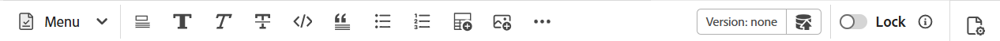

# Crear documentos de Markdown desde el editor {#id223MIE0B079}

Markdown es un lenguaje de marcado ligero que puede ayudarle a agregar elementos de formato a documentos de texto sin formato. Adobe Experience Manager Guides proporciona la función para crear y previsualizar un tema Markdown \(.md\) desde el Editor. También puede cargar los documentos de Markdown existentes y editarlos en el Editor.

## Crear un tema de Markdown

Siga estos pasos para crear un tema de Markdown desde el Editor:

1. En el panel Repositorio, seleccione  y, a continuación, seleccione **Tema** de la lista desplegable.
1. En el cuadro de diálogo **Nuevo tema**, proporcione los siguientes detalles:

   {width="300" align="left"}

   * **Título**: proporcione un título para el tema.
   * **Nombre**: el nombre del archivo se sugiere automáticamente basándose en el título del tema. Si el administrador ha habilitado nombres de archivo automáticos basados en la configuración de UUID, el campo Nombre no se mostrará.
   * **Plantilla**: Seleccione **Markdown** en la lista desplegable. La plantilla **Tema** está seleccionada de manera predeterminada.
   * **Ruta**: busque la ruta en la que desea guardar el archivo de tema. De forma predeterminada, la ruta de la carpeta seleccionada actualmente en el repositorio se muestra en el campo Ruta.

   >[!NOTE]
   >
   > En caso de una actualización, debe agregar la plantilla Markdown al perfil de carpeta actual en uso. Puede [crear una nueva plantilla de markdown desde el Editor](./web-editor-features.md#templates) o usar una plantilla existente para la creación de markdown. Para obtener más información sobre cómo agregar plantillas de creación en Experience Manager Guides, vea [Configurar perfiles globales o de nivel de carpeta](../cs-install-guide/conf-folder-level.md).
1. Seleccione **Crear**.

   El tema Markdown se crea en la ruta seleccionada y está abierto para su edición.

   {width="650" align="left"}

>[!NOTE]
>
> También puede crear un tema de markdown para una carpeta dentro del panel Repositorio. Seleccione la carpeta en la que desea crear un tema de Markdown y seleccione **Nuevo** y, a continuación, seleccione **Tema** en el menú Opciones. Ahora puede crear un tema de marcado proporcionando detalles del tema en el cuadro de diálogo **Crear tema**.

## Conocer las funciones del editor de un tema de Markdown

Esta sección muestra las distintas funciones disponibles en la creación de temas del Editor para Markdown. La interfaz de creación se divide en las siguientes secciones o áreas:

* [Barra de herramientas](#toolbar)
* [Área de edición de contenido](#content-editing-area)
* [Modos Source, Simultáneo y Vista previa](#source-side-by-side-and-preview-modes)
* [Panel derecho](#right-panel)

<!--
### Tab bar 

The tab bar features the file tabs of the topics or maps that are currently opened in the Editor along with other file-level options. 

Features available in the tab bar are explained as follows:

 {width="550" align="left"}

* **Topic tab**: Displays the currently opened topics in a tab. By default, you can view the file titles in the tab. As you hover over a file, you can view the file title and the file path as a tooltip.

    >![NOTE]
    >
    > As an administrator, you can also choose to view the list of files by filenames in the tabs. View [User preferences](./intro-home-page.md#user-preferences) for details.
* **Save all**: Saves the changes you have made in all opened topics. If you have multiple topics opened in the Editor, selecting **Save all** or pressing `Crtl+S` shortcut keys saves all documents in one click. You do not have to individually save each document.
* **AI Assistant**: [AI-powered Smart Help](./ai-based-smart-help.md) feature that helps you find relevant content from the Adobe Experience Manager Guides Documentation.
* **More actions**: Allows you to navigate to the **Assets UI**. As an administrator, you also get an option to navigate to the **Settings** page. Learn how to work with [settings](./web-editor-features.md#main-toolbar) or editor settings. 
* **Expand view**: Allows you to expand the page view using the **Expand** icon. In this view, the header bar is hidden, maximizing the content space. To return to the standard view, use the **Exit the expanded view** icon.

-->

### Barra de herramientas

La barra de herramientas se encuentra justo debajo de la barra de pestañas. Las funciones disponibles en la barra de herramientas se explican de la siguiente manera:

{align="left"}

| Características | Descripción |
|----------------|----------------|
| Edición de acciones | Proporciona acceso a varias características de edición de documentos, entre ellas **Cortar**  , **Deshacer**  , **Rehacer**  , **Copiar**  , **Eliminar**  , y **Buscar y reemplazar**  . Puede acceder a las opciones disponibles desde la lista desplegable **Menú**. |
| Opciones de formato de texto | Proporciona acceso a varias opciones de formato de texto, incluidos **Encabezados**  , **Negrita**  , **Cursiva**  , **Tachado**  , **Código**   y **Cita en bloque**  . |
| Opciones de inserción de contenido | Proporciona opciones para insertar una **lista numerada**  , **lista ordenada**  , **Tabla**  , **Imagen** , **Referencia cruzada**   y **Símbolo**   en un documento.   **Nota**: También puede arrastrar y soltar imágenes y otros archivos en el editor de Markdown. Los archivos se añaden como vínculos de referencia cruzada, mientras que las imágenes se muestran como elementos de imagen estándar. |
| Historial de versiones | Permite crear versiones de archivos Markdown y ver el historial de cambios. Puede comparar diferentes versiones y revertirlas a las anteriores si es necesario. La opción Historial de versiones está presente en el menú desplegable **Menú**. |
| Guardar como nueva versión | Guarda los cambios realizados en el tema y también crea una nueva versión del tema. Si está trabajando en un tema recién creado, la información de la versión se muestra como ninguna. |
| Bloquear/desbloquear | Bloquea o desbloquea el archivo actual. Bloquear un archivo le proporciona acceso de escritura exclusivo al archivo. Esto restringe a otros usuarios de la edición del archivo. Desbloquee el archivo si desea que otros usuarios tengan acceso de edición. Como administrador, también obtienes acceso a la función **Forzar desbloqueo** que te permite desbloquear el archivo bloqueado por otra persona. |

>[!NOTE]
>
> Se puede acceder a la característica **Historial de versiones** y a las características mencionadas en las acciones de edición, el formato de texto y la inserción de contenido desde las vistas **Source** y **en paralelo** del tema Markdown.

### Área de edición de contenido

El área de edición de contenido muestra la fuente Markdown del tema, donde se realizan todas las ediciones de contenido. En la vista en paralelo, esta área se divide en dos secciones: Markdown source view a la izquierda y Preview a la derecha. Puede tener varios temas abiertos al mismo tiempo, que se muestran en sus respectivas pestañas.

### Modos Source, Simultáneo y Vista previa

Para la creación de markdown, el Editor admite tres modos de visualización diferentes para ayudar a crear contenido y dar formato:

{align="left"}

* Origen
* Lado a lado
* Vista previa

**Origen**

Esta es la vista de código de markdown del Editor. Puede editar los temas de markdown como lo haría en cualquier editor de markdown normal. En la vista Source, tiene las opciones para guardar una revisión del documento, insertar encabezados, insertar tabla, insertar imagen, etc.

Utilice esta vista si desea centrarse únicamente en escribir y editar el Markdown sin ver la salida procesada.

**En paralelo**

Este modo divide el Editor en dos paneles:

* Panel de Source que muestra el tema de Markdown que está editando.
* El panel Previsualización que muestra la salida procesada del tema Markdown en tiempo real.

{width="550" align="left"}

Utilice esta vista si desea ver el resultado procesado en tiempo real al editar los temas de Markdown.

**Vista previa**

Al abrir un tema de marcado en el modo de vista previa, se muestra cómo se mostrará un tema cuando lo vea un usuario en el explorador. En esta vista, todas las funciones de edición se quitan de la barra de herramientas. Sin embargo, todavía puede acceder a las características de **Guardar como versiones nuevas**, **Bloquear/desbloquear** de la barra de herramientas y a la característica de **Propiedades del archivo** del panel derecho.

### Panel derecho

El panel derecho le permite acceder al panel **Propiedades del archivo&quot;.

Las Propiedades del archivo tienen las dos secciones siguientes:

**General**

La sección General le permite acceder a las siguientes funciones:

* **Nombre de archivo**: muestra el nombre de archivo del tema seleccionado.
* **ID**: muestra el ID del tema seleccionado.
* **Idioma**: muestra el idioma del tema. Se establece desde el campo language en la página de propiedades.
* **Creado el**: muestra la fecha y la hora en que se creó el tema.
* **Modificado el**: muestra la fecha y la hora en que se modificó el tema.
* **Bloqueado por**: muestra el usuario que desprotegió el tema.
* **Estado del documento**: puede seleccionar y actualizar el estado del documento del tema abierto actualmente. Para obtener más información, vea [Estado del documento](./web-editor-document-states.md).
* **Etiquetas**: estas son las etiquetas de metadatos del tema. Se establecen en el campo de etiquetas de la página de propiedades. Puede escribirlos o seleccionarlos en la lista desplegable. Las etiquetas aparecen debajo de la lista desplegable. Para eliminar una etiqueta, seleccione el icono en forma de cruz situado junto a la etiqueta.
* **Editar más propiedades**: puede editar más propiedades desde la página de propiedades del archivo.

**Referencias**

La sección Referencias le permite acceder a las siguientes funciones:

* **Utilizado en**: el Utilizado en referencias enumera los documentos a los que se hace referencia o se utiliza el archivo actual.
* **Vínculos de salida**: Los vínculos de salida enumeran los documentos a los que se hace referencia en el documento actual.

>[!NOTE]
>
> Todas las referencias de los vínculos de entrada y de salida utilizados se vinculan mediante hipervínculos a los documentos. Puede abrir y editar fácilmente los documentos vinculados.

## Limitaciones de funciones

Actualmente, las siguientes funciones de Experience Manager Guides no son aplicables a la creación de Markdown:

1. Revisión
2. Combinar
3. Asistente de IA
4. Seguimiento de cambios

**Tema principal:**[ Introducción al editor](web-editor.md)
