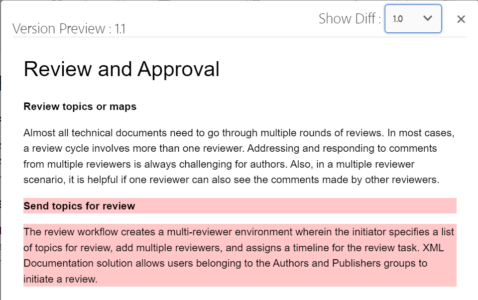
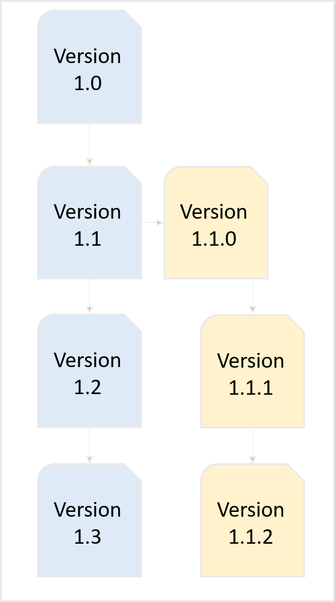

# Previsualización de un tema {#id1696II000QR}

Una vez creado un tema, Adobe Experience Manager Guides genera una vista previa del mismo. El modo Vista previa proporciona varias funciones que puede utilizar para trabajar con el documento.

Existen dos formas de obtener una vista previa de un tema en Experience Manager Guides:

- [Desde el editor](#preview-topics-from-the-editor)
- [Desde la IU de Assets](#preview-topics-from-the-assets-ui)

## Previsualizar temas desde el editor

Siga estos pasos para obtener una vista previa de un tema desde el Editor:

1. En el panel Repositorio, desplácese hasta el tema que desee ver.
1. Pase el ratón sobre el tema que quiera previsualizar y seleccione **Previsualizar** en el menú Opciones.

   {width="600" align="left"}

   Se muestra la previsualización del tema.

   {align="left"}

**Vista previa de temas desde el modo de vista previa**

Cuando abra un tema en el Editor y cambie al modo **Vista previa**, ubicado en la esquina inferior derecha del área de edición de contenido, podrá ver una vista previa del tema que esté abierto en ese momento.

Para obtener más información, vea [Vistas del editor](./web-editor-views.md#preview).

## Previsualización de temas desde la IU de Assets

Siga estos pasos para obtener una vista previa de un tema:

1. En la interfaz de usuario de Assets, vaya al tema que desee ver.
1. Seleccione el tema que desee ver.

   En la interfaz de usuario de Assets se muestra una vista previa del tema.

   >[!NOTE]
   >
   > Puede ver la versión del tema activo o el mapa DITA en la esquina superior derecha de la barra de herramientas.

   >[!IMPORTANT]
   >
   > La colocación de las siguientes funciones en la barra de herramientas Vista previa podría diferir según la configuración del servidor de Adobe Experience Manager. Algunas de las funciones podrían estar disponibles en la barra de herramientas principal, mientras que otras podrían estar disponibles en el menú Más.

## Funciones disponibles en la interfaz de usuario de Assets para vista previa

Las siguientes operaciones están disponibles en la barra de herramientas al utilizar la función Vista previa de la interfaz de usuario de Assets,

{align="left"}

**Propiedades**

Ver las propiedades del tema seleccionado. En función de su versión de Adobe Experience Manager, puede ver propiedades como metadatos, programar \(de\)activación, referencias, estado del documento y mucho más.

>[!NOTE]
>
> La propiedad title de un tema se rellena automáticamente a partir de la etiqueta `title` del tema o asignación DITA. Si realiza cualquier cambio en el título mediante la ventana de propiedades, ese cambio se pierde. Si desea actualizar la propiedad del título, debe hacerlo con el editor.

La página Propiedades contiene información útil sobre las referencias, como dónde se utiliza un mapa o un tema, o qué referencias están contenidas en un documento. La página Propiedades enumera dos tipos de referencias para un documento: **Utilizada en** y **Referencias salientes**.

Las referencias **Utilizadas en** enumeran los documentos a los que se hace referencia o se utiliza el archivo actual. Las **referencias salientes** enumeran los documentos a los que se hace referencia en el documento actual.

El icono \(+\) de la sección **Referencias utilizadas en** le permite desplazarse hacia arriba para encontrar dónde se utiliza o se hace referencia a ese tema.

{align="left"}

Al seleccionar el icono  junto a un documento, se muestran los archivos de asignación o tema a los que se hace referencia en mayor profundidad en ese documento.

**Filtrado condicional \(A/B\)**

Si el tema tiene contenido condicional, verá el icono A/B en la barra de herramientas. Al seleccionar este icono, se abrirá una ventana emergente que le permite filtrar el contenido según las condiciones disponibles en el tema.

>[!NOTE]
>
> El contenido condicional se resalta con un color de fondo claro en el Editor.

{width="300" align="left"}

**Editar**

- Abra el tema para editarlo en el Editor. La opción **Editar** no estará disponible si el administrador ha habilitado la opción **Deshabilitar edición sin bloquear el archivo**. Con la opción habilitada, solo verá la opción **Editar** después de bloquear un archivo de tema.

**Resolución de clave**

- Si desea utilizar un archivo de espacio de claves para el tema, seleccione el icono Resolución de claves. A continuación, puede elegir un espacio de teclas en la ventana emergente Resolución de teclas.

**Origen**

- Abra el código fuente XML de un archivo. Para ver el código XML subyacente de un mapa, tema o archivo DITAVAL, abra el archivo en el modo Vista previa y seleccione el icono Source. La ventana emergente XML Source muestra el código fuente XML. Puede seleccionar un código específico del archivo o presionar `Ctrl`+`a` para seleccionar todo el contenido.

  >[!NOTE]
  >
  > Para obtener la vista del código fuente de un archivo de mapa DITA, seleccione el archivo en la interfaz de usuario de Assets y seleccione Source.

  {align="left"}

**Compartir vínculo UUID**

- Experience Manager Guides permite compartir vínculos basados en UUID para mapas, temas y archivos de imagen DITA desde los siguientes lugares:

   - IU de Assets
   - Consola del mapa DITA
   - Previsualización del tema o la imagen

Se muestra una nueva opción **Compartir vínculo UUID** en la barra de herramientas de las áreas mencionadas anteriormente. La siguiente captura de pantalla muestra la opción **Compartir vínculo UUID** en el modo de vista previa de un tema:

{align="left"}

En la IU de recursos, esta opción está visible al seleccionar un archivo. En el modo Vista previa, esta opción está disponible de forma predeterminada en la barra de herramientas principal. En una consola de mapas DITA, esta opción está visible en la sección Ajustes preestablecidos de salida.

Una vez copiada la dirección URL, la misma se puede compartir con otros usuarios para darles acceso directo al archivo. Este vínculo sigue siendo válido incluso cuando el archivo se mueve a otra ubicación del repositorio. La única vez que el vínculo falla es cuando el archivo se elimina del repositorio.

Si comparte el vínculo desde la consola de mapa DITA o desde el modo de vista previa de un archivo, el usuario accederá a la misma vista de archivo. Sin embargo, cuando comparte el vínculo de un archivo de mapa desde la interfaz de usuario de Assets, el usuario se dirige a la consola del mapa. Del mismo modo, para un tema o archivo de imagen, se muestra la vista previa del archivo.

>[!IMPORTANT]
>
> El vínculo no se puede utilizar como vínculo de referencia en otro tema, solo proporciona acceso directo al archivo en el repositorio. Además, el vínculo sigue siendo válido siempre que el archivo esté disponible en el repositorio. Aunque el archivo se mueva a otra ubicación del repositorio, el vínculo sigue siendo válido. El vínculo solo fallará cuando el archivo se elimine del repositorio.

**Cierre de compra/Registro**

- Activa o desactiva las funciones Desproteger y Proteger. Cuando se desprotege un archivo, el usuario actual obtiene un permiso de escritura exclusivo sobre el archivo. Se puede abrir un archivo desprotegido en el Editor para editarlo. Una vez realizado el cambio necesario, seleccione el icono Proteger para guardar el archivo en DAM.

Cuando se desprotege un tema, el estado del archivo se muestra como desprotegido en la vista de tarjeta y en la vista de lista.

Archivo retirado en la vista de tarjeta:

{width="300" align="left"}

Archivo retirado en la vista de lista:

{width="550" align="left"}

Si la columna Desprotegido no está visible, seleccione **Ver configuración** en **Vista de lista** y seleccione el estado **Desprotegido** en el cuadro de diálogo **Configurar columnas**.

{align="left"}

>[!TIP]
>
> Consulte la sección Versiones del contenido en la guía de prácticas recomendadas para conocer las prácticas recomendadas sobre cómo trabajar con la desprotección y el registro de archivos.

**Diferencia de versión basada en web**

- Si el tema ha sufrido algunos cambios, puede averiguar fácilmente los cambios realizados en diferentes versiones de ese tema. Para conocer los cambios en las distintas versiones de un tema:

  >[!IMPORTANT]
  >
  > El método descrito en el siguiente procedimiento sólo es aplicable a ficheros DITA. Para los archivos que no son DITA, utilice la vista Cronología para crear versiones o restaurar una versión existente de un archivo.

   1. Abra el tema en el modo de vista previa.

   1. En el carril izquierdo, seleccione **Historial de versiones** y elija una versión.

      {align="left"}

   1. De las versiones enumeradas, seleccione la que desee usar como versión base y seleccione **Vista previa**. La vista previa de la versión seleccionada se muestra en la ventana Version Preview.

   1. En la lista **Mostrar diferencias**, seleccione la versión con la que desea comparar la versión base.

      {align="left"}

      El contenido modificado se resalta en la vista previa del tema. El contenido resaltado en verde significa que el contenido recién agregado y el contenido en rojo es el contenido eliminado.

      {align="left"}

## Rama, reversión y versiones posteriores

- En un entorno de creación típico, sería necesario crear una nueva rama de un tema para adaptarla a una versión específica. Al igual que cualquier otro sistema de administración de versiones, Experience Manager Guides permite crear una rama a partir de una versión existente de un tema o revertir a una versión anterior de un tema. Con las funciones de administración de versiones que ofrece Experience Manager Guides, puede realizar las siguientes tareas:

   - Crear una rama a partir de una versión existente de un tema
   - Crear versiones posteriores en una rama nueva
   - Revertir a una versión específica de un tema

  La siguiente ilustración muestra el típico sistema de ramificación y versiones subsiguientes:

  {width="550" align="center"}

  Para cualquier tema nuevo, la primera versión se numera como 1.0. A partir de entonces, cada nueva versión del tema se guarda con un número incremental como 1.1, 1.2, etc. Una vez creada una rama de un tema, se crea una nueva rama tomando el número de versión de donde se crea la rama y agregando un 0 al final de la versión. Como se muestra en la ilustración, se crea una nueva rama a partir de la versión 1.1 de un tema. La nueva rama tiene la versión 1.1.0. A partir de entonces, cada vez que se guarda una nueva versión del tema en esta rama, se obtiene un número de versión incremental como 1.1.1, 1.1.2, etc.

  De forma similar a la bifurcación, también puede revertir la versión de trabajo o actual a cualquier versión que exista en el repositorio. Para revertir a una versión, simplemente seleccione la versión que desee del tema y seleccione **Revertir a esta versión** en el panel **Historial de versiones**.

  Realice los siguientes pasos para crear una rama, revertir a una versión y mantener las versiones posteriores de un tema:

  >[!IMPORTANT]
  >
  > El método descrito en el siguiente procedimiento sólo es aplicable a ficheros DITA. Para los archivos que no son DITA, utilice la vista Cronología para crear versiones o restaurar una versión existente de un archivo.

   1. Acceda al tema en la interfaz de usuario de Assets.

      >[!NOTE]
      >
      > También puede abrir el tema en el modo Vista previa y continuar con el paso 3.

   1. Seleccione el tema para el que desea crear una rama.

   1. En el carril izquierdo, seleccione **Historial de versiones**.

      >[!NOTE]
      >
      > Se muestra una lista de versiones disponibles para el tema seleccionado. Cada versión contiene la marca de tiempo, el nombre de usuario, el comentario de versión y la información de [etiqueta](web-editor-use-label.md#).

   1. Seleccione una versión de la que desee crear una rama. En la siguiente captura de pantalla, se selecciona la versión 1.2 para crear una rama.

      {width="300" align="left"}

      >[!NOTE]
      >
      > La versión actual de un tema contiene *\(Actual\)* mencionado junto al número de versión.

   1. Seleccionar **Revertir a esta versión**.

      Aparece un mensaje que le pide que confirme la creación de una nueva rama.

   1. *\(Opcional\)* En el mensaje, aparece una opción para seleccionar **Guardar la copia de trabajo actual como una nueva versión**. Las dos acciones siguientes son posibles en función de la selección de esta opción:

      - Si selecciona esta opción, se crea una rama a partir de la versión 1.1. Además, también se crea una nueva versión del tema a partir de la copia de trabajo actual del tema y se guarda como la siguiente versión: 1.4.

        {width="300" align="left"}

        La versión 1.2 se convierte en la copia de trabajo actual del tema. Cualquier versión guardada después de esto se crea en la nueva rama de 1.1. Por ejemplo, la versión posterior de un nuevo tema en esta rama se guardará como 1.2.0.

        {width="300" align="left"}

      - Si no selecciona esta opción, no se crea ninguna nueva versión de la copia de trabajo actual del tema. Se crea una nueva rama a partir de la versión 1.2 del tema. Cualquier versión posterior del tema se guarda en la rama 1.2 como 1.2.0, 1.2.1, etc.

        {width="300" align="left"}

   1. Seleccione **Aceptar**.

  Se crea una nueva rama a partir de la versión seleccionada del tema. El proceso anterior también es aplicable para volver a una versión específica de un tema. Técnicamente, revertir a una versión específica significa que crea una rama nueva a partir de la versión seleccionada y convierte esa versión en la copia de trabajo actual del tema. También puede ver el historial de los archivos que se han revertido en el informe Historial de reversiones de la versión. Para obtener más información sobre este informe, vea [Informe del historial de versiones de archivos revertidos](reports-reverted-file-version-history.md#).

**Tema principal:**&#x200B;[&#x200B; Crear y previsualizar temas](create-preview-topics.md)
