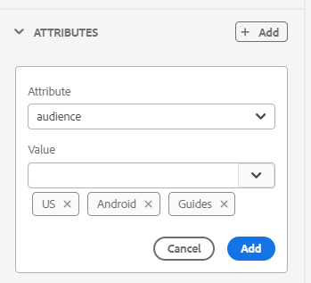
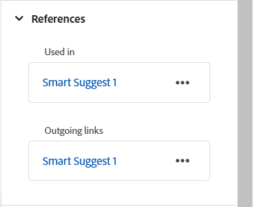

# Panel derecho en el editor

El panel derecho contiene información sobre el documento seleccionado actualmente.

>[!NOTE]
>
> Se puede cambiar el tamaño del panel derecho. Para cambiar el tamaño del panel, coloque el cursor sobre el límite del panel, el cursor cambiará a una flecha de dos puntas, seleccione y arrastre para cambiar el tamaño del ancho del panel.

El panel derecho le permite acceder a las siguientes funciones:

- [Propiedades del contenido](#content-properties)
- [Propiedades del archivo](#file-properties)
- [Revisión](#review)
- [Seguimiento de cambios](#track-changes)
- [Schematron](#schematron)

## Propiedades del contenido

Puede acceder a la función **Propiedades de contenido** seleccionando el icono **Propiedades de contenido** en el panel derecho. El panel **Propiedades de contenido** contiene información sobre el tipo de elemento seleccionado actualmente en el documento y sus atributos.

Para el contenido al que se hace referencia, el panel también muestra las opciones **Ruta del vínculo** y **UUID del vínculo** que le ayudan a identificar y copiar la referencia seleccionada.

>[!NOTE]
>
> En el caso de los archivos basados en HTML, las opciones Ruta del vínculo y UUID del vínculo no están disponibles. Estos archivos siguen usando el comportamiento de **Link URL** existente.

**Tipo**: vea y seleccione las etiquetas de la jerarquía completa para la etiqueta actual en el menú desplegable.

**Ruta de vínculo**: muestra la ruta relativa de la referencia seleccionada. Use **Copiar ruta** para copiar la ruta absoluta.

**UUID de vínculo**: muestra el UUID de la referencia seleccionada. Use **Copiar UUID** para copiar el UUID.

Si pega un UUID válido directamente en el campo Ruta de vínculo, se resolverá automáticamente en la ruta de archivo absoluta y el UUID correspondiente se mostrará en el campo UUID de vínculo. Esto facilita la identificación y copia de la ruta del recurso y su referencia basada en UUID.

**Atributos**: El panel desplegable **Atributos** está disponible en las vistas Diseño, Autor y Source. Puede añadir, editar o eliminar fácilmente los atributos.

    
 Pasos para añadir atributos 

1. Seleccione **Añadir**.

   {width="300"}

1. En el panel desplegable **Atributo**, seleccione el atributo en la lista desplegable y especifique el valor de un atributo.  Luego selecciona **Agregar**.

   {width="300"}

1. Para editar el atributo, pasa el ratón sobre él y selecciona **Editar** .

1. Para eliminar el atributo, pasa el ratón sobre él y selecciona **Eliminar** .

>[!NOTE]
>
> Incluso si el tema contiene contenido referenciado, puede agregar atributos mediante el panel de propiedades.

Si el administrador ha creado un perfil para atributos, obtendrá esos atributos junto con sus valores configurados. Con el panel de propiedades de contenido, puede elegir esos atributos y asignarlos al contenido relevante del tema. De este modo, también puede crear contenido condicional, que luego puede utilizar para crear resultados condicionales. Para obtener más información acerca de cómo generar resultados mediante ajustes preestablecidos condicionales, vea [Usar ajustes preestablecidos de condición](generate-output-use-condition-presets.md#).

## Propiedades del archivo

Vea las propiedades del archivo seleccionado seleccionando el icono Propiedades del archivo en el panel derecho. La función Propiedades del archivo está disponible en los cuatro modos o vistas siguientes: Diseño, Autor, Source y Vista previa.

>[!NOTE]
>
> El panel Propiedades del archivo proporciona opciones para ver y modificar varias propiedades de metadatos asociadas a un archivo. Sin embargo, cuando un archivo está en modo de solo lectura, estas propiedades de metadatos no se pueden modificar. Esta limitación se aplica sólo a ficheros DITA y Markdown. Para los recursos que no son DITA (como imágenes y multimedia), las propiedades de metadatos siguen siendo editables, incluso en modo de solo lectura.

Las propiedades del archivo tienen las dos secciones siguientes:

**General**

La sección General le permite acceder a las siguientes funciones:

{width="300"}

- **Nombre de archivo**: muestra el nombre de archivo del tema seleccionado. El nombre de archivo está enlazado mediante un hipervínculo a la página de propiedades del archivo seleccionado.
- **ID**: muestra el ID del tema seleccionado.
- **Recuento de palabras**: muestra el número total de palabras en el tema DITA correspondiente. Las palabras separadas por espacios se cuentan como palabras individuales. El recuento se actualiza cada vez que se guardan cambios en el tema. En el caso de las referencias cruzadas, solo se incluye el texto para mostrar en el recuento, mientras que las claves se excluyen.

  >[!NOTE]
  >
  > La característica **Recuento de palabras** se introdujo en la versión 2026.01.0 de Experience Manager Guides as a Cloud Service. Los nuevos temas DITA que cree después de actualizar a esta versión tendrán automáticamente el recuento de palabras calculadas en el panel derecho. Para los temas existentes, se requiere [reprocesamiento de los recursos](./asset-processor.md).

- **Etiquetas**: estas son las etiquetas de metadatos del tema. Se establecen en el campo de etiquetas de la página de propiedades. Puede escribirlos o seleccionarlos en la lista desplegable.  Las etiquetas aparecen debajo de la lista desplegable. Para eliminar una etiqueta, seleccione el icono en forma de cruz situado junto a la etiqueta.
- **Editar más propiedades**: permite ver y editar propiedades adicionales del archivo abierto actualmente.

  >[!NOTE]
  >
  > Cualquier adición, eliminación o modificación de las propiedades de metadatos (ya sean predeterminadas o personalizadas) almacenará en déclencheur el [indicador de copia de trabajo](./web-editor-edit-topics.md#working-copy-indicator) en la versión del documento.

- **Idioma**: muestra el idioma del tema. Se establece desde el campo language en la página de propiedades.
- **Creado el**: muestra la fecha y la hora en que se creó el tema.
- **Modificado el**: muestra la fecha y la hora en que se modificó el tema.
- **Bloqueado por**: muestra el usuario que bloqueó el tema.
- **Estado del documento**: puede seleccionar y actualizar el estado del documento del tema abierto actualmente. Para obtener más información, vea [Estado del documento](web-editor-document-states.md#).

>[!NOTE]
>
> Puede copiar los valores de atributo de los distintos campos de las propiedades del archivo en el portapapeles.

**Referencias**

La sección Referencias le permite acceder a las siguientes funciones:

{width="300"}

- **Utilizado en**: el Utilizado en referencias enumera los documentos a los que se hace referencia o se utiliza el archivo actual.
- **Vínculos de salida:** Los vínculos de salida enumeran los documentos a los que se hace referencia en el documento actual.

De forma predeterminada, puede ver los archivos por títulos. Al pasar el ratón por encima de un archivo, puede ver el título y la ruta del archivo como información sobre herramientas.

>[!NOTE]
>
> Como administrador, también puede elegir ver la lista de archivos por nombres de archivo en el Editor. Seleccione la opción **Nombre de archivo** de la sección **Archivos del editor muestran la configuración** en **Preferencias de usuario**.

>[!NOTE]
>
> Todas las referencias utilizadas en y salientes se hipervinculan a los documentos. Puede abrir y editar fácilmente los documentos vinculados.

Además de abrir archivos, también puede realizar muchas acciones utilizando el menú **Opciones** de la sección Referencias. Algunas de las acciones que puede realizar son Editar, Vista previa, Copiar UUID, Copiar ruta, Agregar a colecciones y Propiedades.

**Traducciones**

Esta sección enumera todas las copias de idioma disponibles para el recurso abierto actualmente en el Editor, en orden alfabético. La información se presenta en una vista tabular, en la que se muestra cada código de idioma junto con el *título de archivo* correspondiente (o *nombre de archivo* en caso de que *título de archivo* no esté disponible).

>[!INFO]
>
> Las copias de idioma se crean cuando se envía un recurso para su traducción. El inglés (`en`) actúa como idioma de origen y las copias traducidas se generan en sus respectivas carpetas de idioma de destino (por ejemplo, `de` para alemán o `fr` para francés). Si un recurso existe solamente en la carpeta `en`, no se mostrarán copias de idioma adicionales hasta que se inicie y complete la traducción para los idiomas de destino. Si el recurso no está presente en ninguna carpeta de idioma, se muestra **No hay traducciones disponibles**. Para obtener más información, vea [Prácticas recomendadas para la traducción de contenido](./translation-first-time.md).

{width="300"}

Para cada copia de idioma, puede pasar el ratón sobre el archivo para localizar su ruta en el repositorio o simplemente seleccionarlo para abrirlo en el Editor. Además de abrir archivos, también puede realizar muchas acciones utilizando el menú **Opciones** de la sección Traducciones. Algunas de las acciones que puede realizar son Editar, Vista previa, Copiar UUID, Copiar ruta, Agregar a colecciones y Propiedades.

{width="300"}

## Revisión

Al seleccionar el icono Revisar, se abre el panel de revisión, en el que puede seleccionar una tarea de revisión para el documento abierto actualmente y ver los comentarios.

{width="300"}

Si ha creado varios proyectos de revisión, puede seleccionar uno de la lista desplegable y acceder a los comentarios de revisión.

Con el panel de revisión, puede ver y publicar respuestas a los comentarios proporcionados sobre el tema. Puede aceptar o rechazar los comentarios uno por uno.

>[!NOTE]
>
> El cuadro de comentarios y el cuadro de respuesta admiten entradas de varias líneas y permiten a los usuarios expandirlas según sea necesario para proporcionar comentarios completos así como respuestas detalladas a los comentarios. Puedes usar **Shift** + **Enter** para ir a la línea siguiente mientras escribes los comentarios o respuestas.

Para obtener más información, vea [Comentarios de revisión de direcciones](review-address-review-comments.md#).

## Seguimiento de cambios

Con la función Cambios rastreados del panel derecho, puede ver la información de todas las actualizaciones realizadas en un documento. También puede buscar actualizaciones específicas realizadas en el documento.

>[!NOTE]
>
> La característica de cambios realizados muestra todas las actualizaciones de las que se ha realizado un seguimiento mediante la característica Habilitar/Deshabilitar el seguimiento de cambios de la [barra de fichas](./web-editor-tab-bar.md).

## Schematron

&quot;Schematron&quot; hace referencia a un lenguaje de validación basado en reglas que se utiliza para definir pruebas para un archivo XML. El editor admite archivos de Schematron. Puede importar los archivos de Schematron y también editarlos en el Editor. Con un fichero de Schematron se pueden definir determinadas reglas y, a continuación, validarlas para un tema DITA o un mapa.

Aprenda a trabajar con archivos de Schematron en Experience Manager Guides, consulte [Compatibilidad con archivos de Schematron](./support-schematron-file.md).

**Tema principal:**[ Introducción al editor](web-editor.md)
