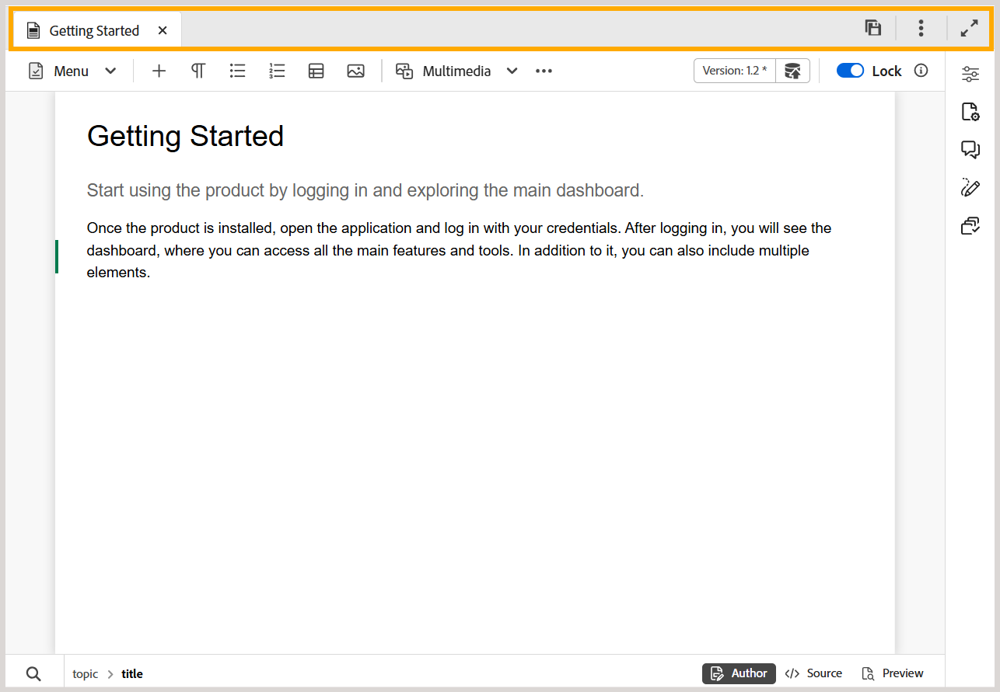

# Barra de pestañas del editor

>[!INFO]
>
> Este tema se aplica tanto al Editor nuevo como al Editor antiguo. Aunque la funcionalidad principal sigue siendo coherente, las diferencias en la interfaz de usuario, la terminología y las interacciones se indican dentro del contenido mediante pestañas y llamadas, según corresponda.

La barra de fichas se encuentra en la parte superior de la interfaz del Editor y proporciona acceso a las distintas funciones de nivel de archivo.

>[!BEGINTABS]

>[!TAB Nuevo editor]

>[!TAB Editor antiguo]

>[!ENDTABS]

**Pestañas**

Muestra los temas abiertos actualmente en el Editor como fichas de archivo. Puede tener varios temas abiertos al mismo tiempo, que se muestran en sus respectivas pestañas en la barra de pestañas. De forma predeterminada, puede ver los títulos de los archivos en las pestañas. Al pasar el ratón por encima de un archivo, puede ver el título y la ruta del archivo como información sobre herramientas.

>[!NOTE]
>
> Como administrador, también puede elegir ver la lista de archivos por nombres de archivo en las pestañas. Seleccione la opción **Filename** en la sección **Configuración de visualización de archivos del editor** en [Preferencias de usuario](./intro-home-page.md#user-preferences).

Al seleccionar la pestaña Archivo, se abre un menú contextual con las opciones Guardar como nueva versión, Copiar, Buscar en, Añadir a, Propiedades, Dividir, Descargar como PDF y Cerrar.

**Guardar todo**

Guarda los cambios realizados en todos los temas abiertos. Si tiene varios temas abiertos en el editor, al seleccionar **Guardar todo** o al usar las teclas de método abreviado **Ctrl**+**S** se guardan todos los documentos con un solo clic. No es necesario guardar cada documento individualmente.

>[!NOTE]
>
> La operación **Guardar todo** no crea una nueva versión de los temas. Para crear una nueva versión, usa la opción **Guardar como nueva versión**.

**Ayudante de IA**

Una potente herramienta impulsada por IA diseñada para mejorar su productividad mediante funciones inteligentes de ayuda y creación. Reúne dos características de IA sólidas — **Creación** y **Ayuda** — en la interfaz de Experience Manager Guides, lo que le permite crear contenido y acceder a información de la documentación de Experience Manager Guides de forma más rápida y eficaz.

>[!NOTE]
>
> Actualmente, la función AI Assistant está disponible para Adobe Experience Manager Guides as a Cloud Service.

**Expandir vista**: permite expandir la vista de página mediante el icono **Expandir**. En esta vista, la barra de encabezado que contiene el logotipo de Adobe Experience Manager está oculta. Esto maximiza el espacio de contenido para editar. Para volver a la vista estándar, usa el icono **Salir de la vista expandida**.

**Más acciones**: Proporciona acceso a opciones adicionales. Al seleccionar este botón, se abre un menú con las siguientes opciones:

- **Assets**: lo lleva a un destino basado en su configuración.
   - **Cloud Services**: Si usas Cloud Services, al seleccionar la opción **Assets** accederás a la página Navegación de AEM.

   - **Software On-Premise**: Si utiliza Adobe Experience Manager Guides (4.2.1 y versiones posteriores), al seleccionar la opción **Assets**, se le redirigirá a la ruta de archivo actual en la interfaz de usuario de Assets.
- **Configuración de Workspace**: lo lleva al cuadro de diálogo Configuración de Workspace. Para obtener más información, vea [Configurar las opciones de Workspace](../install-conf-guide/workspace-settings.md).

>[!NOTE]
>
>Si usa Adobe Experience Manager Guides en una configuración local anterior a la versión 5.2, la opción de configuración de Workspace seguirá apareciendo como **Configuración** en el menú Más acciones.

- **Configuración del editor**: lo lleva al cuadro de diálogo Configuración del editor, donde puede personalizar el comportamiento del editor a nivel de autor individual. Permite controlar la visibilidad y el comportamiento de las etiquetas, los comentarios y otras configuraciones de nivel de editor durante la creación. Para obtener más información, vea [Configuración del editor](../install-conf-guide/workspace-settings.md).

**Tema principal:**&#x200B;[&#x200B; Introducción al editor](web-editor.md)
