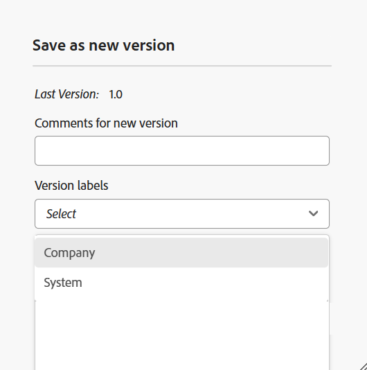

# Barra de herramientas en el editor

La barra de herramientas aparece cuando se abre un tema o un mapa para editarlo en el Editor. Las funciones disponibles en la barra de herramientas son las siguientes:

- [Lista desplegable del menú](#menu-dropdown)
- [Opciones de inserción de contenido](#content-insertion-options)
- [Versión información y Guardar como nueva versión botón](#version-information-and-save-as-new-version)
- [Bloquear/desbloquear](#lockunlock)

>[!NOTE]
>
> Las funciones enumeradas anteriormente solo se aplican a los archivos de tema. Al trabajar con un archivo de mapa, se muestran diferentes opciones en la barra de herramientas en función de la vista actual del editor de mapas. Obtenga información acerca de las opciones de la barra de herramientas del editor de mapas en el documento [Funciones del editor de mapas](./map-editor-advanced-map-editor.md).

## Menú desplegable

La lista desplegable Menú proporciona acceso a las acciones de edición, Buscar y reemplazar, Historial de versiones, Etiqueta de versión, Combinar, Crear tarea de revisión, Rastrear cambios y Etiquetas.

La explicación detallada de estas funciones es la siguiente:

**Editando acciones**

Al editar un tema en el editor, accede a las distintas acciones de edición como **Cortar** o ***Ctrl***+***X*** , **Copiar** o ***Ctrl***+***C*** , **Deshacer** o ***Ctrl***+***Z*** , **Rehacer** o ***Ctrl***+***Y*** y **Eliminar** está presente en el menú desplegable.

**Buscar y reemplazar**

La característica **Buscar y reemplazar** está disponible en los modos de vista Autor y Source. Cuando está habilitada, la barra de texto Buscar y reemplazar aparece en la parte inferior del área de edición del tema. Puede usar las teclas de método abreviado **CTRL**+**F** para invocar la barra Buscar y reemplazar.

{align="left"}

Con el icono de configuración \(\), puede alternar las opciones de búsqueda **Ignorar mayúsculas y minúsculas** y **Sólo palabras completas**. Para realizar la búsqueda sin distinción entre mayúsculas y minúsculas, active \(o seleccione\) la opción **Ignorar mayúsculas y minúsculas**. De lo contrario, si desea realizar la búsqueda que distingue entre mayúsculas y minúsculas, desactive \(o deseleccione\) la opción **Ignorar mayúsculas y minúsculas**. También puede elegir buscar una palabra entera.

El búsqueda es instantáneo, lo que significa que a medida que escribe la frase o palabra búsqueda en el **campo Buscar** , el término se busca y selecciona inmediatamente en el tema. Del mismo modo, para reemplazar un texto en su tema, ingrese el término búsqueda y su reemplazo en los campos respectivos y seleccione el **Reemplazar** o **Reemplazar Todos botón** .

En el Origen vista, la **función Buscar y reemplazar** es extremadamente útil para buscar un elemento o atributo específico. Por ejemplo, si desea reemplazar el `@product` valor del atributo, puede hacerlo fácilmente desde el vista Origen. El Autor vista no permite búsqueda sobre la base de un atributo o elemento. Sin embargo, debe tener cuidado al usar la **característica Reemplazar todos** , ya que podría sobrescribir el código XML.

**Versión historia**

La **función de historial** de Versión en el Editor le permite verificar las versiones disponibles de sus archivos DITA, compararlas y volver a cualquier versión desde el propio Editor. Puede comparar el contenido y la metadatos de la versión actual (que también puede ser una copia de trabajo) con cualquier versión anterior del mismo archivo. También puede vista las etiquetas y los comentarios para las versiones comparadas.

>[!NOTE]
>
> Las opciones del historial de Versión solo aparecen si hay cambios realizados en la primera versión del tema o mapa.

    
 Pasos para acceder al historial de Versión 

1. Abra un tema en el Editor.
1. Seleccione **Versión historial** en el **** menú desplegable.

   Aparecerá el **cuadro de diálogo Historial** Versión.

   {width="550" align="left"}

   *Vista previa los cambios en las distintas versiones de un tema.*

1. Elija una versión del tema que desee comparar o revertir en la **lista desplegable Comparar con** .

   >[!NOTE]
   >
   > Si a una versión se le han aplicado etiquetas, también se muestran \(entre paréntesis\) junto con el número de versión.

1. Habilite la **opción comentarios** etiquetas de Ver para vista las etiquetas y los comentarios aplicados a la versión actual y a las comparadas.
1. También puede vista la siguiente información en el cuadro de **diálogo Historial** de Versión:

   **** Vista previa pestaña: el contenido recién agregado está en verde fuente y el contenido eliminado está en rojo fuente.

   **Metadatos** pestaña: el metadatos recién agregado está en color verde fuente y el metadatos eliminado está en rojo fuente.

   {width="550" align="left"}

   *Comparar los metadatos de diferentes versiones en el historial de Versión.*

   >[!NOTE]
   >
   > El administrador del sistema puede cambiar los metadatos que se mostrarán en la ficha Metadatos en **Configuración**. Para obtener más información, consulte la sección **Más acciones** de la [barra de fichas](#tab-bar).

   También puede ver los detalles de usuario y hora de la versión actual y la comparada.

   Una vez que elija una versión del lista desplegable, estará disponible la **opción Revertir a la versión** seleccionada. La ventana previsualización muestra las diferencias entre la versión actual y la versión seleccionada del tema.

1. Seleccione Revertir **a la versión** seleccionada para revertir la copia de trabajo con la versión seleccionada del tema.

   Aparecerá el cuadro de diálogo Revertir versión.

   {width="550" align="left"}

1. \(*Opcional*\) Proporcione un motivo para revertir a una versión anterior. También puede crear una nueva versión de la copia de trabajo activa del tema.

1. Seleccione **Confirmar**.

   La copia de trabajo del archivo se revierte a la versión seleccionada. Si decide crear una nueva versión de la copia de trabajo activa, también se creará una nueva versión del fichero con todos los cambios de trabajo.

   Al volver a una versión anterior, se muestra una señal visual que indica que la versión en la que está trabajando no es la más reciente.

   {align="left"}

**Versión etiquetas**

Las etiquetas le ayudan a identificar la fase en la que se encuentra un tema determinado en el DDLC \(Ciclo de vida de desarrollo de documentos\). Por ejemplo, cuando trabaje en un tema, podría establecer la etiqueta como &quot;Aprobado&quot;. Una vez que un tema se publica y se pone a disposición de los clientes, puede asignar la etiqueta &quot;Publicado&quot; a ese tema.

Experience Manager Guías permiten especificar etiquetas en una formato de texto de forma gratuito o utilizar un conjunto de etiquetas predefinidas. La etiqueta personalizada permitiría a cualquier autor del sistema especificar una etiqueta según su elección. Esto da flexibilidad; Sin embargo, introduce etiquetas incoherentes en el sistema. Para resolver este problema, los administradores pueden configurar un conjunto de etiquetas predefinidas. Para obtener más información acerca de cómo configurar etiquetas predefinidas, vea *Configurar y personalizar el Editor Web XML* en Instalar y configurar Adobe Experience Manager Guides as a Cloud Service.

Estas etiquetas se muestran a los autores en forma de lista desplegable siempre que necesiten especificar una etiqueta. Esto garantiza que solo se utilicen etiquetas predefinidas y coherentes en el sistema.

Existen diferentes métodos para aplicar etiquetas a los temas: el panel [Historial de versiones](web-editor-use-label.md) en la interfaz de usuario de Assets, la interfaz de usuario de [Líneas bases](/help/product-guide/user-guide/generate-output-use-baseline-for-publishing.md) y el editor. La función Etiqueta de versión del Editor ofrece a los autores una forma rápida y sencilla de asignar etiquetas a sus temas.

    
 Pasos para agregar etiquetas al tema desde el Editor 

1. Abra un tema en el Editor.

1. Seleccione **Versión etiquetas** de la lista desplegable Menú.

   Aparecerá el cuadro de diálogo Administración Etiquetar Versión.

   {width="650" align="left"}

   El cuadro de diálogo Versión Etiquetar Management se divide en dos partes: el panel izquierdo tiene una lista de versiones disponibles para el tema junto con el menú desplegable de etiquetas lista \(o un cuadro de texto para introducir una etiqueta\) y el panel derecho con un previsualización del tema.

1. Seleccione la versión a la que desee aplicar las etiquetas.

   Cuando elige una versión diferente del tema en la lista de versiones, el panel de vista previa muestra los cambios entre la versión actual y la seleccionada del tema

   >[!NOTE]
   >
   > Si ya se ha aplicado una etiqueta a una versión, esta se muestra junto al número de versión en la lista desplegable y debajo de la lista Seleccionar versión. Para quitar una etiqueta existente, seleccione el icono \(**x**\) que hay junto a la etiqueta.

1. Si el administrador ha definido una lista de etiquetas, se le mostrará una lista desplegable de las etiquetas desde la que puede elegir las etiquetas que desea aplicar. Puede seleccionar varias etiquetas en la lista desplegable.

   De lo contrario, se muestra un cuadro de texto, en el que puede introducir las etiquetas que desee agregar al tema.

   >[!NOTE]
   >
   > No se puede aplicar la misma etiqueta en varias versiones de un tema. Si intenta asociar una etiqueta existente, se le proporcionará una opción para eliminarla de la versión existente y aplicarla en la versión seleccionada del tema.

1. Seleccione **Agregar etiqueta**.

1. En el mensaje de confirmación Aplicar etiqueta, seleccione la opción **Mover etiqueta(si se usa en otra versión)** para mover las etiquetas de una versión existente a la versión seleccionada. Si no selecciona esta opción y hay etiquetas asignadas a una versión diferente del tema, no se mueven a la versión del tema seleccionado. Estas etiquetas se omiten en el proceso de aplicación de etiquetas.

**Combinar**

Cuando se trabaja en un entorno de varios autores, resulta difícil realizar el seguimiento de los cambios realizados por los demás autores en un tema o mapa. La función Combinar le proporciona más control no sólo sobre la visualización de los cambios, sino también sobre los cambios que se conservan en la última versión del documento.

    
 Combinar archivos de temas 

Para combinar los cambios en un tema, realice los pasos siguientes:

1. Abra un tema en el Editor.

1. Seleccione **Combinar**.

   Aparecerá el cuadro de diálogo Combinar.

   {width="550" align="left"}

1. *\(Opcional\)* También puede examinar y seleccionar un archivo nuevo desde otra ubicación del repositorio.

1. Seleccione una versión del archivo con la que desee comparar la versión actual del archivo.

1. En la Opciones, elija:

   - **Realizar un seguimiento de los cambios de la versión** seleccionada: Esta opción muestra todas las actualizaciones de contenido en forma de cambios controlados. A continuación, puede elegir aceptar o rechazar los cambios en el documento uno a la vez o todo de una sola vez.

   - **Revertir a la versión** seleccionada: Esta opción revierte la versión actual del documento a la versión seleccionada. Esta opción no le proporciona ningún control sobre qué contenido se acepta o rechaza.

1. Seleccione **Listo**.

1. Si seleccionó la **opción Controlar cambios de la versión** seleccionada, todos los cambios de la versión seleccionada se muestran en la función Cambios controlados del panel derecho.

   Puede elegir aceptar o rechazar todos los comentarios del panel Cambios controlados o aceptar o rechazar comentarios individuales.

    
 Combinar archivos de mapas 

Para combinar cambios en un archivo de mapa, realice los pasos siguientes:

1. Abra un mapa en el Editor.

1. Seleccione **Combinar**.

   Aparecerá el cuadro de diálogo Combinar.

   {width="550" align="left"}

1. *\(Opcional\)* También puede examinar y seleccionar un archivo nuevo desde otra ubicación del repositorio.

1. Seleccione una versión del archivo con la que desee comparar la versión actual del archivo.

1. En la Opciones, elija:

   - **Realizar un seguimiento de los cambios de la versión** seleccionada: Esta opción muestra todas las actualizaciones de contenido en forma de control de cambios. A continuación, puede elegir aceptar o rechazar los cambios en el documento uno a la vez o todo de una sola vez.

   - **Revertir a la versión** seleccionada: Esta opción revierte la versión actual del documento a la versión seleccionada. Esta opción no le proporciona ningún control sobre qué contenido se acepta o rechaza.

1. Seleccione **Listo**.

1. Si seleccionó la **opción Controlar cambios de la versión** seleccionada, todos los cambios de la versión seleccionada se mostrarán en el panel Cambios controlados \(a la derecha\).

   Puede aceptar o rechazar todos los cambios del panel Cambios controlados o aceptar o rechazar cambios individuales en el archivo de mapa.

**Crear revisión tarea**

Puede [crear una tarea de revisión](./review-send-topics-for-review.md) del tema o archivo de asignación actual directamente desde el Editor. Abra el archivo para el que desea crear la tarea de revisión y seleccione **Crear tarea de revisión** del menú desplegable para iniciar el proceso de creación de la revisión.

**Rastrear cambios**

Puede realizar un seguimiento de todas las actualizaciones realizadas en un documento activando el modo Seguimiento de cambios. Después de habilitar el seguimiento de cambios, todas las inserciones y eliminaciones se capturan en el documento. Todo el contenido eliminado se resalta con Tachado y todas las inserciones se resaltan en texto de color verde. Además, también se obtienen las barras de cambio en el borde del tema Página. Una vez más, se muestra una barra roja para los contenido eliminados y una barra verde para los contenido adicionales. En caso de que haya una adición y eliminación en la misma línea, se muestran las barras verdes y rojas.

En la siguiente captura de pantalla se resalta el contenido eliminado e insertado junto con las barras de cambio:

{width="650" align="left"}

Un caso de uso típico para seguimiento cambios en una documento puede ser para hacer una revisión por pares. Puede habilitar el control de cambios y compartir sus documento para su revisión, y el revisor luego realiza cambios con el control de cambios activado. Cuando reciba el documento, debe tener un mecanismo para vista las actualizaciones sugeridas junto con una forma conveniente de aceptar o rechazar los cambios.

Experience Manager Guías proporciona la función de control de cambios que contiene información sobre las actualizaciones realizadas en el documento. La función Cambios rastreados proporciona información sobre qué actualizaciones se realizaron, quién las hizo y a qué hora. Con la función Cambios realizados, también puede aceptar o rechazar fácilmente las actualizaciones sugeridas en el documento.

Para acceder a la función, seleccione el icono **Rastrear cambios** en el panel derecho.

{width="300" align="left"}

Al seleccionar un cambio controlado, se selecciona el contenido modificado en el documento. Puede aceptar un cambio seleccionando el icono Aceptar cambio o rechazarlo seleccionando el botón Rechazar cambio.

Si desea aceptar o rechazar todos los cambios con un solo clic, seleccione **Aceptar todos los cambios** o **Rechazar todos los cambios**.

>[!NOTE]
>
> El modo Vista previa permite ver el documento con o sin las marcas del contenido modificado. Para obtener más información, vista el [modo Vista previa](web-editor-views.md#preview-mode-id19AAGL00163) .

**Etiquetas**

La **función Etiquetas** del editor es un botón conmutador que controla la visibilidad de los elementos DITA. Cuando está habilitado, muestra etiquetas estructurales dentro del contenido, lo que le permite vista y administrar los elementos DITA subyacentes de manera más efectiva. Cuando está desactivado, el editor oculta estas etiquetas, lo que proporciona un entorno de creación más limpio y centrado.

La siguiente captura de pantalla muestra un documento con la vista Etiquetas habilitada:

{width="650" align="left"}

Las siguientes operaciones se pueden realizar en un documento con etiquetas:

- **Seleccionar un elemento**: seleccione la etiqueta de apertura o cierre de un elemento para seleccionar su contenido.

- **Expandir o contraer etiquetas**: seleccione el signo + o - en una etiqueta para expandirla o contraerla.

- **Usar el menú contextual**: El menú contextual proporciona opciones para cortar, copiar o pegar el elemento seleccionado. También puede insertar un elemento antes o después del elemento seleccionado. Las demás opciones le permiten Generar ID o abrir el panel Propiedades del elemento seleccionado.

- **Arrastrar y soltar elementos**: seleccione la etiqueta de un elemento y arrástrela y suéltela fácilmente en el documento. Si la ubicación de colocación es una ubicación válida donde el elemento está permitido, el elemento se coloca en la ubicación de colocación.

>[!NOTE]
>
> Si un usuario habilita la vista Etiquetas desde el Editor, permanecerá habilitada incluso en todas las sesiones. Esto significa que no es necesario volver a habilitar la vista Etiquetas para acceder a ella más adelante. El valor predeterminado de la vista Etiquetas para la sesión de un nuevo usuario está determinado por la propiedad `tagsView` del archivo `ui\_config.json`. Para obtener más información, vea la sección [Configurar el valor predeterminado de la vista de etiquetas](../cs-install-guide/configure-default-value-tags-view.md) en Instalar y configurar Adobe Experience Manager Guides as a Cloud Service.

## Opciones de inserción de contenido

**Elemento** - 

Inserta un elemento válido en la ubicación válida actual o siguiente. También puede utilizar el atajo ***de teclado Alt***+***Intro*** para abrir el cuadro de diálogo Elemento. Por ejemplo, si está editando un párrafo y, luego, en el **cuadro de diálogo Elemento** , aparece una lista de elementos que se pueden insertar en el párrafo. Seleccione el elemento que desea insertar. Puede utilizar el teclado para desplazarse por la lista de elementos y presionar ***Intro*** para insertar el elemento requerido.

Puede vista dos tipos de elementos válidos:

- **Elementos válidos en la ubicación** actual: la lista muestra los elementos que puede insertar en la ubicación del cursor actual.

- **Elementos válidos fuera de la ubicación** actual: la lista muestra los elementos que se pueden insertar después de cualquiera de los elementos principales para el elemento actual dentro del elemento jerarquía.

Por ejemplo, si se encuentra dentro del elemento en línea `<b>` , puede insertar elementos gustar `<u>`, `<xref>`, `<i>` en la ubicación actual. Por el contrario, puede insertar elementos gustar dentro y fuera `<table>` de la ubicación actual, o `<topic>` fuera de ella.

También puede escribir un carácter o una cadena en el cuadro de búsqueda y búsqueda para los elementos que comienzan por él.

{width="300" align="left"}

*Escriba &quot;t&quot; para búsqueda todos los elementos válidos que comienzan por &quot;t&quot;.*

Si está trabajando dentro de un elemento de bloque gustar un `note`, utilice el icono Insertar elemento para insertar un nuevo elemento después del `note` elemento. En el siguiente captura de pantalla se ha insertado un elemento nota dentro del elemento p \(párrafo\):

{align="left"}

Si pulsa Intro en el elemento de nota, se creará un nuevo párrafo dentro del propio elemento de nota. Para insertar un nuevo elemento fuera de la nota, seleccione el elemento p \(resaltado en captura de pantalla\) en los elementos ruta y luego seleccione el icono Elemento o presione ***Alt***+***Intro*** para abrir el cuadro de diálogo Insertar elemento. A continuación, seleccione el elemento deseado y pulse Intro para insertar el elemento seleccionado después del elemento de nota.

También puede agregar un elemento entre dos elementos cuando aparece un cursor de bloque parpadeante.

{width="300" align="left"}

Por ejemplo, si está trabajando en un tema DITA y el cursor de bloque parpadea entre la descripción corta y el cuerpo, puede agregar `prolog` elemento y luego agregar derechos de autor, autor y otros detalles.

Otra forma de introducir un nuevo elemento es mediante el menú contextual. Haga clic con el botón derecho en cualquier lugar del documento para invocar el menú contextual. En este menú, elija **Insertar elemento** para mostrar el cuadro de **diálogo Insertar elemento** y elija el elemento que desea insertar.

{width="300" align="left"}

**Párrafo** - 

Insertar elemento de párrafo en la ubicación válida actual o en la siguiente.

**lista** con viñetas: 

Crea una lista con viñetas en la ubicación válida actual o en la siguiente. Si tiene una lista con viñetas y selecciona este icono, el elemento se convierte en un párrafo normal.

**Número lista** - 

Crea una lista numerada en la ubicación válida actual o en la siguiente. Si está en un lista numerado y selecciona este icono, el elemento se convierte en un párrafo normal.

>[!NOTE]
>
>También puede seleccionar la **opción Dividir lista** del menú contextual de un elemento de lista para dividir el lista actual y comenzar un nuevo lista en el mismo nivel.

**Tabla** - 

Inserta una tabla en la ubicación válida actual o siguiente. Seleccione el icono Tabla para abrir el cuadro de diálogo Insertar tabla sencilla.

{width="550" align="left"}

>[!NOTE]
>
> También puede copiar una tabla de MS Word o Excel y pegarla en el archivo de temas de Experience Manager Guides. La tabla copiada se pegará como `<simpletable>` o `<tgroup>` según la configuración del Editor XML. Para obtener más información, vea [Configurar la visualización de las tablas pegadas](../cs-install-guide/conf-pasted-tables.md).

Puede especificar el número de filas y columnas necesarias en la tabla. Si desea mantener la primera fila como encabezado de tabla, seleccione la opción **Establecer la primera fila como encabezado**. Para añadir un título a la tabla, introdúzcalo en el campo Título.

Una vez insertada una tabla, puede modificarla mediante el menú contextual.

{width="550" align="left"}

Utilizando el menú contextual de la tabla, puede:

- Insertar celdas, filas o columnas

- Combinar celdas en las direcciones derecha y abajo

- Dividir celdas horizontal o verticalmente

- Eliminar celdas, filas o columnas

- Generación de ID

    
 Definir atributos en varias celdas, filas completas o columnas de una tabla 

También puede definir atributos en varias celdas, filas completas o columnas de una tabla. Por ejemplo, para alinear la celda de la tabla, arrastre y seleccione la celda requerida. En el panel Propiedades de contenido (a la derecha), la propiedad **Type** cambia a **entry**.

1. En la sección **Atributos**, seleccione **+Agregar**.
1. Seleccione el `@valign` atributo en la **lista desplegable Atributo** lista.
1. En la lista desplegable de valores lista, seleccione la alineación de texto que desee aplicar a las celdas de tabla seleccionadas.
1. Seleccione **añadir.**

{align="left"}

**Imagen** - 

Inserta una imagen en la ubicación válida actual o siguiente. Seleccione el icono Imagen para abrir el cuadro de diálogo Insertar imagen y, a continuación, busque y seleccione la imagen que desee insertar.

>[!NOTE]
>
> También puede agregar una imagen arrastrándola y soltándola desde el sistema local en el artículo. En este caso, el archivo de imagen se agrega mediante el flujo de trabajo **Cargar Assets**.  Para obtener más información, vea el flujo de trabajo **Cargar Assets** en la sección [Panel izquierdo](#left-panel).

{width="300" align="left"}

Puede agregar un título de imagen/figura y texto alternativo para la imagen en el cuadro de diálogo Insertar imagen.

>[!NOTE]
>
> Al insertar una imagen y especificar un texto alternativo para la misma, se agrega dentro del elemento `<alt>` de acuerdo con los estándares DITA más recientes. El uso del atributo `@alt` para texto alternativo está en desuso, pero sigue siendo compatible con versiones DITA anteriores.

Con la opción **Seleccionar archivo**, puede buscar el archivo de imagen requerido por nombre de archivo. También puede filtrar los resultados de búsqueda por Ruta \(para buscar\), Colecciones, Tipo de archivo y Etiquetas. Cuando encuentre el archivo de imagen necesario, selecciónelo y elija **Seleccionar** para insertar la imagen en el documento. Puede insertar varios formatos de archivos de imagen, como `.png`, `.svg`, `.gif`, `.jpg`, `.eps`, `.ai`, `.psd`, etc.

Una vez insertada una imagen, puede cambiar la altura, la anchura, la ubicación y los atributos en el panel Propiedades de contenido. Seleccione el archivo de imagen y, a continuación, realice cambios en el panel de propiedades Contenido del panel derecho.

{align="left"}

El campo Source muestra el UUID del archivo de imagen insertado. Puede encontrar la ruta completa del archivo de imagen insertado pasando el puntero del ratón sobre el campo Source. La ruta se muestra en la información del objeto.

Puede cambiar el tamaño de una imagen proporcionando el valor Altura o Anchura para el archivo de imagen. La proporción de aspecto de la imagen se mantiene automáticamente. Si lo desea, también puede optar por no mantener la proporción de aspecto del archivo de imagen seleccionando el icono de candado \(de Mantener proporción de aspecto\) y proporcionando los valores de Altura y Anchura.

También puede especificar la configuración Ubicación para la imagen como En línea o Salto. Si decide utilizar la opción Colocación de rotura, puede elegir dónde alinear la imagen (izquierda, centro o derecha).

También puede agregar otras propiedades para un archivo de imagen seleccionando las propiedades requeridas en el campo **Atributos**.

>[!NOTE]
>
>También puede definir las áreas \(mapa de imagen\) en las que puede hacer clic en la imagen. Para obtener más información, vea la descripción de la característica **Insertar/Editar mapa de imagen** en la sección [Panel izquierdo](web-editor-features.md#left-panel).

**Menú contextual para archivos de imágenes o multimedia**

También puede realizar algunas operaciones comunes para imágenes y archivos de medios utilizando el menú contextual. Haga clic con el botón derecho en cualquier lugar de la imagen para invocar el menú contextual.

El menú contextual ofrece opciones para cortar, copiar o pegar la imagen o el medios. Puede insertar un elemento antes o después del elemento seleccionado. También tiene la opción de cambiar el nombre o desajustar un elemento. Puede ubicar la imagen o el medios seleccionado en el repositorio o vista el previsualización del archivo en Assets IU.

Las otras opciones del menú contextual permiten copiar una ruta, editar una asignación de imagen, cambiar el nombre de un elemento, crear un fragmento de código o generar ID para el elemento seleccionado.

**Insertar/Editar mapa de imagen**

Inserta un mapa de imagen en la imagen seleccionada. Una imagen con áreas se puede hacer clic que vincular a temas o páginas web se denomina mapa de imagen.

Seleccione una imagen del tema actual y seleccione el icono Insertar/Editar Imagen mapa para abrir el cuadro de diálogo Insertar Imagen mapa.

{width="650" align="left"}

Elija la forma preferida Rectángulo , Círculo o Polígono  para definir un área sobre una imagen que desee utilizar como vincular. Después de definir un área, aparece el cuadro de diálogo Referencia en el que debe especificar el vincular a contenido internos o externos:

{width="650" align="left"}

Si las áreas se superponen, puede llevar la forma hacia adelante o hacia atrás haciendo clic en el icono correspondiente en la barra de herramientas. También puede eliminar un área seleccionándola y haciendo clic en el icono Eliminar. Al hacer doble clic en un área, se abre el cuadro de diálogo Referencia, en el que puede cambiar el destino vincular. Una vez que haya marcado las áreas necesarias en la imagen, guarde los cambios seleccionando **Listo**.

**Multimedia**

Inserta diferentes tipos de archivos multimedia. Seleccione el icono desplegable Multimedia y elija el tipo de archivo que desea insertar. Los formatos multimedia admitidos son:

- Audio Archivo
- Vídeo Archivo
- YouTube
- Vimeo

Al seleccionar la opción Audio o Vídeo archivo, se le mostrará la repositorio vista examinar y seleccionar el archivo deseado. Si elige YouTube o Vimeo, obtendrá el cuadro de diálogo Insertar multimedia. Pegar el vincular del archivo de vídeo en el campo Vínculo web y seleccione Insertar para añadir el vídeo en la ubicación válida actual o siguiente del documento.

>[!NOTE]
>
> Al agregar un vincular de video de YouTube, debe reemplazar la cadena `watch?v=` con `embed` en el URL. Por ejemplo, para agregar un vínculo de vídeo de YouTube: `https://www.youtube.com/**watch?v**=WlIKQOrmZcs`, debe agregarlo como: `https://www.youtube.com/**embed/**WlIKQOrmZcs`. Este cambio garantiza que el vídeo se incruste en el sitio de AEM y en la salida de PDF.

También puede agregar el archivo de audio o vídeo desde el cuadro de diálogo Insertar multimedia. Seleccione la opción Archivo de audio/vídeo y, a continuación, seleccione el icono Examinar para iniciar la vista del repositorio. Seleccione el archivo de audio o vídeo del repositorio y seleccione **Seleccionar** para agregar el vínculo del archivo en el campo Archivo de audio o vídeo. Si elige un archivo de vídeo, también se mostrará una vista previa del archivo en el área de Vista previa. Puede reproducir el archivo de vídeo para ver su previsualización.

{width="650" align="left"}

**Referencia cruzada**

Inserte referencias de tipo: referencia de contenido, referencia de clave de contenido, referencia clave, referencia de Archivo, vínculo web o vínculo de correo electrónico.

Seleccione el icono Seleccionar Archivo **\(para referencia de contenido y Archivo referencia\) o** el **icono Seleccionar mapa** raíz \(para referencia de clave de contenido y referencia clave\) y seleccione el archivo o la contenido que desee vincular.

{width="650" align="left"}

Se añadirá un vincular de la referencia seleccionada en el documento. El menú contextual del vincular le ofrece las opciones para:

- **Insertar elemento**: muestra un lista de elementos válidos que se pueden insertar en un contexto determinado.
- **Copiar UUID**: copia el UUID de la referencia insertada.
- **Copiar ruta**: copia la ruta de acceso completa de la referencia insertada.
- **Generar ID**: genera un ID único para la referencia insertada.

También puede buscar utilizando el UUID del archivo al que desee hacer referencia. En los vínculos Contenido y Referencia clave, introduzca el UUID del archivo al que desea vincular y el archivo se buscará y mostrará automáticamente en la sección Vista previa. Cuando especifique el UUID del archivo, no es necesario mencionar explícitamente la extensión de archivo para los archivos .xml. La extensión .xml se anexa automáticamente al UUID.

{width="650" align="left"}

Si su administrador ha habilitado la opción UUIDs en *XMLEditorConfig*, vista el UUID del contenido al que se hace referencia en el **Propiedad Vínculo** .

{align="left"}

>[!NOTE]
>
> Si la **opción Habilitar UUIDs** no está habilitada, se muestra la ruta relativa de la contenido a la que se hace referencia.

>[!IMPORTANT]
>
> Aunque la ruta relativa del contenido al que se hace referencia se muestra en el **Propiedad Vínculo** , internamente el vincular se crea utilizando el UUID del contenido al que se hace referencia.

>[!TIP]
>
> Ver la sección Referencias de la sección Prácticas recomendadas guía para conocer las prácticas recomendadas relacionadas con las referencias a contenido.

**Filtrar Search**

Puede búsqueda texto en los archivos presentes en la ruta seleccionada del repositorio AEM. Por ejemplo, &quot;general&quot; se busca en la siguiente captura de pantalla. También puede reducir el búsqueda mediante filtros mejorado. Puede buscar todos los Archivos DITA gustar temas DITA y mapas DITA presentes en la ruta seleccionada.

Puede buscar archivos que no sean DITA, como los archivos de imagen, multimedia y documentos de la ruta seleccionada. También se pueden buscar valores específicos en los atributos de elementos DITA. También puede buscar archivos que el usuario especificado haya desprotegido.

{width="650" align="left"}

>[!NOTE]
>
> El administrador del sistema también puede configurar los filtros de texto y mostrar u ocultar otros filtros. Para obtener más información, vea la sección *Configuración de filtros de texto* en Instalar y configurar Adobe Experience Manager Guides as a Cloud Service.

Se muestra la lista de archivos filtrados que contienen el texto buscado. Por ejemplo, en la captura de pantalla anterior se enumeran los archivos que contienen el texto &quot;general&quot;. También puede obtener una vista previa del contenido del archivo.

**Contenido reutilizable** - 

Reutilice el contenido de cualquier otro documento del proyecto. Puede insertar contenido vinculándolo directamente al contenido de un archivo o usando una referencia de clave, ver [Resolver referencias de clave](map-editor-other-features.md#id176GD01H05Z). Al seleccionar el icono Contenido reutilizable, aparece el cuadro de diálogo Reutilizar contenido:

{width="650" align="left"}

En el cuadro de diálogo Reutilizar contenido (Reuse Content), seleccione el fichero DITA para referencias de fichero o el fichero de mapa DITA que contiene las referencias de clave. Una vez seleccionado, el tema o las referencias clave se muestran en el cuadro de diálogo. Puede seleccionar la clave o el identificador del tema que desee insertar y seleccionar **Listo** para insertar el contenido en el tema.

Para insertar una referencia de contenido, también puede introducir el UUID del archivo y el contenido reutilizable de ese archivo se muestra en la sección Vista previa.

En función de la configuración para insertar vínculos, puede ver el UUID del contenido insertado o la ruta relativa en el panel Propiedades o en la vista de código de Source. El vínculo siempre se crea con el UUID del contenido al que se hace referencia. Vea *Configurar vínculos basados en UUID* en la instalación y configuración de Adobe Experience Manager Guides as a Cloud Service.

>[!NOTE]
>
> Para agregar contenido antes o después del contenido referido, usa las teclas de flecha *Alt*+*Izquierda* o Alt+*Derecha* para mover el cursor a la ubicación deseada.

También puede incrustar el contenido referido dentro del tema haciendo clic con el botón secundario en el contenido referido y eligiendo **Reemplazar referencia por contenido** del menú contextual.

**Símbolo** - 

Inserta caracteres especiales en el tema. Seleccione el icono Símbolo para abrir el cuadro de diálogo Insertar Carácter especial.

>[!NOTE]
>
> Experience Manager Guides proporciona cuadros de diálogo móviles y de tamaño variable. Se puede cambiar el tamaño de los cuadros de diálogo que tienen dos líneas cruzadas en la esquina inferior derecha. A continuación se muestran las líneas transversales del cuadro de diálogo Carácter especial.

{width="350" align="left"}

En el cuadro de diálogo Insertar carácter especial, puede buscar un carácter especial utilizando su nombre. Todos los caracteres especiales se almacenan en varias categorías. Utilice la lista desplegable Seleccionar categoría y seleccione una categoría. Se muestran los caracteres especiales disponibles en la categoría seleccionada. Puede desplazarse por el lista de carácter especial utilizando las teclas de flecha o seleccionar el carácter que desee insertar. El nombre y la Code hexadecimal del carácter especial seleccionado se muestran debajo del lista. Seleccione **Insertar** para insertar el carácter seleccionado en el documento.

**Palabra clave** - 

Inserte palabra clave definido en su mapa DITA. Seleccione la opción Palabra clave para abrir el cuadro de diálogo Referencia clave.

{width="550" align="left"}

Las palabras clave se enumeran en orden alfabético y también puede palabra clave de búsqueda\(s\) escribiendo una cadena de búsqueda en el cuadro Search. La resultado de búsqueda devolverá las palabras clave que contengan la cadena en ID o Valor. Las palabras clave definidas en su mapa DITA se enumeran en este cuadro de diálogo. Elija el palabra clave que desea insertar y seleccione **Insertar**.

También puede cambiar los atributos del palabra clave insertado haciendo clic con el botón derecho en el palabra clave y seleccionando la opción Atributos. Se abre el cuadro de diálogo **Atributos de palabra clave:

{width="550" align="left"}

Puede cambiar los atributos del palabra clave o agregar un nuevo atributo al palabra clave.

**Fragmentos de código** - 

Inserte un fragmento en la ubicación válida actual o en la siguiente. Para que esta función funcione, debe tener fragmentos definidos en su sistema. Para obtener más información sobre cómo agregar un fragmento, vista la descripción de la función Fragmento **en la [sección Panel izquierdo](./web-editor-left-panel.md).**

Al seleccionar la opción Fragmentos, se le muestra el catálogo Insertar fragmentos. El catálogo es sensible al contexto, lo que indica que mostrará los fragmentos solo si están permitidos en la ubicación actual.

El ejemplo siguiente muestra dos fragmentos preconfigurados: Advertencia y Error que se pueden insertar en la ubicación actual en el documento.

{width="300" align="left"}

Al elegir un fragmento de la lista, éste se inserta en la ubicación válida actual o siguiente del documento. La siguiente captura de pantalla muestra el fragmento de error insertado en el documento:

{width="400" align="left"}

**Citas** - 

Cree citas y agréguelas a su contenido. Aprenda a [agregar y administrar citas en su contenido](./web-editor-apply-citations.md).

**Datos de consulta** - 

Conéctese con su fuente de datos y utilice los datos para crear contenido. Obtenga información sobre cómo [utilizar datos de la fuente de datos](./web-editor-content-snippet.md).

## Versión información y Guardar como nueva versión

La **Versión información y Guardar como nueva función de versión** combina la versión seguimiento y contenido guardar en un solo funcionalidad.

- La información de versión muestra la versión actual del tema o asignación. Aparece un asterisco (*) junto al número de versión para indicar que no se han guardado los cambios.

  El número de versión cambia con cada nueva versión que se crea para el tema o el archivo de asignación. Si está trabajando en un documento recién creado, la información de la versión se mostrará como **none**.

  {align="left"}

- **Guardar como nueva versión** es un botón que guarda los cambios realizados en el tema y también crea una nueva versión del mismo.

  {align="left"}

Cuando elige guardar un tema o asignación mediante **Guardar como nueva versión**, aparece el siguiente cuadro de diálogo:

{width="300" align="left"}

Escriba comentarios y etiquetas de versión para identificar los cambios y seleccione **Guardar** para crear una nueva versión del archivo.

Al elegir la opción **Guardar como nueva versión**, la primera versión del tema se crea en DAM, que también se convierte en la versión activa del tema en ese momento. Posteriormente, si vuelve a una versión anterior del tema, esta se convierte en la versión activa actual del tema.

Si el administrador tiene etiquetas de versión preconfiguradas, verá esas etiquetas en una lista desplegable. Puede elegir una etiqueta de la lista de etiquetas disponibles y guardar el documento.

{width="300" align="left"}

Al guardar un tema, puede agregar un comentario que especifique los cambios realizados en el tema. Este comentario se muestra en el historial de Versión del tema.

Si su tema está bajo revisión, sus revisores recibirán un notificación diciendo que hay una versión más reciente del tema disponible. Pueden acceder fácilmente a la última revisión de su documento y continuar revisando la última versión de su tema.

Al pasar el puntero sobre el título de un tema, se le muestra el título del archivo, la ruta del archivo y el número de versión.

{align="left"}

>[!NOTE]
>
> Una vez que haya una versión del tema disponible, también puede añadirle etiquetas. Estas etiquetas se pueden utilizar para crear una línea base para publicar una versión específica del documento. Para obtener más información sobre el uso de etiquetas en los temas, vista [Usar etiquetas](web-editor-use-label.md#).

## Bloquear/desbloquear

Bloquea o desbloquea el archivo actual. Bloquear un archivo le proporciona acceso de escritura exclusivo al archivo. Esto restringe a otros usuarios de la edición del archivo. Desbloquee el archivo si desea que otros usuarios tengan acceso de edición. Cuando el archivo está desbloqueado, los cambios se guardan en la versión actual del archivo.

{align="left"}

Si está en el Ver Mapa y expande el mapa principal, puede bloquear todos los archivos del mapa con un solo clic. Simplemente expanda el archivo de asignación principal y seleccione el archivo principal, lo que resulta en la selección de todos los archivos dentro del mapa. A continuación, puede seleccionar **Bloquear**  para bloquear todos los archivos del mapa.

En el panel Repositorio, los archivos bloqueados se muestran con un icono de bloqueo. Cuando pasa el ratón por encima de este icono de bloqueo, el nombre de usuario o bloqueado por usted se muestra como información sobre herramientas.

{width="350" align="left"}

Si un archivo está bloqueado por otro usuario, al pasar el ratón por encima del icono de bloqueo del Repositorio, se muestra el nombre del usuario que lo ha bloqueado. En este caso, el archivo se abre en modo de solo lectura, con **acceso de solo lectura** junto a la información de la versión.

Como administrador, también obtienes acceso a la función **Forzar desbloqueo** que te permite desbloquear el archivo bloqueado por otros usuarios. Utilice esta función para acceder a los derechos de edición de un archivo bloqueado por otros usuarios.

{width="350" align="left"}
**Tema principal:**[ Introducción al editor](web-editor.md)
