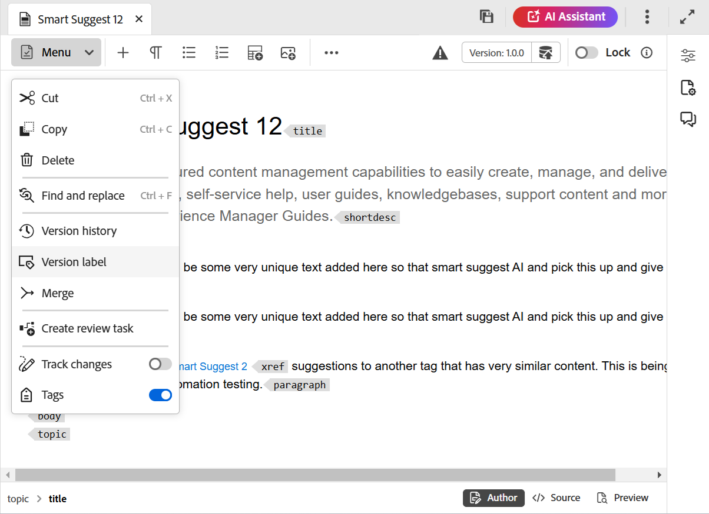
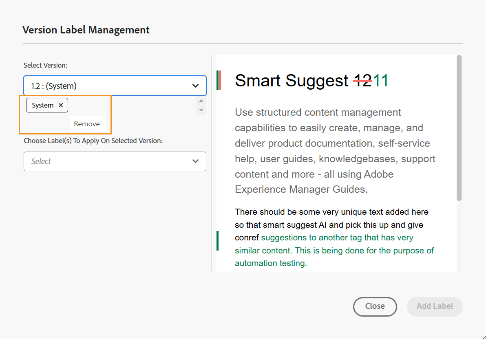

# Uso de etiquetas {#id164JBG0M0T1}

Adobe Experience Manager Guides permite agregar etiquetas a diferentes versiones de un archivo. Puede utilizar estas etiquetas para especificar la versión que desea incluir en una línea de base para la publicación. Para obtener más información acerca del uso de etiquetas para crear una línea de base, vea [Trabajar con línea de base](generate-output-use-baseline-for-publishing.md#).

Por ejemplo, si desea utilizar la *versión 1.0* de un tema en la *versión 1.0* y la *versión 1.1* del mismo tema en la *versión 2.0*, puede agregar la etiqueta *versión 1.0* en la etiqueta *versión 1.0* y *versión 2.0* en la *versión 1.1*.

Una vez agregadas las etiquetas, puede crear una línea de base y especificar qué versión del tema debe incluirse para la publicación mediante esa línea de base. Para ver qué versión se debe incluir o excluir en una línea base, se puede utilizar la opción Historial de Versiones.

## Añadir una etiqueta desde el editor

Siga estos pasos para agregar una etiqueta al tema desde el Editor:

1. En el panel Repositorio, vaya a un tema y ábralo en el Editor.
1. Seleccione **Etiqueta de versión** del menú desplegable **Menú**.

   {width="400" align="left"}

   Se muestra el cuadro de diálogo **Administración de etiquetas de versión**.

1. En el cuadro de diálogo **Administración de etiquetas de versión**, seleccione una versión a la que desee agregar una etiqueta.
1. Seleccione una etiqueta para la versión seleccionada y seleccione **Agregar etiqueta**.

   {width="650" align="left"}

   >[!NOTE]
   >
   > No se puede agregar la misma etiqueta a las distintas versiones de un tema. Sin embargo, puede agregar varias etiquetas a la misma versión de un tema.
1. Confirme para aplicar las etiquetas en el mensaje de confirmación.

   Las etiquetas se muestran en el Historial de versiones del tema seleccionado.

   {width="650" align="left"}

   >[!NOTE]
   >
   > Con una línea de base, puede agregar una etiqueta a varios temas. Para obtener más información acerca de cómo agregar etiquetas mediante línea de base, vea [Agregar etiquetas a una línea de base](generate-output-use-baseline-for-publishing.md#id184KD0T305Z).

Para eliminar una etiqueta de versión de un tema, use el icono **Quitar** proporcionado con cada etiqueta agregada en el cuadro de diálogo Administración de etiquetas de versión.

{align="left"}

## Uso de etiquetas desde la interfaz de usuario de Assets

También puede agregar etiquetas a un tema y eliminarlas según sea necesario en la interfaz de usuario de Assets.

Siga estos pasos para agregar una etiqueta al tema desde la interfaz de usuario de Assets:

1. En la interfaz de usuario de Assets, seleccione un tema y ábralo.
1. Seleccione el icono del selector del carril izquierdo y seleccione **Historial de versiones**.
1. En el menú desplegable Historial de versiones, seleccione la versión a la que desee agregar una etiqueta.
1. Introduzca una etiqueta para la versión seleccionada y pulse Intro. Por ejemplo, *Versión 2.6*.

   >[!NOTE]
   >
   > No se puede agregar la misma etiqueta a las distintas versiones de un tema. Sin embargo, puede agregar varias etiquetas a la misma versión de un tema.

   Las etiquetas se muestran en el Historial de versiones del tema seleccionado. La captura de pantalla siguiente muestra las etiquetas *x.x Release* y *User Guide* agregadas a la versión resaltada del tema.

   {width="300" align="left"}

>[!NOTE]
>
> Con una línea de base, puede agregar una etiqueta a varios temas. Para obtener más información acerca de cómo agregar etiquetas mediante línea de base, vea [Agregar etiquetas a una línea de base](generate-output-use-baseline-for-publishing.md#id184KD0T305Z).

Para eliminar una etiqueta de versión de un tema, use el botón **Eliminar** proporcionado con cada etiqueta en el panel Historial de versiones.

{width="300" align="left"}

**Tema principal:**&#x200B;[ Introducción al editor](web-editor.md)
