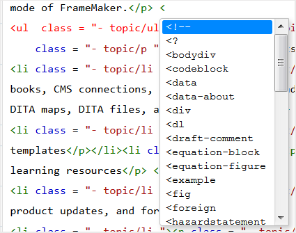
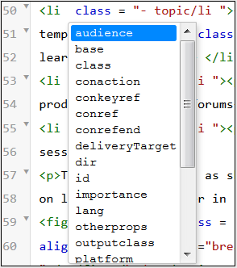
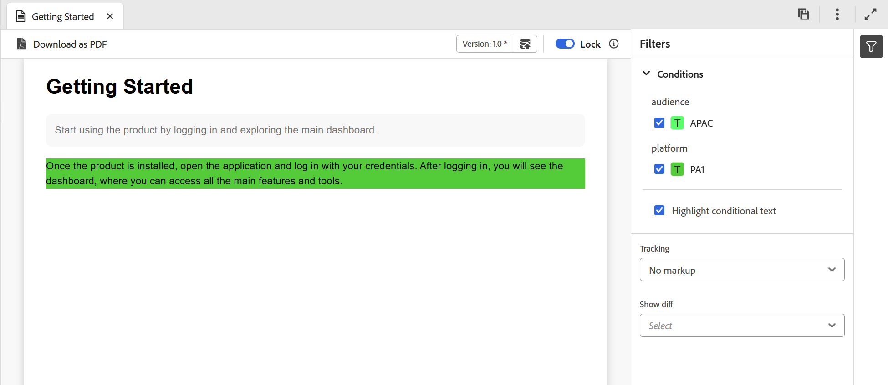
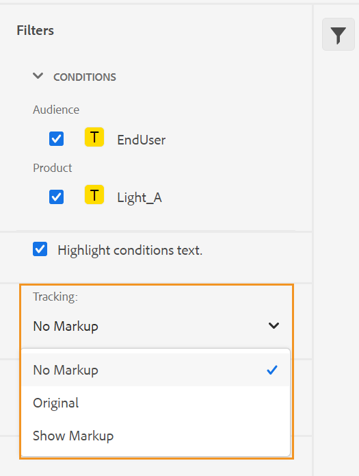

# Vistas del editor de temas {#id204GK0D0V5Z}

>[!INFO]
>
>Este tema se aplica tanto al Editor nuevo como al Editor antiguo. Aunque la funcionalidad principal sigue siendo coherente, las diferencias en la interfaz de usuario, la terminología y las interacciones se indican dentro del contenido mediante pestañas y llamadas, según corresponda.

La interfaz del editor de Adobe Experience Manager admite la visualización de temas en cuatro modos o vistas diferentes:

* [Autor](#author)
* [Origen](#source)
* [Vista previa](#preview)
* [Lado a lado](#side-by-side)

## Autor

Esta es una vista típica de **Lo que se ve es lo que se obtiene** \(WYSISYG\) del Editor. Puede editar temas como lo haría en cualquier editor de texto enriquecido normal. En la vista Autor, tiene las opciones para guardar una revisión del documento, buscar y reemplazar contenido, insertar elementos, insertar hipervínculos, insertar referencias de contenido, etc.

>[!NOTE]
>
> Cuando se utiliza la referencia de contenido, el contenido referido también se muestra en la vista Autor en color azul. El contenido referido no es editable.

## Origen

La vista Source muestra el XML subyacente que compone el tema. Si se siente cómodo trabajando directamente con XML, debería utilizar la vista de Source. Además de realizar ediciones de texto normales en esta vista, también puede agregar elementos y atributos mediante el Catálogo inteligente, o buscar y reemplazar texto, elementos o atributos.

* Para invocar el catálogo inteligente, coloque el cursor al final de cualquier etiqueta de elemento donde desee insertar el nuevo elemento y escriba &quot;&lt;&quot;. El editor muestra una lista de todos los elementos XML válidos que puede insertar en esa ubicación. Utilice las teclas de flecha para seleccionar el elemento que desea insertar y pulse Intro. Cuando se introduce el corchete de cierre &quot;\>, la etiqueta de cierre del elemento se añade automáticamente.

  {width="400"}

* También puede cambiar un elemento fácilmente desde la vista de Source. Por ejemplo, si cambia la etiqueta de apertura de un elemento `p` a `note`, la etiqueta de cierre `p` se cambiará automáticamente a `/note`. Si reemplaza un elemento por un elemento incorrecto, se le mostrará inmediatamente el error de validación.

* Si desea agregar un atributo a un elemento, coloque el cursor dentro de la etiqueta del elemento y pulse la barra espaciadora. En el catálogo inteligente se muestra una lista de atributos válidos para ese elemento. Utilice las teclas de flecha para seleccionar el elemento deseado y pulse Intro para insertar el elemento. Para especificar un valor para el atributo, introduzca el signo igual \(=\) y el editor introducirá automáticamente las comillas de apertura y cierre &quot;&quot;, donde puede especificar el valor del atributo.

  {width="350"}

* En la vista de Source, hay una opción de sangría automática que reorganiza el código XML en un formato presentable y fácilmente legible. Además, si selecciona cualquier texto y cambia de Autor a Source o de Source a la vista Autor, el texto seleccionado también se resalta en la otra vista.
* Otra característica potente de la vista de Source es la validación XML del documento. Si abre un documento que contiene XML no válido, se abrirá en la vista de Source con la información sobre XML no válido. Por ejemplo, en la siguiente captura de pantalla se proporciona información exacta sobre el XML erróneo en la ventana emergente de error de análisis.

  {width="650"}

  En la captura de pantalla anterior, se utiliza un resaltado cruzado para señalar la línea que contiene el XML erróneo.

* La función Buscar y reemplazar permite buscar texto, elementos o atributos en la vista de Source.
Para obtener más información, vea la descripción de la característica **Buscar y reemplazar** en la sección [Barra de fichas](web-editor-tab-bar.md).

* La vista de Source proporciona muchos métodos abreviados para ayudarle a desplazarse por un documento y trabajar con él rápidamente. En la tabla siguiente se enumeran las acciones admitidas y sus teclas de método abreviado:

  | Para ello | Utilizar este acceso directo |
  |----------|-----------------|
  | Añadir varios cursores | **Ctrl**+clic izquierdo |
  | Varias selecciones de texto no consecutivas | **Ctrl**+clic izquierdo para arrastrar y seleccionar texto |
  | Seleccionar texto entre líneas y a lo ancho de ellas | **Alt**+clic izquierdo para arrastrar y seleccionar texto |
  | Deshacer selección múltiple o salir del modo de pantalla completa | **Esc** |
  | Mostrar completado automático | **Ctrl**+**Espacio** |
  | Ir a la etiqueta de apertura o cierre de la etiqueta actual | **Ctrl**+**J** |
  | Expandir o contraer la etiqueta actual y su contenido | **Ctrl**+**T** |
  | Seleccionar el elemento actual y su contenido | **Ctrl**+**L** |
  | Anular la sangría del elemento actual | **Mayús**+**Tabulación** |
  | Eliminar el elemento actual y su contenido | **Mayús**+**Ctrl**+**K** |
  | Mover el cursor una palabra a la izquierda | **Alt**+**Flecha izquierda** |
  | Mover el cursor una palabra a la derecha | **Alt**+**Flecha derecha** |
  | Desplazarse una línea hacia arriba sin cambiar la ubicación del cursor | **Ctrl**+**Flecha arriba** |
  | Desplazarse una línea hacia abajo sin cambiar la ubicación del cursor | **Ctrl**+**Flecha abajo** |
  | Alternar pantalla completa | **F11** |
  | Insertar una nueva línea después del elemento actual | **Ctrl**+**Entrar** |
  | Insertar una nueva línea antes del elemento actual | **Mayús**+**Ctrl**+**Entrar** |
  | Buscar y seleccionar la siguiente aparición de la palabra actual | **Ctrl**+**D** |
  | Mover el elemento actual y su contenido un elemento hacia arriba | **Mayús**+**Ctrl**+**Flecha arriba** |
  | Mover el elemento actual y su contenido un elemento hacia abajo | **Mayús**+**Ctrl**+**Flecha abajo** |
  | Agrupar el elemento actual en la etiqueta de comentario | **Ctrl**+**/** |
  | Duplicar el elemento actual y su contenido | **Mayús**+**Ctrl**+**D** |
  | Eliminar texto que sigue al cursor. Si el cursor está antes de un elemento de apertura, se elimina todo el elemento. | **Ctrl**+**K**+**K** |
  | Eliminar texto a la izquierda del cursor en la línea actual. Si el cursor se encuentra después de la etiqueta de cierre de un elemento, se elimina todo el elemento. | **Ctrl**+**K**+**Retroceso** |
  | Convertir el texto actual a mayúsculas | **Ctrl**+**K**+**U** |
  | Convertir el texto actual a minúsculas | **Ctrl**+**K**+**L** |
  | Desplazar el elemento actual al centro del editor | **Ctrl**+**K**+**C** |
  | Agregar un cursor sobre la posición actual | **Ctrl**+**Alt**+**Flecha arriba** |
  | Añadir un cursor debajo de la posición actual | **Ctrl**+**Alt**+**Flecha abajo** |
  | Buscar de forma recursiva la palabra actual \(en dirección hacia delante\) | **Ctrl**+**F3** |
  | Buscar de forma recursiva la palabra actual \(hacia atrás\) | **Mayús**+**Ctrl**+**F3** |

## Lado a lado

>[!NOTE]
>
>Esta función solo está disponible en el editor nuevo.

La vista en paralelo le permite ver y trabajar en las vistas Autor y Source simultáneamente en la misma pantalla. La vista Autor de WYSIWYG y la vista Source XML subyacente se muestran adyacentes, lo que permite el contenido paralelo y la edición estructural sin cambiar de vista. Ambas vistas permanecen sincronizadas en tiempo real, lo que garantiza que la posición y la selección del cursor en la vista Autor se reflejen en la ubicación correspondiente de la vista Source, lo que proporciona una mejor precisión y control durante la creación de contenido estructurado.

{width="650"}

## Vista previa

Al abrir un tema en el modo de vista previa, se muestra cómo se mostrará cuando un usuario lo visualice en el explorador. En el caso de un mapa DITA, se muestra una vista previa del mapa, en la que se muestra un único documento compuesto de todos los temas del mapa.

El modo de previsualización le ofrece las siguientes funcionalidades:

* [Visualización de contenido en función de filtros condicionales](#id2114BI00VXA)
* [Ver las marcas de seguimiento de cambios](#id2114BJ00CE8)
* [Exportación de un tema como PDF](#id2114BL00B5U)

### Visualización de contenido en función de filtros condicionales {#id2114BI00VXA}

Si ha utilizado condiciones en el tema o el mapa, esas condiciones se muestran en el panel Filtros. De forma predeterminada, se seleccionan todas las condiciones y se muestra todo el contenido. Si anula la selección de una condición, el contenido que tenga esa condición se eliminará de la vista. También puede elegir resaltar contenido condicionado.

La siguiente imagen muestra un tema que usa dos condiciones: `Audience` y `Platfor`. El contenido condicionado se resalta con un fondo amarillo.

>[!BEGINTABS]

>[!TAB Nuevo editor]

{width="650"}

>[!TAB Editor antiguo]

{width="650"}

>[!ENDTABS]

### Ver las marcas de seguimiento de cambios {#id2114BJ00CE8}

Si un documento contiene marcas de seguimiento de cambios \(o indicaciones visuales\), también puede obtener una vista previa del documento con o sin esas marcas. Al previsualizar un documento, el panel derecho contiene las opciones Filtros y Seguimiento.

{width="400"}

Hay tres opciones de **Tracking** entre las que puedes elegir:

* **Sin marcas**: en esta vista, se aceptan todas las inserciones y eliminaciones, y se presenta una vista simple del documento. En esta vista no se ven marcas de seguimiento de cambios.
* **Original**: en esta vista, todas las inserciones se rechazan, todas las eliminaciones se restauran y se muestra una vista previa. Simplemente, se obtiene la forma original del documento antes de habilitar el modo de seguimiento de cambios.
* **Mostrar marcas**: en esta vista, se obtienen todas las marcas para el contenido insertado y eliminado.

  La siguiente imagen muestra la previsualización de un archivo de mapa con marcas:

  {width="300"}

### Exportación de un tema como PDF {#id2114BL00B5U}

PDF es uno de los formatos de salida más comunes que se utiliza en todas las etapas posibles del ciclo de desarrollo de documentos. Experience Manager Guides proporciona la flexibilidad para generar la PDF de un tema individual o de un archivo de mapa completo. La función Exportar como PDF permite al autor, editor o administrador generar fácilmente la salida de PDF para un tema individual. Utiliza las configuraciones DITA-OT guardadas en el perfil de nivel de carpeta para generar PDF.

Esta función admite las siguientes funcionalidades:

* Generar el PDF de la copia de trabajo activa de un tema.
* Acepte el nombre de transformación DITA-OT y los argumentos de la línea de comandos para generar PDF.
* Guarde la salida generada en el sistema local.
* Resuelva las referencias de clave y contenido utilizadas en el tema antes de generar el resultado.

Para exportar un tema como PDF, siga estos pasos:

1. Abra el tema en el modo de vista previa. Asegúrese de que el tema forme parte de un archivo de asignación.

1. Seleccione la opción **Descargar como PDF** en la parte superior.

   Icono .

   >[!NOTE]
   >
   > Asegúrese de haber habilitado la ventana emergente en la configuración del explorador; de lo contrario, PDF no se descargará.

   El PDF se genera y abre en una nueva pestaña o se le muestra un cuadro de diálogo para guardar el PDF en el sistema local.

**Tema principal:**[ Introducción al editor](web-editor.md)
