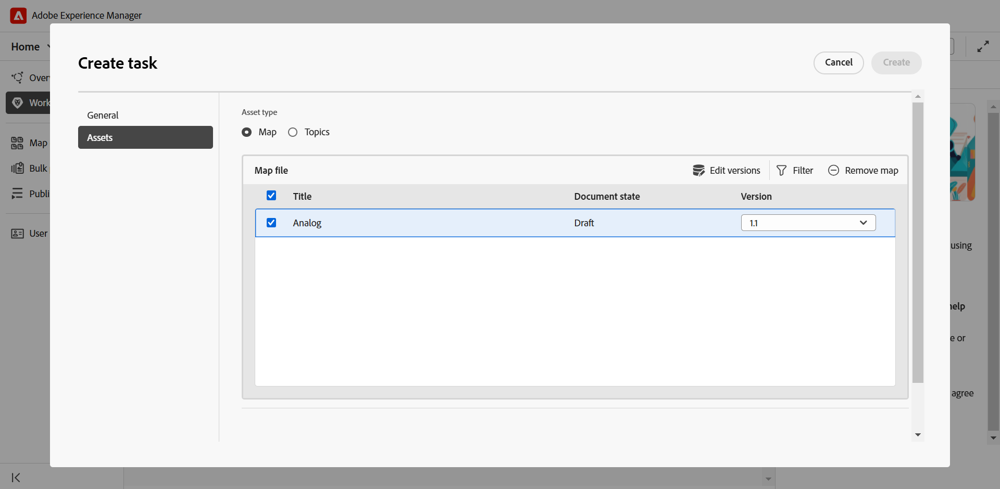
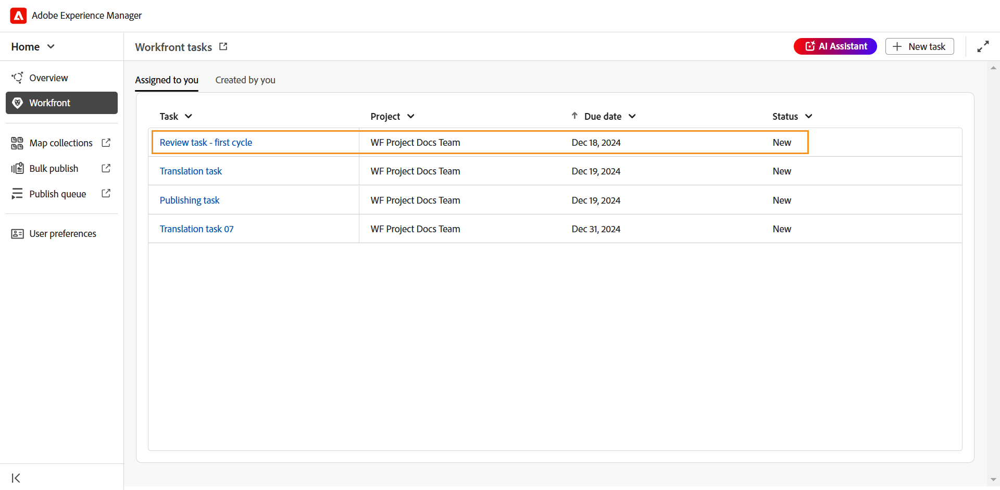
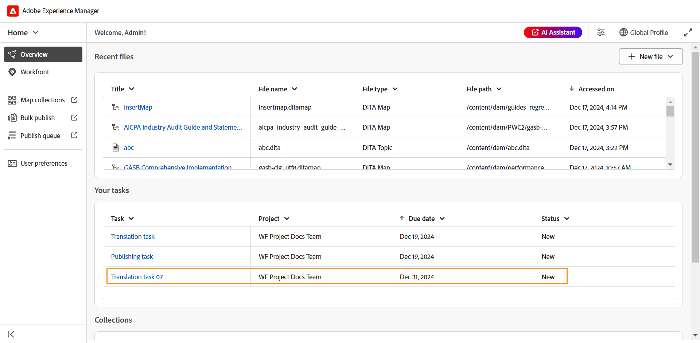
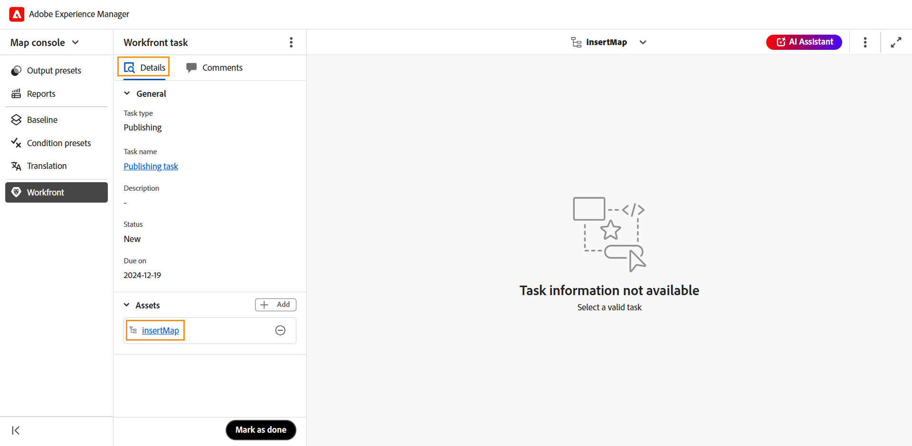

# Integración de Workfront

Adobe Workfront es una solución de administración de trabajo basada en la nube que ayuda a los equipos y las organizaciones a planificar, rastrear y administrar su trabajo de forma eficiente. La integración entre Experience Manager Guides y Adobe Workfront le permite acceder a funciones de administración de proyectos sólidas además de las funciones principales de CCMS de Experience Manager Guides, lo que le permite planificar, asignar y rastrear tareas de forma eficaz.

Con esta integración, puede crear y administrar tareas de Adobe Workfront directamente desde Experience Manager Guides. Por ejemplo, como autor, puede crear una tarea de revisión (con uno o más temas o mapas DITA agregados) directamente en la interfaz de Experience Manager Guides y asignarla a un revisor. Como revisor, puede trabajar en las tareas asignadas en la interfaz de usuario de revisión de Experience Manager Guides y devolvérselas al autor con comentarios. Del mismo modo, puede crear una tarea de publicación y traducción y, a continuación, asignarla a los usuarios necesarios para trabajar en ella.

La integración también permite supervisar las colas de trabajo, asegurándose de estar organizado y al día de todas las tareas (tareas asignadas).

**Funciones principales**

Con la integración de Experience Manager Guides y Adobe Workfront, puede:

* Planifique, asigne y realice un seguimiento del progreso de tareas y proyectos individuales sin depender de varias herramientas no integradas.
* Administre todos los flujos de trabajo de Experience Manager Guides, incluidos la creación, revisión, publicación y traducción de contenido, de forma más eficaz.
* Reciba notificaciones por correo electrónico de Adobe Workfront cada vez que se asignen nuevas tareas. Para obtener más información, vea [Información general sobre notificaciones](https://experienceleague.adobe.com/en/docs/workfront/using/basics/use-notifications/wf-notifications).
* Monitorice el estado del proyecto mediante el intuitivo panel de Adobe Workfront, que ofrece información en tiempo real sobre el rendimiento del proyecto.

  Adobe Workfront Para obtener más información acerca de las sólidas funcionalidades de administración de proyectos habilitadas para los jefes de proyecto en Experience Manager Guides, vea [Información general sobre la planificación de un proyecto](https://experienceleague.adobe.com/en/docs/workfront/using/manage-work/projects/plan-a-project/plan-project).

## Introducción

Una vez que el administrador lo haya configurado y habilitado, podrá acceder a las tareas de Adobe Workfront directamente desde la [página de inicio de Experience Manager Guides](./intro-home-page.md).

Siga estos pasos para acceder a sus tareas de Adobe Workfront:

1. Inicie sesión en Experience Manager Guides y abra la **página principal**.
2. En el panel izquierdo, seleccione **Workfront**.

   Se muestra la página **tareas de Workfront**.

   {align="left"}
3. Seleccione **Iniciar sesión**.

   Se le redirigirá a la página de Adobe Workfront Sign In.
4. Inicia sesión con la misma dirección de correo electrónico que usaste en Experience Manager Guides y, a continuación, selecciona **Permitir acceso** para que la aplicación acceda a tu cuenta de Adobe Workfront.

   Se le redirigirá automáticamente a la página **tareas de Workfront** en Experience Manager Guides.

   {align="left"}

## Funciones disponibles en la página de tareas de Workfront

Las siguientes funciones están disponibles en la página de tareas de Workfront:

* [Nueva tarea](#create-workfront-tasks): permite crear tareas de Adobe Workfront directamente desde la interfaz de Experience Manager Guides.
* [Asignado a usted](#managing-tasks-assigned-to-you): Enumera todas las tareas que están asignadas a usted y que aún están activas.
* [Creado por usted](#managing-tasks-created-by-you): Enumera todas las tareas que ha creado y que siguen activas.

La página de tareas de Workfront también incluye un icono de vincular  que, cuando se selecciona, lo lleva a la página del proyecto de Adobe Workfront. Aquí puede ver los detalles de las tareas, ver comentarios, agregar comentarios y acceder a otras funciones en función de los permisos asignados a su cuenta de Adobe Workfront.

Para obtener más información, vea [Información general sobre las fechas del proyecto, tarea y problema en Workfront](https://experienceleague.adobe.com/en/docs/workfront/using/basics/navigate/definitions-pti-dates).

### Creación de tareas de Workfront

Puede crear tareas de Adobe Workfront directamente desde la interfaz de Experience Manager Guides con el botón **Nueva tarea** presente en la página de tareas de Workfront.

Siga estos pasos para crear una nueva tarea de Adobe Workfront:

1. En la página Tareas de Workfront, seleccione **Nueva tarea**.

   Se muestra el cuadro de diálogo **Crear tarea**.

   {align="left"}
2. En la ficha **General**, escriba los siguientes detalles de la tarea:

   * **Tipo de tarea**: seleccione el tipo de tarea que desea crear. Las opciones disponibles son: **Creación**, **Revisión**, **Publicación** y **Traducción**.
   * **Proyecto**: seleccione el proyecto en el que desea crear la tarea.
   * **Nombre de tarea**: escriba un nombre descriptivo para la tarea.
   * **Descripción**: escriba una breve descripción de la tarea.
   * **Vencimiento el**: establezca la fecha límite para la finalización de la tarea.
   * **Usuario asignado**: seleccione un usuario asignado para la tarea.
3. En la ficha **Assets**, seleccione **Agregar** para agregar un recurso a esta tarea.

   {align="left"}

   Se muestra el diálogo **Seleccionar ruta**. Seleccione una ruta al recurso requerido. Puede añadir varios recursos seleccionando las rutas válidas en el explorador de rutas. Las rutas seleccionadas se conservarán, lo que le permite revisarlas o modificarlas fácilmente cuando vuelva a abrir el cuadro de diálogo.

   * Para las tareas de creación, publicación y traducción, se le pedirá que seleccione la ubicación del archivo requerido en el cuadro de diálogo **Seleccionar archivo**. El archivo seleccionado (un tema para la creación y asignación para la publicación y traducción) se agrega a la tarea en cuanto se selecciona el botón **Crear**.

     {align="left"}

   * Para las tareas de revisión, primero se le pide que seleccione un tipo de recurso (Mapa o Temas) y, a continuación, los archivos seleccionados se muestran de la siguiente manera:

     {align="left"}

     *Agregar temas a una tarea de revisión*

     {align="left"}

     *Agregando asignaciones a una tarea de revisión*

     Las siguientes acciones están disponibles para modificar la selección antes de enviarla a revisión:

      * Anule la selección de algunos temas de la lista.
      * Filtre la lista de temas en función del estado del documento.
      * Edite o establezca la versión de los temas seleccionados en **Última versión**, **Versión según las fechas** y **Línea de base** (solo disponible para mapas) según sea necesario.

     Para obtener más información, vea [enviar temas para revisión](./review-send-topics-for-review.md).

   >[!NOTE]
   >
   > Añadir un recurso a una tarea proporciona a los usuarios asignados acceso rápido a un tema, mapa o cualquier otro archivo en el que necesiten trabajar. Para las tareas de creación, publicación y traducción, añadir un recurso es opcional, pero puede resultar útil para optimizar los flujos de trabajo. Sin embargo, para las tareas de revisión, es obligatorio agregar un recurso.

4. Seleccione **Crear**.

Se crea una nueva tarea y se enumera en la ficha **Creada por usted**.

>[!NOTE]
>
> Como jefe de proyecto, puede ver esta tarea recién creada en su panel de Adobe Workfront junto con otros detalles clave de la tarea. Para obtener más información, vea [Comprender los paneles](https://experienceleague.adobe.com/en/docs/workfront/using/reporting/dashboards/understand-dashboards/understand-dashboards).

### Administración de tareas creadas por usted

Todas las tareas que ha creado y que aún están activas se muestran en la ficha **Creado por usted** de la página de tareas de Workfront, lo que le proporciona detalles clave sobre las tareas, como el nombre del proyecto, los usuarios asignados, la fecha de creación de la tarea, la fecha de finalización de la tarea y el estado de la tarea.

{align="left"}

Las siguientes opciones están disponibles cuando pasa el ratón sobre una tarea presente en la pestaña Creado por usted:

**Abrir** - 

Permite abrir la tarea. Según el tipo de tarea, se abrirá en el editor, en la consola de mapas o en la interfaz de usuario de revisión.

**Editar** - 

Permite editar los detalles de la tarea agregados al crearla. Todos los campos son editables, excepto Tipo de tarea y Proyecto. Solo puede editar las tareas que haya creado. Las tareas asignadas no se pueden editar.

Además, puede agregar o quitar recursos al editar una tarea de creación, publicación o traducción. Sin embargo, para una tarea de revisión, solo puede cambiar la versión de los recursos enviados para su revisión.

**Detalles de la tarea** - 

Muestra la información de la tarea, incluidos los detalles introducidos durante la creación de la tarea, el estado de la tarea y los recursos agregados.

### Administración de tareas asignadas a usted

Todas las tareas que se le hayan asignado y que aún estén activas se mostrarán en la ficha **Asignado a usted** de la página de tareas de Workfront, lo que le proporcionará detalles clave sobre las tareas, como el nombre del proyecto, los usuarios asignados, la fecha de vencimiento y el estado de las tareas.

{align="left"}

Las siguientes opciones están disponibles cuando pasa el ratón sobre una tarea presente en la pestaña Asignado a usted:

**Abrir** - 

Permite abrir la tarea. Según el tipo de tarea, se abrirá en el editor, en la consola de mapas o en la interfaz de usuario de revisión.

**Detalles de la tarea** - 

Muestra la información de la tarea, incluidos los detalles introducidos durante la creación de la tarea, el estado de la tarea y los recursos agregados.

{align="left"}

#### Acceso a las tareas asignadas desde la sección Información general

También puede tener acceso a las tareas de Adobe Workfront asignadas desde la [sección Información general](./intro-home-page.md#overview). La sección Información general, cuando se selecciona, incluye diferentes widgets que le ayudan a mantener el enfoque y la organización.

**Sus tareas** es uno de esos widgets donde se muestra una lista de tareas de Adobe Workfront (que le han sido asignadas y siguen activas) junto con los detalles clave de la tarea, como el nombre de la tarea, el proyecto asociado, la fecha de vencimiento y el estado actual.

{align="left"}

Similar a la pestaña Asignado a ti, el widget Tus tareas también proporciona opciones para **Abrir** y ver **Detalles de la tarea** cuando pasa el ratón sobre una tarea.

El widget también proporciona opciones para ordenar y cambiar el tamaño de las columnas para una vista personalizada. Para aplicar la ordenación a una columna, seleccione el encabezado de la columna y las opciones se mostrarán en una lista. Para ajustar el ancho de una columna, pase el ratón sobre la línea divisoria de la columna en el encabezado y arrástrela para cambiar su tamaño.

>[!NOTE]
>
> Cuando esté fuera de la interfaz de Experience Manager Guides, recibirá una notificación por correo electrónico de Adobe Workfront para cualquier tarea recién asignada. Para desproteger estas tareas, inicie sesión en la instancia de Experience Manager Guides y acceda a las tareas asignadas.

## Trabajar con tareas asignadas de Adobe Workfront

Existen cuatro tipos de tareas de Adobe Workfront que puede crear y, a continuación, asignar o en las que puede trabajar cuando se le asigna en Experience Manager Guides:

1. [Tareas de creación](#authoring-tasks)
2. [Revisar tareas](#review-tasks)
3. [Tareas de traducción](#translation-tasks)
4. [Tareas de publicación](#publishing-tasks)

Las siguientes secciones le guían a través del proceso detallado de trabajo en tareas de Adobe Workfront asignadas.

### Tareas de creación

Siga estos pasos para trabajar en una tarea de creación:

1. Acceda a la tarea desde la sección [Información general](#accessing-assigned-tasks-from-overview-section) o desde la pestaña [Asignado a usted](#managing-tasks-assigned-to-you).

   {align="left"}

   *Tarea de creación en la ficha Asignado a usted*

   {align="left"}

   *Crear tarea en el widget Tus tareas*
2. Pase el ratón sobre la tarea en la que quiera trabajar y seleccione    para abrirlo. También puede abrir la tarea simplemente seleccionando la tarea.

   Todas las tareas de creación se abren en el Editor.
3. Revise los detalles de la tarea en la ficha **Detalles** y seleccione el archivo de **recurso** para abrirlo.

   {align="left"}

4. Realice las ediciones necesarias y seleccione **Marcar como listo**.
5. Cambie a la ficha **Comentarios** para agregar un comentario a esta tarea. Estos comentarios, agregados al nivel de tarea, también se reflejarán en el panel del proyecto de Adobe Workfront.

   >[!NOTE]
   >
   > Una vez que la tarea esté marcada como completada, se eliminará tanto de la lista de tareas asignadas como de la lista de tareas **Creada por usted** del iniciador de la tarea.

### Revisar tareas

Como revisor, puede revisar las tareas de revisión de Adobe Workfront que se le hayan asignado.

Siga estos pasos para trabajar en una tarea de revisión asignada.

1. Acceda a la tarea desde la sección [Información general](#accessing-assigned-tasks-from-overview-section) o desde la pestaña [Asignado a usted](#managing-tasks-assigned-to-you).

   {align="left"}

   *Revisar la tarea en la ficha Asignado a usted*

   {align="left"}

   *Crear tarea en el widget Tus tareas*
2. Pase el ratón sobre la tarea en la que quiera trabajar y seleccione    para abrirlo. También puede abrir la tarea simplemente seleccionando la tarea.

   Para los revisores, la tarea de revisión se abrirá en la **IU de revisión**.

   {align="left"}

3. Realice la revisión necesaria. Para obtener detalles sobre cómo revisar un tema, vea [revisar temas](./review-topics.md).
4. Una vez completada la revisión, seleccione **Marcar como listo**.
5. Cambie a la ficha **Comentarios** para agregar un comentario a esta tarea. Estos comentarios, agregados al nivel de tarea, también se reflejarán en el panel del proyecto de Adobe Workfront.

Marcar la tarea como realizada por el revisor no indica la finalización de la tarea. Todas las tareas de revisión se asignan de nuevo al usuario que ha creado la tarea (preferiblemente, a un autor que haya solicitado una revisión).

>[!NOTE]
>
> Si la tarea está asignada a varios revisores, se vuelve a asignar al creador de la tarea solo después de que todos los revisores la hayan marcado como completada.

Se puede acceder a las tareas de revisión reasignadas al creador o los autores para su incorporación a la revisión desde la sección [Información general](#accessing-assigned-tasks-from-overview-section) o desde la pestaña [Asignado a usted](#managing-tasks-assigned-to-you).

{align="left"}

*Revisar tarea asignada de nuevo a los autores*

Para estas tareas, el estado de la tarea para el usuario asignado cambia a **Creación** mientras que el tipo de tarea permanece como **Revisión**. Este cambio de estado se produce cuando todos los revisores completan la revisión.

{align="left"}

Al seleccionar la tarea o el icono de apertura , se abre la tarea en el Editor, donde el autor puede [dirigir comentarios de revisión](../user-guide/review-address-review-comments.md), editar la tarea al actualizar la versión de los temas y, a continuación, volver a asignar la tarea al revisor si es necesario.

El autor también puede editar la tarea y asignarla a otro autor, delegando la tarea de incorporar los comentarios. Para ello, seleccione **Editar**, cambie el estado de la tarea a **Creación** y, a continuación, seleccione **Cambiar usuario asignado**. Ahora puede seleccionar un usuario asignado de la lista.

Este proceso forma un ciclo continuo, en el que la tarea se mueve de un lado a otro entre el autor y el revisor hasta que se completa por completo. Una vez incorporados todos los cambios sugeridos, el autor puede completar la tarea seleccionando **Marcar como listo**.

### Tareas de traducción

Puede realizar varias acciones de traducción en las tareas de traducción de Adobe Workfront que se le hayan asignado.

Siga estos pasos para trabajar en una tarea de traducción:

1. Acceda a la tarea desde la sección [Información general](#accessing-assigned-tasks-from-overview-section) o desde la pestaña [Asignado a usted](#managing-tasks-assigned-to-you).

   {align="left"}

   *Tarea de traducción en la ficha Asignado a usted*

   {align="left"}

   *Tarea de traducción en el widget Tus tareas*

2. Pase el ratón sobre la tarea en la que quiera trabajar y seleccione    para abrirlo en la **consola de mapas**. También puede abrir la tarea simplemente seleccionando la tarea.
3. Revise los detalles de la tarea y el archivo agregado para su traducción.

   {align="left"}
4. Vaya a la pestaña **Traducción** para ver las distintas opciones de traducción. Aprenda a [traducir contenido](../user-guide/translation.md) en Experience Manager Guides.
5. Realice la traducción requerida y seleccione **Enviar para traducción**.
   {align="left"}
6. Vaya a la sección **Workfront** y seleccione **Marcar como listo** para indicar que la tarea se ha completado.
7. Cambie a la ficha **Comentarios** para agregar un comentario a esta tarea. Estos comentarios, agregados al nivel de tarea, se reflejarán en el panel del proyecto de Adobe Workfront.

   >[!NOTE]
   >
   > Una vez que la tarea esté marcada como completada, se eliminará tanto de la lista de tareas asignadas como de la lista de tareas **Creada por usted** del iniciador de la tarea.

### Tareas de publicación

Como editor, puede ver los detalles y publicar una tarea de publicación asignada.

Siga estos pasos para trabajar en una tarea de publicación:

1. Acceda a la tarea desde la sección [Información general](#accessing-assigned-tasks-from-overview-section) o desde la pestaña [Asignado a usted](#managing-tasks-assigned-to-you).

   {align="left"}

   *Tarea de publicación en la ficha Asignado a usted*

   {align="left"}

   *Tarea de publicación en el widget Tus tareas*
2. Pase el ratón sobre la tarea en la que quiera trabajar y seleccione    para abrirlo en la **consola de mapas**. También puede abrir la tarea simplemente seleccionando la tarea.
3. Revise los detalles de la tarea y el archivo agregado para la publicación.

   {align="left"}
4. Vaya a **Ajustes preestablecidos de salida** y realice las acciones de publicación necesarias para publicar la tarea. Para obtener más información, vea [Explicación de los ajustes preestablecidos de salida](../user-guide/generate-output-understand-presets.md).
5. Una vez finalizada la publicación, vaya a la sección **Workfront** y seleccione **Marcar como listo** para indicar que la tarea se ha completado.
6. Cambie a la ficha **Comentarios** para agregar un comentario a esta tarea. Estos comentarios, agregados en el nivel de tarea, se reflejarán en el tablero del proyecto de Workfront.

   >[!NOTE]
   >
   > Una vez que la tarea esté marcada como completada, se eliminará tanto de la lista de tareas asignadas como de la lista de tareas **Creada por usted** del iniciador de la tarea.
