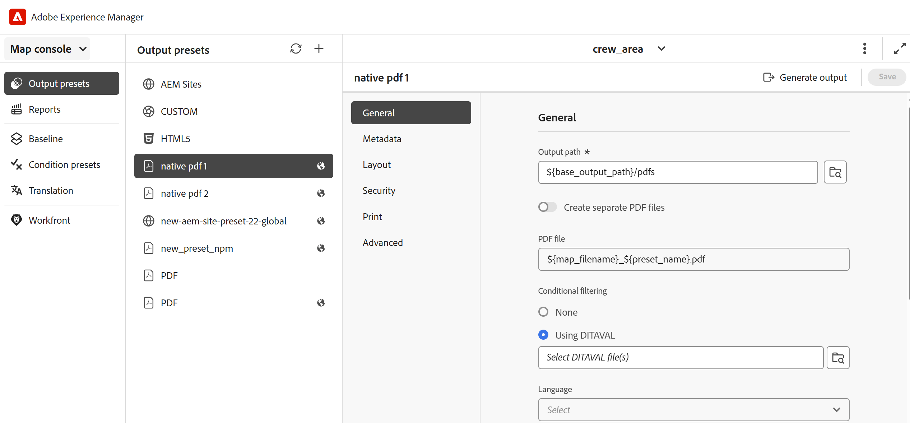
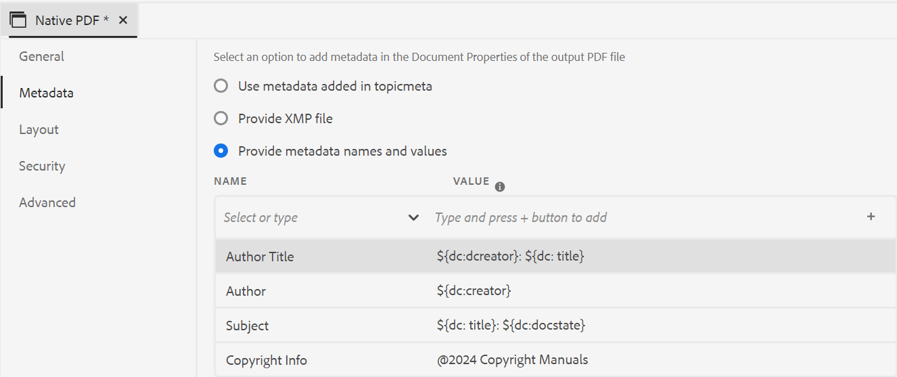

# Ajuste preestablecido de salida de PDF nativo

Al crear contenido, es esencial asegurarse de que el contenido esté optimizado para su visualización, edición e impresión. Mediante estándares como W3C CSS3 para el estilo de contenido y los estándares de medios paginados CSS para las propiedades de definición de página como tamaño, márgenes, orientación, saltos de página, encabezados, pies de página y numeración de páginas, puede establecer la vista y el diseño del documento de PDF, lo que garantiza la coherencia y la facilidad de uso. La función de publicación nativa de PDF utiliza estos estándares para generar un PDF.

Con la publicación nativa de PDF, puede utilizar plantillas predefinidas para garantizar la coherencia en el diseño y la estructura del contenido, aplicar hojas de estilo para alterar el aspecto de la salida, optimizar PDF, establecer marcas de impresora, permitir la compatibilidad con lectores de pantalla, establecer la conformidad con PDF, incrustar fuentes y mucho más.

La generación de un PDF mediante la publicación nativa de PDF tiene dos aspectos:

* Uso de plantillas para aplicar estilo al contenido, establecer diseños de página y varias configuraciones para ajustar el PDF. Los autores pueden elegir utilizar o modificar las plantillas de ejemplo proporcionadas o crear plantillas personalizadas y establecer las opciones de configuración avanzadas que utilizan los editores y desarrolladores.

* Cree o configure un ajuste preestablecido de salida de PDF para controlar la configuración de PDF. Una vez creado un ajuste preestablecido de salida de PDF, puede generar PDF.

## Crear un ajuste preestablecido de salida

Siga estos pasos para crear el ajuste preestablecido de PDF desde la consola Mapa:

1. [Abra un archivo de mapa DITA en la consola de mapas](../user-guide/open-files-map-console.md).

   También puede obtener acceso al archivo de asignación desde el widget **Archivos recientes** en la [sección Información general](../user-guide/intro-home-page.md#overview). El archivo de mapa seleccionado se abriría en la consola de mapas.
1. En la pestaña **Ajustes preestablecidos de salida**, seleccione el icono + para crear un ajuste preestablecido de salida.
1. Seleccione **PDF** del menú desplegable Tipo en el cuadro de diálogo **Nuevo ajuste preestablecido de salida**.
1. En el campo **Nombre**, proporcione un nombre para este ajuste preestablecido.
1. En el campo **Generar PDF mediante**, seleccione **Native-PDF**.
1. Seleccione la opción **Agregar al perfil de carpeta actual** para crear un ajuste preestablecido de salida dentro del perfil de carpeta actual. El  indica un ajuste preestablecido de nivel de perfil de carpeta.

   Obtenga más información sobre [Administrar ajustes preestablecidos de salida de perfil global y de carpeta](../user-guide/web-editor-manage-output-presets.md).

1. Seleccione **Añadir**.

   Se crea el ajuste preestablecido de PDF.

## Configuración del ajuste preestablecido nativo de PDF

Una vez creado el ajuste preestablecido, configure el ajuste preestablecido nativo de PDF. Las opciones de configuración preestablecidas para DITA-OT se organizan en las fichas **General**, **Metadatos**, **Diseño**, **Seguridad**, **Imprimir** y **Avanzado**.

**General**

Utilice para especificar la configuración básica de salida, como especificar la ruta de salida, el nombre del archivo PDF, etc.

>[!NOTE]
>
>Si la característica de comprobación de estado [1&rbrace; está configurada para el perfil de carpeta, se muestra la opción **Ejecutar comprobación de estado antes de generar resultados** en la pestaña General. &#x200B;](../install-conf-guide/conf-health-check-preset.md)Utilícelo para que una comprobación de estado se ejecute automáticamente cada vez que genere resultados con este ajuste preestablecido, de modo que no tenga que almacenarlos en déclencheur manualmente desde el mapa. El informe se anexa al registro de publicación y es puramente informativo. No bloqueará ni retrasará su salida, incluso si la comprobación encuentra errores o advertencias sin resolver. Más información acerca de [Usar la característica de comprobación de estado en Experience Manager Guides](../user-guide/map-editor-other-features.md#run-health-check-on-a-map).

| Configuración | Descripción |
| --- | --- |
| **Ruta de salida** | Ruta de acceso dentro del repositorio de AEM donde se almacena la salida de PDF. Asegúrese de que la ruta de acceso de salida no esté ubicada dentro de la carpeta del proyecto. La ruta de acceso de salida se establece a través de la variable `${base_output_path}`, que configura el administrador. Para configurar la ruta de salida, vea [Configurar la ubicación de salida base para Cloud Services](../native-pdf/configure-base-location-cs.md) o [Configurar la ubicación de salida base para On-Premise Services](../native-pdf/configure-base-output-location.md) según el servicio que esté usando.  También puede utilizar las siguientes variables integradas para definir la ruta de acceso de salida. Puede utilizar una sola variable o una combinación de ellas para definir esta opción.   `${map_filename}`: utiliza el nombre de fichero de mapa DITA para crear la ruta de destino.   `${map_title}`: utiliza el título de mapa DITA para crear la ruta de destino.  `${preset_name}`: utiliza el nombre del ajuste preestablecido de salida para crear la ruta de destino.   `${language_code}`: utiliza el código de idioma donde se encuentra el archivo de asignación para crear la ruta de acceso de destino.   `${map_parentpath}`: utiliza la ruta completa del archivo de asignación para crear la ruta de destino.   `${path_after_langfolder}`: utiliza la ruta de acceso del archivo de asignación después de la carpeta de idioma para crear la ruta de acceso de destino. |
| **Archivo PDF** | Especifique un nombre de archivo para guardar PDF. De forma predeterminada, el nombre del fichero PDF añade el nombre del mapa DITA junto con el nombre del ajuste preestablecido. Por ejemplo, ditamap es &quot;TestMap&quot; y el nombre del ajuste preestablecido es &quot;preset1&quot;, el nombre predeterminado del pdf será &quot;TestMap_preet1.pdf&quot;.  También puede usar las siguientes variables predeterminadas para definir el archivo de PDF. Puede utilizar una sola variable o una combinación de ellas para definir esta opción.  `${map_filename}` `${map_title}` `${preset_name}`   `${language_code}`. |
| **Aplicar condiciones usando** | Para el contenido condicionado, elija entre las siguientes opciones para generar una salida de PDF basada en esas condiciones:  <ul> <li> **Ninguno aplicado** Seleccione esta opción si no desea aplicar ninguna condición en el mapa y en el contenido de origen.  <li> **Archivo DITAVAL** Seleccione un archivo DITAVAL para generar contenido condicional. Puede seleccionar varios archivos DITAVAL utilizando el cuadro de diálogo de exploración o introduciendo la ruta de archivo manualmente. Para quitar un archivo seleccionado, haga clic en el icono cruzado junto a su nombre. Si se selecciona un archivo no válido, aparece un mensaje de error indicando **Se ha seleccionado un archivo DITAVAL no válido**.    Cada archivo DITAVAL puede contener una serie de propiedades, como condiciones de filtrado y estilos de indicación. El marcado le permite marcar visualmente el contenido mediante marcas de inicio y finalización, que pueden incluir imágenes o formato de texto como negrita o cursiva. En caso de que se superpongan condiciones o conflictos de estilo, puede definir un color de fondo mediante la configuración de conflictos de estilo. Para obtener más información, vea [Usar el editor DITAVAL](../user-guide/ditaval-editor.md). <li> **Ajuste preestablecido de condición** Seleccione un ajuste preestablecido de condición en la lista desplegable para aplicar una condición al publicar la salida. Esta opción está visible si se ha añadido una condición para el fichero de mapa DITA. La configuración condicional está disponible en la ficha Ajustes preestablecidos de condición de la consola de mapas DITA. Para obtener más información acerca del ajuste preestablecido de condición, vea [Usar ajustes preestablecidos de condición](https://help.adobe.com/en_US/xml-documentation-for-adobe-experience-manager/index.html#t=DXML-master-map%2Fgenerate-output-use-condition-presets.html).   </ul> |
| **Usar línea de base** | Si ha creado una Línea base para el mapa DITA seleccionado, seleccione esta opción para especificar la versión que desea publicar. Ver [Trabajo con línea de base](https://help.adobe.com/en_US/xml-documentation-for-adobe-experience-manager/index.html#t=DXML-master-map%2Fgenerate-output-use-baseline-for-publishing.html) para obtener más detalles. |
| **Crear PDF con barra de cambios entre versiones publicadas** | Utilice las siguientes opciones para crear un PDF que muestre las diferencias de contenido entre dos versiones con barras de cambios:  <ul><li> **Línea de base de la versión anterior** Elija la versión de línea de base que desea comparar con la versión actual u otra línea de base. Aparecerá una barra de cambios en PDF para indicar el contenido modificado. Una barra de cambios es una línea vertical que identifica visualmente el contenido nuevo o revisado. La barra de cambios aparece a la izquierda del contenido que se ha insertado, modificado o eliminado.   **Nota**: Si selecciona **Usar línea de base** y elige una línea de base para publicar, la comparación se realizará entre las dos versiones de línea de base seleccionadas. Por ejemplo, si elige la línea de base Versión 1.3 en **Usar línea de base** y Versión 1.1 en **Línea de base de la versión anterior**, la comparación se realizará entre la línea de base Versión 1.1 y la línea de base Versión 1.3.  <li> **Mostrar texto agregado** Seleccione esta opción para mostrar el texto insertado en color verde y subrayado. Esta opción está seleccionada de forma predeterminada.   <li> **Mostrar texto eliminado** Seleccione esta opción para mostrar el texto eliminado en color rojo y marcado con un tachado. Esta opción está seleccionada de forma predeterminada.  **Nota** También puede personalizar el estilo de la barra de cambios, el contenido insertado o el contenido eliminado mediante la hoja de estilo. </ul> |
| **Idioma** | Seleccione el idioma en el que desea traducir el resultado. Si prefiere publicar el resultado en el mismo idioma que el atributo `xml:lang` del mapa raíz, seleccione la opción **Usar idioma del mapa** en lugar de seleccionar un idioma explícitamente.   Si el mapa no tiene ningún `xml:lang` definido, el resultado se establece en inglés (en_US) de forma predeterminada. Esto ayuda cuando el mapa principal ya tiene un conjunto de atributos `xml:lang`, por lo que no necesita un ajuste preestablecido de salida independiente para cada idioma. Para comprender cómo afecta esta configuración a los distintos tipos de contenido, vea [Resolución de idioma para el contenido DITA frente a variables de plantilla de salida](../native-pdf/native-pdf-language-variables.md#language-resolution-for-dita-content-vs-output-template-variables). |
| **Argumentos de línea de comandos DITA-OT** | Cuando se habilita **Habilitar el preprocesamiento DITA-OT**, el campo **argumentos de la línea de comandos DITA-OT** queda disponible. Aquí puede especificar los argumentos adicionales que desea que DITA-OT procese durante la generación de resultados. Para obtener detalles acerca de los argumentos de línea de comandos admitidos en DITA-OT, vea [Documentación de DITA-OT](https://www.dita-ot.org/). **NOTA:**   Los vínculos relacionados definidos en tablas de relación DITA (`<reltable>`) no se incluyen en la salida nativa de PDF de forma predeterminada. Utilice el argumento DITA-OT `-Dargs.rellinks=nofamily` para incluir estos vínculos relacionados en la salida nativa de PDF.   Para los mapas anidados, el atributo `toc="no"` establecido en una referencia de mapa no excluye de forma predeterminada sus temas secundarios del índice. Utilice el argumento DITA-OT `-Dpreprocess.move-meta-entries.skip=false` para asegurarse de que los temas secundarios se excluyen de la tabla de contenido de dichos mapas. |
| **Flujo de trabajo de generación posterior** | Seleccione para mostrar una lista desplegable que contenga todos los flujos de trabajo configurados en AEM. Puede seleccionar el flujo de trabajo que desea ejecutar después de la finalización del flujo de trabajo de generación de PDF. |

>[!NOTE]
>
>- Los vínculos relacionados definidos en tablas de relación DITA (`<reltable>`) no se incluyen en la salida nativa de PDF de forma predeterminada. Utilice este campo para pasar el argumento DITA-OT `-Dargs.rellinks=nofamily` e incluir dichos vínculos relacionados en la salida.
>

**Metadatos**

Los metadatos son la descripción o definición del contenido. Los metadatos ayudan en la administración de contenido y en la búsqueda de archivos en Internet.

Utilice la pestaña Metadatos para establecer los campos de metadatos, como el nombre del autor, el título del documento, las palabras clave, la información de copyright y otros campos de datos para la salida de PDF. También puede agregar metadatos personalizados para la salida de PDF.

Estos metadatos se asignan a los metadatos de la ficha **Descripción** dentro de las **Propiedades del documento** de su PDF de salida.

En los ajustes preestablecidos de salida, seleccione **PDF** > **Native-PDF** > **Metadatos** para agregar y personalizar opciones de metadatos.

* **Usar metadatos agregados en topicmeta**

  Esta opción está seleccionada de forma predeterminada. Puede utilizar los metadatos que ha añadido en el elemento meta del tema del mapa DITA para rellenar los campos de metadatos de la salida de PDF.

* **Proporcionar archivo XMP**

  También puede rellenar directamente los campos de metadatos importando el archivo [XMP](https://www.adobe.com/products/xmp.html) (Extensible Metadata Platform). Puede descargar un archivo de XMP de ejemplo desde aquí.

  [Descargar](assets/SampleXMP.xmp)

  También puede generar un archivo XMP con Adobe Acrobat.
  1. Seleccione **Archivo** > **Propiedades** en Acrobat.
  1. En **Descripción**, seleccione **Metadatos adicionales**.
  1. En el panel izquierdo, seleccione **Avanzado**.
  1. Seleccione **Guardar**.

  El archivo XMP se guardará en el dispositivo.

* **Proporcionar nombres y valores de metadatos**

  1. Añada un nombre seleccionándolo en la lista desplegable o agregue metadatos personalizados escribiendo directamente en el campo de nombre.
  1. Introduzca el valor de los metadatos y seleccione el icono &quot;+&quot;.
     Los metadatos se añaden a la lista de metadatos de PDF.

También puede utilizar variables para definir los valores de los metadatos.  Se pueden utilizar los metadatos definidos para el mapa DITA o el fichero bookmap como variables. Los metadatos se encuentran en el nodo `/jcr:content/metadata` del mapa DITA o del archivo bookmap.
Cuando se utiliza una variable, su valor se selecciona de las propiedades de metadatos.

Para utilizar una variable, debe definirla en el formato `${<variable>}`.

Por ejemplo, una de las propiedades de metadatos definidas en el nodo /`jcr:content/metadata` es
`dc:title`. Puede especificar `${dc:title}`, y el valor del título se utilizará en el resultado final.

Puede utilizar una sola variable o una combinación de ellas para definir los metadatos. Por ejemplo, `${dc:title} ${dc:docstate}`. También puede utilizar la combinación de una variable y una cadena.  Por ejemplo, `View ${dc:title} in ${dc:language}`.

Utilice variables de idioma para definir el valor localizado de las propiedades de los metadatos. Según el idioma elegido, el valor localizado se selecciona automáticamente en la salida de PDF. Por ejemplo, puede imprimir &quot;Autor&quot; como el valor de los metadatos en inglés y &quot;Autor&quot; en alemán.

Formato: `${lng:<variable name>}`. Por ejemplo, `${lng:author-label}` donde `author-label` es una variable de idioma.

Pase el ratón sobre  cerca de la opción para ver más detalles al respecto.

**Diseño**

Utilice para definir los diseños de página y especificar las opciones de vista de página para la salida de PDF, como Visualización de página y definir los niveles de zoom.

| Configuración | Descripción |
| --- | --- |
| **Plantilla de PDF** | Las plantillas de PDF proporcionan una estructura clara para definir diseños de página, estilos de contenido y aplicar varias configuraciones a la salida de PDF. Seleccione en las opciones desplegables de PDF template para elegir la plantilla que prefiera.   También puede seleccionar **Examinar plantilla**  para elegir una plantilla. En el cuadro de diálogo **Seleccionar plantilla de PDF** también puede obtener una vista previa de la miniatura y ver el título y la descripción de la plantilla seleccionada. |
| **Visualización de página** | Utilice la Visualización de página para la vista de página que muestra cómo se muestra PDF cuando se abre. Seleccione en las opciones desplegables de Visualización de página para elegir una vista preferida.  <ul><li> **Predeterminado** se muestra según la configuración predeterminada del visor de PDF en el equipo de un usuario.    <li> **Vista de página única** muestra una página cada vez.     <li> **Desplazamiento de página única** Muestra una sola página en una columna vertical continua.    <li> **Vista de dos páginas** muestra dos páginas en paralelo a la vez. .  <li> **Desplazamiento de dos páginas** Muestra un pliego de dos páginas en paralelo con desplazamiento continuo. </ul> |
| **Zoom** | Seleccione esta opción para cambiar el tamaño de la vista de página que muestra cómo se muestra PDF cuando se abre.   <ul><li> **Predeterminado** se muestra según la configuración predeterminada del visor de PDF en el equipo   de un usuario <li> **100%** Hace que la página aparezca en su tamaño real.       <li> **Ajustar página** Hace que el ancho y el alto de la página se ajusten al panel del documento.   .  <li> **Ajustar ancho de página** Hace que el ancho de la página llene el ancho del panel del documento.    <li> **Ajustar alto de página** Hace que el alto de la página ocupe el alto del panel del documento. </ul> |

**Seguridad**

Proteja su PDF agregando restricciones para abrir y leer el archivo. Utilice las siguientes opciones para evitar el acceso no autorizado.

| Configuración | Descripción |
| --- | --- |
| **Establecer contraseña para abrir el documento** | Seleccione para añadir una contraseña segura para ver el archivo PDF. Especifique una contraseña en el campo **Contraseña de usuario**. Los usuarios solo pueden abrir PDF introduciendo la contraseña proporcionada en este campo. |
| **Establecer las restricciones del documento** | Seleccione esta opción para restringir la forma en que los usuarios pueden interactuar con su PDF. Especifique una contraseña en el campo **Contraseña de propietario** para que funcione la siguiente configuración de restricción.   <ul><li> **Impresión** Seleccione esta opción para permitir que un usuario imprima el PDF.   <li> **Impresión de calidad de borrador** Seleccione esta opción para permitir que un usuario imprima el PDF en una resolución inferior.    <li> **Copia de contenido** Seleccione esta opción para permitir que un usuario copie contenido de PDF.   <li> **Anotaciones** Seleccione esta opción para permitir que un usuario agregue una nota o comentario en PDF.   <li> **Modificaciones de contenido** Seleccione esta opción para permitir que un usuario modifique el contenido de PDF.   <li> **Copia de contenido para accesibilidad** Seleccione esta opción para permitir que los lectores de pantalla lean y naveguen por el contenido en PDF.    **Ensamblado de documento** Seleccione esta opción para permitir que los usuarios inserten páginas en PDF.   **Nota**: los usuarios deben escribir la contraseña de propietario para cambiar las restricciones de Archivo > Propiedades en Adobe Acrobat. |

**Imprimir**

>[!NOTE]
>
> A partir de la versión 5.0/2025.02.0 de Experience Manager Guides, la sección Imprimir ahora forma parte del **ajuste preestablecido de salida nativa de PDF**. Para las plantillas existentes con la configuración de impresión guardada, los datos de impresión permanecerán intactos, pero ya no aparecerán en la interfaz de usuario ni se aplicarán durante la salida. Para seguir utilizando esta configuración, debe volver a configurarla en el ajuste preestablecido de salida nativa de PDF.

Configure las opciones de producción de impresión para asignar marcas de impresora, definir cuadros de página y establecer las opciones de color y perfil ICC para la salida de PDF. La ficha Imprimir está organizada en tres secciones, en orden: **Marcas de impresora**, **Cuadros de página** y **Color e ICC**.

## Marcas de impresora

Cuando se prepara un documento para la producción de impresión, las marcas de impresora se agregan a los límites de la página para facilitar la alineación, el recorte y la selección de color adecuados durante la impresión. Al seleccionar una marca de impresora, el límite de página se extiende para dar cabida a la marca y el área extendida se recorta después de la impresión.

Utilice la siguiente configuración para configurar las marcas de impresora de la salida de PDF:

| Configuración | Descripción |
| --- | --- |
| **Todas las marcas de impresora** | Seleccione esta opción para habilitar o deshabilitar todos los ajustes de marcas de impresora: **Marcas de recorte**, **Marcas de sangrado**, **Marcas de registro** y **Barras de color** juntas. Si habilita o deshabilita una marca individual mientras está seleccionada la opción **Todas las marcas de impresora**, esta opción se desactiva automáticamente. Cuando esta opción no está seleccionada, puede habilitar o deshabilitar marcas individuales. |
| **Marcas de recorte** | Seleccione esta opción para colocar una marca en cada esquina del área de recorte e indicar dónde debe recortarse el papel después de la impresión. |
| **Marcas de sangrado** | Seleccione esta opción para colocar una marca en cada esquina del cuadro de sangrado e indicar el área de recorte de la imagen ampliada. |
| **Marcas de registro** | Seleccione esta opción para colocar una marca fuera del área de recorte y alinear las diferentes separaciones en un documento de color. |
| **Barras de color** | Seleccione esta opción para agregar una franja de colores fuera del área de recorte para mantener la coherencia del color y ajustar la densidad de la tinta al imprimir. |
| **Anchura de línea** | Especifique el ancho de la línea utilizada para dibujar las marcas de impresora seleccionadas. El valor aumenta en pasos de 0,25 pt. |
| **Color de línea** | Especifique el color de la línea utilizada para dibujar las marcas de impresora seleccionadas. |

## Cuadros de página

Utilice esta sección para definir el tamaño de página general y el área de sangrado de la salida de PDF.

Utilice la siguiente configuración para configurar los cuadros de página:

| Configuración | Descripción |
| --- | --- |
| **Tamaño del contenedor multimedia** | Especifica el tamaño total de la página, incluido el área extendida ocupada por las marcas de impresora. Utilice la lista desplegable para seleccionar el tamaño de página de la salida de PDF o crear un tamaño personalizado. |
| **Ancho de cuadro de purga** | Especifique la anchura del cuadro de sangrado, que es el área que se extiende más allá del cuadro de recorte y que admite marcas de sangrado y cualquier imagen que se extiende más allá de la línea de recorte. |

## Color e ICC

Utilice esta sección para elegir un espacio de color para imprimir y, opcionalmente, administrar la precisión de color entre dispositivos mediante un perfil ICC. Cuando se utiliza el espacio de color CMYK, se requiere un perfil de color ICC para las conformidad de PDF que requieren administración de color.

>[!NOTE]
>
> Para mejorar la administración del perfil de color ICC, asegúrese de usar el [motor nativo de PDF v2](../native-pdf/new-pdf-engine.md), que incluye correcciones para problemas conocidos del perfil de color ICC en el motor nativo de PDF v1.

Utilice la siguiente configuración para configurar el espacio de color y el perfil ICC:

| Configuración | Descripción |
| --- | --- |
| **Espacio de color** | Elija entre **RGB** y **CMYK** espacios de color para su documento de PDF. Elija **RGB** para archivos PDF destinados a la visualización digital y **CMYK** para la impresión física. |
| **Convertir colores** | Activar para convertir los colores definidos en el documento al espacio de color seleccionado anteriormente. Esta opción está habilitada de forma predeterminada para los espacios de color RGB y CMYK. Cuando está habilitado, el campo **Interpretación** también está disponible. |
| **Interpretación** | Solo está disponible cuando la opción **Convertir colores** está habilitada. Seleccione la interpretación que se va a utilizar al convertir los colores al espacio de color de destino: - **Predeterminado**: Utiliza el comportamiento de representación predeterminado. - **Perceptual**: Ajusta los colores para conservar su apariencia visual general. - **Colorimétrico relativo**: Ajusta los colores según el espacio de color de destino mientras mantiene la precisión de color siempre que sea posible.  **Nota**: Cuando use esta característica con una configuración On-Premise de Adobe Experience Manager Guides, asegúrese de que Java 20 o posterior esté disponible para que el motor de PDF nativo subyacente aplique la interpretación especificada. |
| **Nombre de identificador** | Introduzca el nombre del identificador de salida. |
| **Perfil de exploración** | Busque el archivo de perfil ICC (`.icc` o `.icm`) en su servidor de AEM. Este campo está deshabilitado cuando **Usar URL para el perfil** está habilitado. |
| **Usar URL para el perfil** | Active esta opción para utilizar un perfil ICC alojado en línea en lugar de un archivo local. |
| **URL del perfil** | Solo está disponible cuando la dirección URL de uso **para el perfil** está habilitada. Introduzca la URL donde se aloja el perfil ICC. |

**Avanzado**

Utilice las siguientes opciones para especificar la configuración avanzada para combinar archivos PDF, utilizar compresión, seleccionar el estándar de conformidad y mucho más.

| Configuración | Descripción |
| --- | --- |
| **Crear PDF accesible (etiquetado)** | Seleccione esta opción para generar una PDF con etiquetas. Una PDF etiquetada facilita a los lectores de pantalla la lectura y la navegación por el contenido, los hipervínculos, los marcadores, etc. Por ejemplo, si se etiqueta una tabla, el lector de pantalla sabrá que está leyendo la tabla y no solo líneas y texto. |
| **Combinar PDF incluidos en el índice** | Seleccione esta opción para combinar los PDF existentes en la salida agregándolos al mapa DITA como un fichero de recursos. Los PDF se insertarán en la ubicación representada en el mapa y las páginas se incrementarán en consecuencia. |
| **Incrustar fuentes utilizadas** | Seleccione esta opción cuando utilice fuentes que no estén instaladas en el equipo del usuario final. Con esta opción seleccionada, las fuentes utilizadas se incrustan en el PDF, lo que garantiza que el usuario pueda ver el PDF como estaba previsto aunque las fuentes no estén instaladas en el equipo.   **Nota**: una fuente solo se puede incrustar si contiene una configuración del proveedor de fuentes que permita su incrustación. Asegúrese de tener la configuración o licencia necesarias antes de incrustar una fuente. |
| **Usar división automática de palabras** | Con la división automática de palabras habilitada, las palabras al final de las líneas se dividen en lugares gramaticalmente correctos con un guión. |
| **Habilitar JavaScript** | Active esta opción si tiene un código JavaScript que desee utilizar para transformar el contenido dinámicamente antes de generar un PDF. |
| **Incrustar archivos multimedia** | Seleccione esta opción para incluir cualquier audio, vídeo y contenido interactivo en PDF. |
| **Use compresión completa para optimizar el tamaño de PDF** | Seleccione esta opción si desea comprimir o reducir el tamaño de un PDF grande. Recuerde que la compresión de PDF puede reducir la calidad del archivo. |
| **Use la compresión de imágenes para optimizar el tamaño de PDF** | Seleccione esta opción si desea comprimir o reducir el tamaño de las imágenes utilizadas en el PDF. Recuerde que la compresión de una imagen puede reducir la calidad de la imagen. |
| **Usar resolución personalizada (píxeles por pulgada)** | Es la resolución de visualización de la página en píxeles por pulgada. Introduzca un valor preferido en el campo que aparece cuando se selecciona esta opción. El valor predeterminado es 96 píxeles por pulgada. Configure un valor más alto para que quepa más contenido en una pulgada y viceversa, si establece un valor más bajo. |
| **Mostrar filigrana** | Seleccione esta opción para superponer una marca de agua en la salida. Puede escribir una nueva cadena de texto en el cuadro de texto con la letra mayúscula tal y como desee.   Use texto estático o variables de idioma para publicar la versión localizada de la marca de agua.  Según el idioma elegido, el valor localizado se selecciona automáticamente en la salida de PDF. Por ejemplo, puede imprimir &#39;Publisher&#39; como marca de agua en inglés y &#39;Auteure&#39; en francés.    Formato: `${lng:<variable name>}`. Por ejemplo, `$ {lng:publisher-label}` donde `publisher-label` es una variable de idioma.   Pase el ratón sobre  cerca de la opción para ver más detalles al respecto. |
| **Habilitar ecuaciones de MathML** | Seleccione esta opción para procesar las ecuaciones de MathML presentes en el contenido. Las ecuaciones se ignorarán de forma predeterminada. |
| **Crear formulario PDF interactivo** | Seleccione esta opción si desea incluir campos de formulario de PDF interactivos y personalizables para mejorar la entrada del usuario en las salidas de PDF generadas. |
| **Incluir cambios de seguimiento** | Seleccione esta opción si desea incluir las marcas de revisión en el PDF generado para facilitar la revisión y comparación. |
| **Incluir comentarios de borrador** | Seleccione esta opción si desea incluir comentarios de borrador agregados en temas DITA del mapa seleccionado en el PDF generado.   **Nota**: al habilitar esta opción por sí sola, los comentarios de borrador no aparecen en la salida. Un administrador también debe establecer la propiedad de visualización del estilo de borrador-comentario en un valor visible (como `block`, `inline-block`, `grid` y más) en la plantilla de salida utilizada para el mapa. Para obtener más información, vea [Mostrar u ocultar comentarios de borrador en la salida nativa de PDF](../native-pdf/components-pdf-template.md#show-or-hide-draft-comments-in-native-pdf-output). |
| **Conservar archivos temporales** | Seleccione esta opción si desea conservar los archivos HTML provisionales creados al generar la salida nativa de PDF. Posteriormente, puede descargar los archivos temporales después de generar la salida. Los archivos descargados también incluirían `system_config.xml` archivo que le brinda información sobre la URL del autor, la URL local y la URL de publicación. Estas direcciones URL se configuran en la configuración de externalización de AEM y se reflejan en el archivo `system_config.xml`. |
| **Conformidad de PDF** | Es el estándar con el que pretende guardar el PDF para asegurarse de que es compatible. Seleccione en el menú desplegable para elegir entre la lista de estándares de PDF disponibles. Para obtener más información acerca de los estándares admitidos, vea [Acerca de los estándares de PDF](https://helpx.adobe.com/acrobat/using/pdf-conversion-settings.html#about_pdf_x_pdf_e_and_pdf_a_standards). |
| **Propiedades de archivo** | Seleccione los metadatos que desea pasar a la publicación nativa de PDF. La lista desplegable enumera las propiedades personalizadas y predeterminadas. Por ejemplo, `dc:description`, `dc:language`, `dc:title` y `docstate` son las propiedades predeterminadas, mientras que puede tener `author` como propiedad personalizada. Las propiedades de metadatos seleccionadas se pasan al archivo de PDF generado mediante PDF nativo.   Estas propiedades se seleccionan del archivo `metadataList` disponible en:`/libs/fmdita/config/metadataList`.  Este archivo se puede superponer en: `/apps/fmdita/config/metadataList`. |

<!--

### Additional notes for PDF output

**Download temporary files after generating the Native PDF output**

If you select the **Download temporary files** option in the Advanced settings, you can also download the interim HTML files created while generating the Native PDF output. Once you've generated the output, you can download the temporary files using the **Download temporary files** icon on the top bar. This feature helps you view your interim HTML styles and layouts and helps you correct or change your CSS styles according to your requirements.

>[!NOTE]
>
> The **Download temporary files**   icon appears only if you have generated the last PDF output using the preset wherein you have selected the option in the **Advanced** tab. 

**Use language variables**

AEM Guides also provides the support for language variables. Select **Language Variables**   in the left panel to define a localized version of the out-of-the-box labels like Note, Caution, and Warning or static text in the PDF output. For more details, view [Support for language variables](../native-pdf/native-pdf-language-variables.md).

**Support for Markdown documents**

Experience Manager Guides also provides support for your Markdown documents.  Markdown files are easy to author and also provide a variety of formatting options. Learn how to [author Markdown documents from the Editor](../user-guide/web-editor-markdown-topic.md). 

You can add the Markdown topics to your DITA map and generate the PDF output using the Native PDF output presets.  Learn how to configure or [create a PDF output preset](#create-a-pdf-output-preset-create-output-preset). 

-->